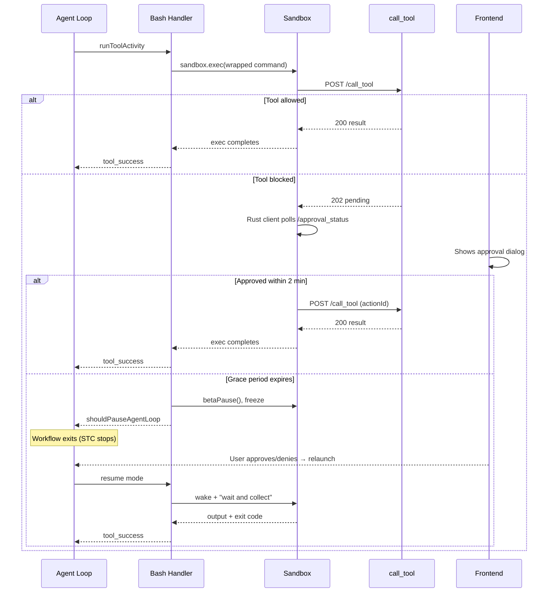
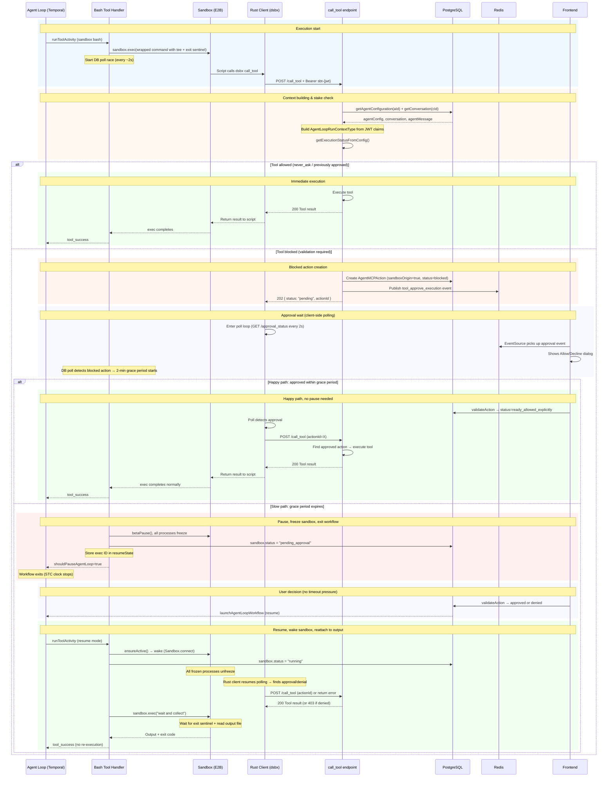
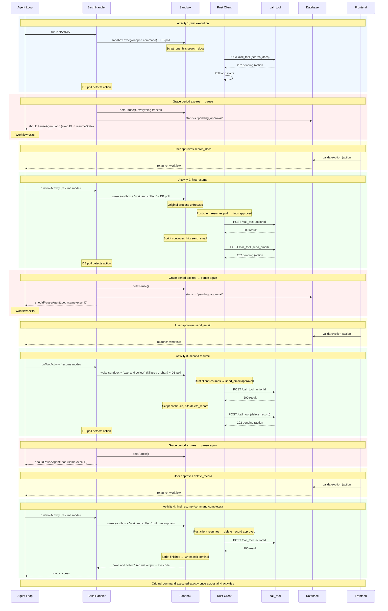

## Problem

When the agent loop executes the sandbox (bash) tool, code running inside the `E2B` container can call other MCP tools via `POST /api/v1/w/{wId}/spaces/{spaceId}/mcp_server_views/{svId}/call_tool`. Before this change, these calls bypassed all tool stake validation, tools with `high`, `medium`, or `low` permission levels were executed without user approval. Also, sandbox tool calls had no knowledge of the agent, conversation, or message that triggered them, because we were not building an Agent Loop Context.

### Re-execution side effects

The natural solution would be to pause the Temporal workflow (like regular tool approvals). But the sandbox is itself a running tool:

1. Pausing the workflow kills the Temporal activity
2. Killing the activity loses the `sandbox.exec()` connection handle
3. On resume, the bash command must re-execute from scratch
4. Re-execution replays all side effects that happened before the tool call: file writes, `curl` calls, package installs, database operations
5. Re-execution also re-triggers the tool call, creating a new blocked action, the user gets prompted again, creating an infinite approval loop

E2B supports pausing (`betaPause()`) and resuming (`Sandbox.connect()`) sandboxes, which freezes and restores all processes in place. This solves the process state problem, but the `Sandbox.exec()` SDK handle is still lost when the activity dies. After wake, the original command is still running inside the sandbox, but nobody is reading its output.

### Requirements

1. **Tool stake validation**: Sandbox MCP tool calls must go through the same approval flow as regular tool calls
2. **No long-lived HTTP connections**: The approval wait must not depend on holding an HTTP connection open
3. **No side-effect replay**: The bash command must execute exactly once, no re-execution after pause/resume
4. **Output continuity**: After pause/resume, the handler must capture the full output of the original (still-running) process
5. **Happy path optimization**: Quick approvals (user is watching) should complete with zero overhead, no pause, no re-execution

---

## Proposal

### 1. Full agent loop context for sandbox tool calls

The sandbox JWT token now carries `mId` (agent message sId) alongside the existing `wId`, `cId`, `aId`, `sbId`. The `call_tool` endpoint reconstructs a **complete `AgentLoopRunContextType`** from the token claims, the same context that tools receive when called from the agent loop:

- **`agentConfiguration`** : fetched from DB via `getAgentConfiguration(aId, variant: "full")`
- **`conversation`** : fetched from DB via `getConversation(cId)`
- **`agentMessage`** : found by `mId` in the conversation content
- **`toolConfiguration`** : built via `makeServerSideMCPToolConfigurations` using the real action config from `agentConfiguration.actions` or `getJITServers`, matched by `mcpServerViewId`, with real permission from `view.getToolPermission(toolName)`
- **`stepContext`** : parent's (sandbox tool call) step context

### 2. Sandbox-side polling (replace server-side long-poll from original proposal)

Instead of the backend holding the HTTP connection open for 90s, move the polling to the Rust client inside the sandbox:

1. `call_tool` checks the tool's permission level via `getExecutionStatusFromConfig()`
2. If blocked: creates the blocked action (`sandboxOrigin: true`), publishes `tool_approve_execution` event to Redis, returns **HTTP 202** immediately with `{ status: "pending", actionId: "..." }`
3. The **Rust `dsbx` client** detects the 202 response and enters a poll loop against a new lightweight `GET /approval_status/{actionId}` endpoint (every 2s)
4. When approved: Rust client re-POSTs to `call_tool` with `actionId` param, backend finds the approved action, skips stake check, executes tool
5. When rejected: Rust client receives "rejected" status, returns error
6. Frontend shows the approval dialog via existing `BlockedActionsProvider` + `MCPToolValidationRequired` UI

The Rust client controls its own timeout. No proxy issues. The approval window can be arbitrarily long.

### 3. Output-captured execution with pause/resume

Every sandbox command is wrapped to capture output to a file. This decouples the SDK connection from the process output, so pause/resume doesn't lose any data. A **2-minute grace period** avoids the expensive pause cycle for quick approvals.

### Happy path: approval within grace period

1. The **bash tool handler** races `sandbox.exec()` (wrapped command) against a DB poll that monitors for `sandboxOrigin` blocked actions on the current message
2. During the **2-minute grace period**, the handler only monitors, it does NOT pause
3. If the user approves within the grace period: the Rust client's poll detects approval, tool executes, bash completes normally, `sandbox.exec()` returns, **no pause, no re-execution, zero overhead**
4. Output is streamed live via the SDK handle as normal (the tee file is a side effect, unused in happy path)

### Slow path: pause after grace period expires

1. If the grace period expires with the action still blocked: **pause the E2B sandbox** via `betaPause()`, all processes freeze (including the Rust client mid-poll)
2. Sandbox status is updated to **`pending_approval`** in the DB
3. `sandbox.exec()` throws (E2B SDK loses connection when sandbox pauses)
4. Bash tool handler catches this, stores exec ID in `resumeState`, returns `shouldPauseAgentLoop: true` → **Temporal workflow exits** (user wait excluded from STC)
5. User approves via frontend → `validateAction` relaunches the workflow
6. Workflow resumes → bash tool handler checks sandbox status: `pending_approval` → enters **resume mode**
7. `ensureActive()` **wakes the sandbox** (`Sandbox.connect()` auto-resumes frozen processes), status returns to `running`
8. The original frozen process unfreezes and **keeps running**, Rust client resumes polling, finds approval, tool executes, bash continues
9. Handler runs a lightweight "wait and collect" command instead of re-executing:
    
    ```bash
    # Kill previous wait-and-collect orphan if any (from a prior pause/resume cycle)
    if [ -f /tmp/dust_wac_{id}.pid ]; then
      kill $(cat /tmp/dust_wac_{id}.pid) 2>/dev/null
    fi
    echo $$ > /tmp/dust_wac_{id}.pid
    
    while [ ! -f /tmp/dust_exec_{id}.exit ]; do sleep 0.5; done
    cat /tmp/dust_exec_{id}.out
    exit $(cat /tmp/dust_exec_{id}.exit)
    ```
    
10. The original command finishes, writes the exit sentinel, "wait and collect" picks it up, **no re-execution, no side effects replayed**

### Hardest path : Sequential high stake tool calls in one script

When a script calls multiple tools that each need approval (e.g. for composition), the pause/resume cycle repeats for each tool. The original command always runs exactly once, only the observation layer ("wait and collect") restarts on each resume.

Example script:

```bash
result1 = $(dsbx tools notion search_docs '{"query": "revenue"}')   # low stake
process_data "$result1"
result2 = $(dsbx tools gmail send_email '{"to": "bob@acme.com"}')   # medium stake
echo "email sent"
result3 = $(dsbx tools salesforce delete_record '{"id": "123"}')    # high stake
```

**Activity 1, first execution:**

1. Bash handler wraps command with tee to `/tmp/dust_exec_1234.out` + exit sentinel. Starts `sandbox.exec()` + DB poll race.
2. Script runs. Hits `search_docs`. Rust client POSTs `call_tool` → 202 → enters poll loop.
3. `call_tool` creates blocked action #1 (`search_docs`, sandboxOrigin=true). Publishes Redis event.
4. DB poll detects blocked action #1. Starts 2-min grace period.
5. Grace period expires, action still blocked → `betaPause()` → sandbox freezes (script frozen mid-poll on `search_docs`). Status → `pending_approval`.
6. `sandbox.exec()` throws. Handler stores `{ execId: "1234" }` in `resumeState`. Returns `shouldPauseAgentLoop: true`. Workflow exits.

*State at rest: sandbox paused. Script frozen at tool #1. Output file has everything printed before `search_docs`. Action #1 blocked.*

**User approves `search_docs` 
→ workflow relaunches 
→ Activity 2 (first resume):**

1. Bash handler sees sandbox status `pending_approval` → **resume mode**. `ensureActive()` wakes sandbox. Status → `running`.
2. All frozen processes unfreeze. Original script's Rust client resumes polling `search_docs` → finds approved → re-POSTs `call_tool` with actionId → gets result.
3. Handler starts `sandbox.exec("wait-and-collect for exec 1234")` + DB poll race.
4. Script continues past `search_docs`. Runs `process_data`. Hits `send_email`. Rust client POSTs `call_tool` → 202 → enters poll loop.
5. `call_tool` creates blocked action #2. DB poll detects it. Fresh 2-min grace period starts.
6. Grace period expires → `betaPause()` → sandbox freezes (script frozen mid-poll on `send_email`, "wait and collect" also frozen mid-tail). Status → `pending_approval`.
7. "Wait and collect" `exec()` throws. Handler stores same `{ execId: "1234" }` in `resumeState`. Returns `shouldPauseAgentLoop: true`. Workflow exits.

*State at rest: sandbox paused. Script frozen at tool #2. One orphan "wait and collect" frozen. Action #2 blocked.*

**User approves `send_email` 
→ workflow relaunches 
→ Activity 3 (second resume):**

1. Resume mode. Wake sandbox. All frozen processes unfreeze: original script + previous "wait and collect" orphan (harmless, its SDK handle is dead, output goes nowhere).
2. Handler starts new `sandbox.exec("wait-and-collect for exec 1234")` + DB poll race. The "wait and collect" script kills the previous orphan via PID file before starting.
3. Original script's Rust client resumes polling `send_email` → approved → gets result. Script continues. Hits `delete_record` → 202 → blocks.
4. DB poll detects action #3. Grace period. Expires → pause → `pending_approval`. Workflow exits.

*State at rest: sandbox paused. Script frozen at tool #3. Two orphan "wait and collect"s frozen. Action #3 blocked.*

**User approves `delete_record` 
→ workflow relaunches 
→ Activity 4 (final resume):**

1. Resume mode. Wake sandbox. All frozen processes unfreeze.
2. Handler starts new "wait and collect" (kills previous orphans via PID file) + DB poll race.
3. Original script's Rust client polls `delete_record` → approved → gets result. Script finishes. Writes exit code to `/tmp/dust_exec_1234.exit`.
4. "Wait and collect" detects exit sentinel. Reads full output file. Returns exit code.
5. `sandbox.exec()` completes. Handler returns full output to agent loop. `tool_success`.

**Key properties:** The original command executes exactly once (same exec ID `1234` across all resumes). Only the final activity returns output. The DB poll runs in every activity (first exec and all resumes), this is how subsequent tools are discovered. Happy path can happen at any position: if tool #1 pauses but #2 and #3 are approved in-band, only 1 cycle total.

## Flow (overview)

More detailed mermaid diagrams available at the end of the design doc



---

## Design decisions

| Decision | Rationale |
| --- | --- |
| **Blocked action lives on the parent step** | The sandbox tool call is part of the step running the sandbox bash tool. Using the parent step number + parent `stepContext` keeps the action hierarchy consistent. |
| **Sandbox-side polling** (Rust client polls GET endpoint) | Eliminates fragile long-lived HTTP connections. The Rust client controls its own timeout. No proxy timeout issues. Approval window can be arbitrarily long. |
| **2-minute grace period before pause** | Most approvals happen quickly (user is watching). The grace period avoids the expensive pause/resume cycle for the common case. Only slow approvals trigger the heavy path. |
| **Output-captured execution (tee + exit sentinel)** | Every sandbox command is wrapped to tee output to `/tmp/dust_exec_{id}.out` and write an exit code to `/tmp/dust_exec_{id}.exit`. This decouples the SDK connection from the process output, so pause/resume doesn't lose any data. On resume, a "wait and collect" script tails the output file and waits for the exit sentinel. The frozen process resumes and keeps running to completion. No re-execution, no side-effect replay, no journal needed. |
| **Token expiry extended to 24 hours + Redis-backed revocation** | The 60s token was tied to `DEFAULT_EXEC_TIMEOUT_MS`. With pause/resume the sandbox can be frozen for hours. Token TTL is bumped to 24h. To avoid long-lived unrevocable tokens, a Redis key `sandbox:{sbId}:exec:{execId}` is registered on exec start and deleted on exec completion. JWT verification checks key existence before accepting. See [tasks#6847](https://github.com/dust-tt/tasks/issues/6847). |

## Implementation mapping

### Sandbox status

`SandboxStatus` in `front/lib/resources/storage/models/sandbox.ts` is currently `"running" | "sleeping" | "deleted"`. Add `"pending_approval"`.

`ensureActive()` in `front/lib/resources/sandbox_resource.ts` handles statuses via a switch. `pending_approval` should be handled like `sleeping`, call `provider.wake()`, return `wokeFromSleep: true`. The status is set back to `running` before returning.

### Bash tool handler, deciding between new exec and resume

The branch point is in the bash tool handler in `front/lib/api/actions/servers/sandbox/tools/index.ts`. Currently:

```tsx
const wrappedCommand = wrapCommand(command, providerId, { timeoutSec });
const execResult = await sandbox.exec(auth, wrappedCommand, { ... });
```

Becomes:

```tsx
const execId: string | undefined = runContext.stepContext.resumeState?.execId;

if (execId) {
  // Resume mode: reattach to existing process output
  const waitAndCollectCmd = buildWaitAndCollectCommand(execId);
  execResult = await sandbox.exec(auth, waitAndCollectCmd, { ... });
} else {
  // Normal mode: wrap command with output capture
  const newExecId = generateExecId();
  const wrappedCommand = wrapCommandWithCapture(command, newExecId, providerId, { timeoutSec });
  execResult = await sandbox.exec(auth, wrappedCommand, { ... });
}
```

The handler checks `sandbox.status` (not `resumeState` alone) to decide the mode. This is unambiguous: `pending_approval` means a previous execution was paused for tool approval and the process is still alive inside the frozen sandbox.

### Command wrapping

`wrapCommand()` in `front/lib/api/sandbox/image/profile.ts` currently produces:

```bash
source /opt/dust/profile/common.sh && shell "{command}" {timeout}
```

The `shell()` function in `front/lib/api/sandbox/image/profile/shell.sh` runs the command via `bash -c "$cmd"` with timeout and output truncation.

The output capture (`tee` + exit sentinel) wraps **around** the entire `wrapCommand` output, not inside `shell()`. This ensures both stdout and stderr from the shell function are captured. A new `wrapCommandWithCapture(cmd, execId, providerId, opts)` function produces:

```bash
exec > >(tee /tmp/dust_exec_{execId}.out) 2>&1
source /opt/dust/profile/common.sh && shell "{command}" {timeout}
_EXIT=$?
echo $_EXIT > /tmp/dust_exec_{execId}.exit
exit $_EXIT
```

### DB poll race

Both normal and resume modes race `sandbox.exec()` against a concurrent DB poll (every ~2s) that checks for `sandboxOrigin` blocked actions on the current agent message. This is how the handler discovers blocked tools, both during the first execution (tool #1) and during resume (tools #2, #3, ...).

When a blocked action is detected, the 2-minute grace period starts. If it expires with the action still blocked, the handler:

1. Calls `betaPause()` on the sandbox
2. Updates sandbox status to `pending_approval`
3. Stores `{ execId }` in `resumeState` via `action.updateStepContext()`
4. Returns `shouldPauseAgentLoop: true`

The `sandbox.exec()` call throws when the sandbox is paused (SDK connection lost), which the handler catches.

### API changes

#### `call_tool` response (when blocked)

```json
// HTTP 202 Accepted
{
  "status": "pending",
  "actionId": "act_abc123"
}
```

#### `call_tool` request (re-POST after approval)

```json
{
  "toolName": "some_tool",
  "arguments": { ... },
  "actionId": "act_abc123"
}
```

When `actionId` is present, `call_tool` verifies the action is approved and skips stake validation.

#### New endpoint: `GET /approval_status/{actionId}`

```json
// Response
{ "status": "pending" | "approved" | "rejected" | "error" }
```

Lightweight read-only endpoint. Authenticated via sandbox token. Returns current action status.

## Cleanup

### On rejection

**Happy path (no pause):** The action is marked `denied` in the DB. The Rust client's poll detects the rejection and returns an error to the script. The original command continues (or exits, depending on script logic).

**Slow path (sandbox paused):** The workflow relaunches on rejection the same way as on approval. The handler enters resume mode, wakes the sandbox, starts "wait and collect." The Rust client unfreezes, resumes polling, finds the rejection, and returns an error to the script. Same outcome, the only difference is the script was frozen for a while.

### On timeout (no user response)

If the sandbox is paused and the user never responds, the sandbox eventually gets reaped by the sandbox reaper temporal workflow. The paused E2B sandbox has its own TTL.

---

## Detailed flow diagrams

### Single tool call, full detail



### Sequential tool calls, multiple pause/resume cycles

Shows a script with 3 high-stake tool calls, each triggering the slow path (grace period expires).



---

## Execution plan

Tickets 1–4 can start in parallel. Ticket 5 integrates them. Ticket 6 ships before prod.

```
1 (202 + endpoint) ──┐
2 (Rust polling)  ────┤
3 (command wrapping) ─┼──→ 5 (handler integration) ──→ ship
4 (pending_approval) ─┘         │
                                └──→ 6 (token revocation)
```

### Ticket 1: `call_tool` returns 202 for blocked sandbox tools

*Builds on the current branch.*

- Replace the server-side long-poll in `call_tool` with immediate 202 return: `{ status: "pending", actionId }`
- Support re-POST with `actionId` — verify the action is approved, skip stake check, execute tool
- New `GET /approval_status/{actionId}` endpoint, authenticated via sandbox token, returns `{ status: "pending" | "approved" | "rejected" | "error" }`
- `sandboxOrigin: true` in stepContext so `validateAction` skips agent loop relaunch
- `call_tool` publishes to `sandbox:blocked:{messageId}` Redis channel when creating a blocked action (consumed by the bash handler in ticket 5)

**Files:** `front/pages/api/v1/w/[wId]/spaces/[spaceId]/mcp_server_views/[svId]/call_tool.ts`, `front/lib/api/assistant/conversation/validate_actions.ts`
**Depends on:** nothing

### Ticket 2: Rust client (`dsbx`) handles 202 + polling

- Detect 202 response from `call_tool`
- Poll `GET /approval_status/{actionId}` every 2s
- On approved: re-POST `call_tool` with `actionId`
- On rejected: return error to script
- Configurable timeout on the poll loop

**Files:** `cli/dust-sandbox/` (Rust)
**Depends on:** Ticket 1

### Ticket 3: Output-captured execution

- `wrapCommandWithCapture(cmd, execId, providerId, opts)` — wraps with `tee /tmp/dust_exec_{execId}.out` + exit sentinel
- `buildWaitAndCollectCommand(execId)` — wait-for-sentinel script with PID-based orphan cleanup (`/tmp/dust_wac_{execId}.pid`)
- `generateExecId()` utility
- Unit tests for both functions

**Files:** `front/lib/api/sandbox/image/profile.ts`
**Depends on:** nothing

### Ticket 4: `pending_approval` sandbox status

- Add `"pending_approval"` to `SandboxStatus` type
- Handle in `ensureActive()` switch — wake like `sleeping` but do **not** fall through to recreation on failure (the frozen process state is unrecoverable, return error instead)
- DB migration for the new enum value
- Update sandbox reaper to handle `pending_approval` sandboxes (reap after TTL like sleeping)

**Files:** `front/lib/resources/storage/models/sandbox.ts`, `front/lib/resources/sandbox_resource.ts`, `front/temporal/sandbox_reaper/activities.ts`
**Depends on:** nothing

### Ticket 5: Bash handler — grace period + pause + resume

*Integration ticket. Wires everything together.*

- Handler branching: check `resumeState.execId` → resume mode (`buildWaitAndCollectCommand`) vs normal mode (`wrapCommandWithCapture`)
- Race `sandbox.exec()` against Redis subscription on `sandbox:blocked:{messageId}`
- On blocked action detected: start 2-min grace period timer
- If approved within grace period: no-op, `sandbox.exec()` completes naturally
- If grace period expires: `betaPause()`, set status to `pending_approval`, store `{ execId }` in `resumeState`, return `shouldPauseAgentLoop: true`
- Handler catches the `sandbox.exec()` throw on pause (SDK connection lost)

**Files:** `front/lib/api/actions/servers/sandbox/tools/index.ts`
**Depends on:** Tickets 1, 3, 4

### Ticket 6: Token revocation (Redis-backed)

*Security hardening. Ship before prod.*

- Bump sandbox JWT TTL to 24h
- Register `sandbox:{sbId}:exec:{execId}` in Redis on exec start
- Delete key on exec completion
- JWT verification checks key existence before accepting
- On sandbox destroy, delete all `sandbox:{sbId}:*` keys
- Per [tasks#6847](https://github.com/dust-tt/tasks/issues/6847)

**Files:** `front/lib/api/sandbox/access_tokens.ts`, `front/lib/api/actions/servers/sandbox/tools/index.ts`
**Depends on:** Ticket 3
