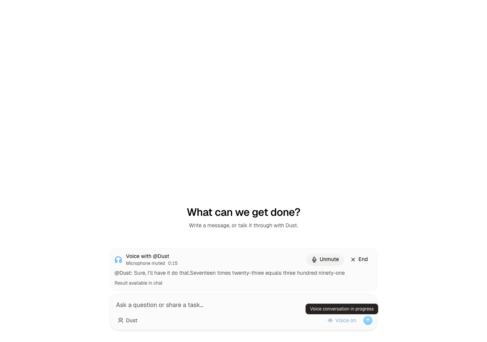

# GPT-Live POC

GPT-Live supplies continuous voice over WebRTC. Its client delegation events enter
Dust through `useSubmitMessage`, with the selected agent and tool validation enabled.
The normal durable agent loop owns tools, permissions, execution, and the answer.
The browser streams public answer sentences and quiet tool-status updates into
the ongoing voice session. Polling recovers missed completions. Transcript handoffs
use an internal voice origin and stay out of the chat; approvals and results remain
visible. Voice does not announce a backend handoff.



## Try it locally

Warm the hive and start its normal services. Enable the `gpt_live` workspace flag
through Poke, then select an agent in the composer and press **Voice**. This works
in a new or existing conversation. Captions, mute, and end controls appear just
above the composer and stay available while answering a question in chat.
Microphone access requires localhost or HTTPS.

This POC uses the global OpenAI endpoint and requires an eligible OpenAI key and
workspace provider configuration. EU workspaces are rejected. The server chooses
the instructions, credentials, model, and delegation mode; the browser sends only
an agent ID and its WebRTC offer.

Approvals, sign-in requests, and `ask_user_question` stay in their existing chat
cards. Voice tells the user when the task is waiting and relays the eventual result.
Spoken approval does not authorize a tool. Ending voice leaves durable Dust tasks
running in the conversation. Calls end automatically after 15 minutes.

## Reproduce the live smoke test

The scripts require `NODE_ENV=development` and an existing local workspace admin.
The browser fixture replaces only login and the microphone source. It runs the real
UI hook, Hono endpoints, OpenAI audio session, and Dust tool loop. No production
authentication code is changed or bypassed. These commands make billable API calls.

From the hive root on macOS:

```sh
source /Users/aubin/.dust-hive/envs/poc-gpt-live/env.sh

# Initialize the local workspace defaults, enable the flag, and check the harness.
cd front
NODE_ENV=development npx tsx scripts/gpt_live_poc/check_harness.ts \
  --userEmail aubin@dust.tt --execute
cd ..

say -v Samantha -o /tmp/dust-live-test.aiff \
  'Please ask the backend to use the math operation tool to calculate seventeen times twenty three. It must call the tool and then tell me the result.'
afconvert -f WAVE -d LEI16 /tmp/dust-live-test.aiff /tmp/dust-live-test.wav

cd front-api
NODE_ENV=development PW_TEST_SCREENSHOT_NO_FONTS_READY=1 \
  npx tsx scripts/gpt_live_poc.ts --userEmail aubin@dust.tt \
  --audioFile /tmp/dust-live-test.wav --spaUrl http://localhost:16011 --execute
```

The browser test requires Playwright with Chromium installed. It writes
`/tmp/gpt-live-e2e.json`, `/tmp/gpt-live-e2e.png`, and a final screenshot. The JSON
contains local test transcripts and tool output, so keep it outside version control.

Verified on 2026-09-16: hidden transcript context, real `math_operation`, live tool
status over SSE, streamed answer, spoken 391, mute, and confirmed session close.
The successful run received 319,824 audio bytes and reported 20 seconds of voice usage. API tests
cover access controls and provider restrictions; hook tests cover duplicate events,
waiting for chat input, resumed results, and cancellation during microphone access.
Composer coverage checks selected-agent routing, creation before microphone access,
delayed audio mounting, question-card replacement, and navigation cleanup.

## POC boundaries

- Voice duration is not yet integrated with Dust credit metering or a server-owned
  session registry. Enable only for internal evaluation.
- Restarting or navigating away closes voice. Running Dust tasks remain in chat;
  voice does not reconnect to them automatically.
- Delegation IDs are deduplicated within a browser session. The snapshot waits
  briefly for transcript fragments; unclear or late speech can require repetition.
- Separate delegated requests remain queued. Voice stays live while each Dust run
  executes tools and streams updates.
- Approvals and question cards were checked through lifecycle tests, not a live
  browser approval or question-answer scenario. Voice-only approvals are out of scope.
- Storybook previews render, but the Storybook MCP test runner fails importing its
  existing `@storybook/addon-vitest` setup file in this hive.

Protocol references: [WebRTC](https://developers.openai.com/api/docs/guides/voice-webrtc?api=live),
[client delegation](https://developers.openai.com/api/docs/guides/live-delegation),
[session events](https://developers.openai.com/api/docs/guides/live-conversations).
