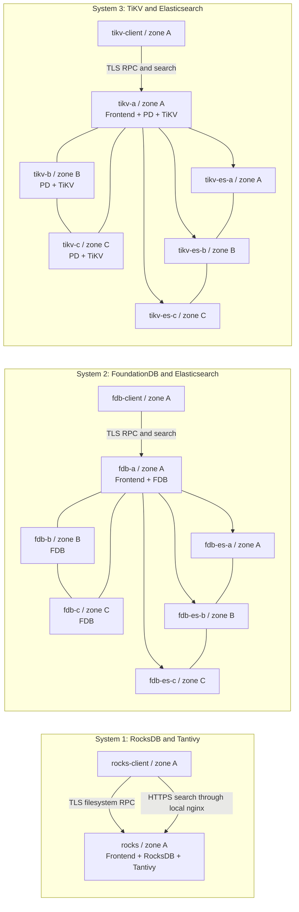

# Three independent systems

All 16 hosts use `c4-standard-8-lssd`, 8 vCPUs, 30 GiB RAM and 375 GiB Titanium NVMe Local SSD. A/B/C are `us-east4-a`, `us-east4-b`, `us-east4-c`. Host names share the prefix `dfs-clean-jd-20261006-`; boxes below give their suffixes. [Exact names, IPs and disk attachment metadata](../results/hosts.json).

The systems share no VM, database, ES cluster or local disk. Clients are distinct VMs in zone A. FDB and TiKV have three storage copies across three zones; their ES clusters have three primary shards with one replica per shard. Frontends are colocated with database host A. RocksDB/Tantivy has one storage host. The coordinator releases each workload phase concurrently; it is outside the measured request path.

Local SSDs hold all datasets and index files. Boot disks hold operating systems and packages. [Resource limits, consistency, durability and measurement method](METHOD.md).
