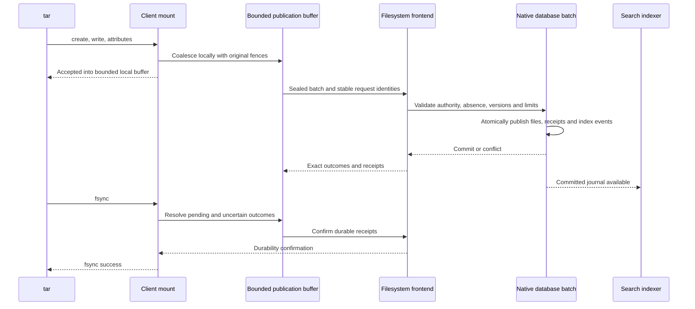

# Write path rework

Status: bounded buffering has passed correctness tests and the [complete three-system benchmark](FULL_RESULTS.md). Distributed extraction is still above the target, so the optimization loop continues. The measurements below are the clean SSD baseline, not results of this rework. All three systems extracted the same 10,000-file, 177,499,149-byte corpus concurrently with indexing enabled. [Placement and hardware](TOPOLOGY.md) and [method](METHOD.md) describe the experiment.

| Baseline system | Extraction | Subsequent open + fsync + close of all files |
|---|---:|---:|
| RocksDB + Tantivy | 23.049 s | 301.148 ms |
| Three FDB nodes + three ES nodes | 2,276.448 s | 316.010 ms |
| Three TiKV nodes + three ES nodes | 363.978 s | 357.685 ms |

The baseline is preserved under `results/recovery/`. RocksDB's later filesystem suite failed with EAGAIN during concurrent content reads; neither that suite nor search is a completed three-system comparison.

## Why the current path costs so much

The RocksDB mount recorded 47,543 mutation RPCs for extraction plus its untar-phase validation. Create, individual FUSE write requests, and attributes each publish separately. Creating an entry invalidates the client's directory view, adding head validation between files. The post-extraction fsync pass is short because distributed commits already happened during ordinary operations.

FDB additionally used an application-level persistent tree: logical edits traversed immutable objects, rewrote tree paths, uploaded objects in transactions, then compared and replaced a tenant root. This is a second publication protocol layered over a database that already implements serializable transactions. The native FDB probe during extraction measured a 3.743 ms commit and 14–18% disk utilization. These observations do not support attributing the 38-minute result to SSD saturation.

The distributed index workers consume only 16 journal events per pass and then sleep 500 ms; Elasticsearch refresh visibility adds more delay. Roughly 47,500 events consequently took over an hour to catch up. Faster file publication alone cannot fix that backlog.

## Design changes and DDIA context

DDIA chapter 7 supplies the relevant abstraction for FDB: one serializable transaction over the records that actually change. Native conflict tracking protects observed values and absent entries. There is no storage tree root to rebuild. Filesystem state, authorization dependencies, original request outcomes, and indexing events still publish atomically. The filesystem's tenant head remains a shared write dependency until the journal is partitioned; removing a tree does not establish same-tenant write scaling.

The new FDB layout uses a distinct `dfs-fdb-v2/` physical prefix. Logical values are checksummed inline records, with values larger than 64 KiB split into chunks committed in the same transaction. Mutation bytes are limited to 4 MiB, recorded read dependencies to 1 MiB, and snapshots to four seconds. Expired snapshots fail instead of silently obtaining a newer read version. This replaces the earlier guarantee that immutable-tree snapshots could survive indefinitely. Existing v1 data requires explicit migration; the benchmark uses a fresh namespace.

For the client, chapters 7 and 9 distinguish optimistic concurrency from permission to omit validation. A cache may supply the proposed base version; publication must atomically check the original file/entry dependencies and current authority. Conflicts cannot silently rebase the caller's payload. A successful publication can overlay acknowledged changes locally without advancing the contiguous journal cursor or extending metadata validity.

Cross-file client buffering is a separate acknowledgement decision. It can combine create, writes, and attributes into a bounded publication, but permitting close to return before remote publication changes failure behavior. The user approved bounded write buffering with durable fsync/unmount. Metadata's one-second validation limit measures observation age against committed state; it does not make unpublished client changes visible remotely. A publication delay followed by a separate one-second reader TTL cannot honestly be described as a one-second bound from local write acknowledgement.

DDIA chapter 11 frames indexing as a derived view fed by the publication journal. Workers now attempt up to 1024 journal events per range read, coalesce repeated changes to a node, and fetch at most eight documents concurrently. Encoded materialization is bounded to 64 MiB; capacity or snapshot deadlines reduce the attempted batch. Bulk writes defer refresh, followed by one explicit refresh covering the pass before checkpoint advancement. This removes per-bulk waits for the scheduled refresh, with segment creation and refresh cost to be measured. Workers drain existing backlog without a fixed sleep. Version fences and durable tombstones still prevent delayed workers from restoring older content.

## Measurement gates

Each iteration uses fresh destinations, the same corpus, the same cache budgets, indexing enabled, and a common release barrier for the three systems. Builds run on the separate build VM. Record the application source and binary hashes for every iteration.

Report extraction return time, durable publication completion, hash validation, and search catch-up independently. If buffering moves work after tar exits, that work remains visible in the result. Do not advertise a seven-second extraction as seven-second durability unless both measurements support it.

Before broad benchmarking, check stale-writer conflicts, atomic record publication, absent-entry/range conflicts, retry identity after uncertain outcomes, bounded buffers, explicit fsync, and cross-client metadata expiry. Fix bounded read admission so ordinary concurrent reads receive backpressure instead of EAGAIN. Then run the complete filesystem suite and validated search workloads on all three systems.

## Correctness evidence so far

The final native FDB release passed seven storage tests, six engine tests and three indexing tests on `fdb-a`. They cover independent clients, atomic conflicts, ordered snapshots, chunk integrity and expiry, cross-frontend sessions, deduplication, opposing renames, revoked authority, sparse content, and original-version fences. Combined log: `results/native-01-fdb-tests.log`. The indexing suite created 10,000 empty entries in 59.619 s, indexed them in 1.295 s across ten passes, and verified five later edits in 47.880–57.946 ms each. This is a direct-driver correctness/diagnostic workload, with different content and timing boundaries from untar. Its raw evidence is `results/native-01-large-index.json`. These checks do not establish a performance result or complete mount/search correctness. An earlier attempt from the build VM timed out connecting to the cluster; it is not a backend-performance sample.

## Bounded client publication buffer

The user approved close before remote publication. The first implementation has passed its targeted correctness tests: new files coalesce creation, content and attributes; unrelated operations drain the buffer before using the existing synchronous path.

| Operation | Acknowledgement boundary |
|---|---|
| Create, write, truncate, attributes | Accepted into a bounded local overlay after cached-authority checks; publication still validates current authority and original dependencies |
| Close | Local descriptor release; pending data, request identity and errors remain owned by the mount |
| Explicit fsync or namespace synchronization | Relevant pending requests resolved, committed receipts durably confirmed |
| Graceful unmount | All accepted changes drained and errors reported before successful shutdown |
| Expired metadata access | Authoritative validation required; a dirty overlay cannot indefinitely hide failed publication or expired authority |

The initial implementation bounds pending payload to one MiB and 64 files. A local worker checks every 25 ms and publishes once the oldest change reaches 100 ms; capacity pressure, fsync, namespace operations, and expired metadata also drain it. One batch publishes at a time, with backpressure during publication. Metadata TTL is shortened to 500 ms, leaving 500 ms of the one-second target for publication. This is a healthy-system visibility target; network/storage delay and partitions can exceed it, and fsync reports publication failures.

For a newly created, unpublished file, combine create, body writes and final attributes into one record. Stable client-generated identities must be validated for uniqueness and included in the retained request payload. For an existing file, retain its original observed version and entry token; never silently change those preconditions to make a conflicting publication succeed. Coalescing stops when a batch is sealed. Ambiguous retries resend that exact batch identity and payload.

The server validates session and policy, destination absence or original entry token, base file generation, node quota and byte limits in one transaction. It writes immutable chunks, final file metadata, publication outcomes and receipts, and journal/index events atomically. A failed batch cannot partly expose a directory entry or body. Retrying after a definite conflict requires an explicit conflict outcome or a separately defined resolution policy; uncertainty cannot be treated as a definite failure and split into different requests.

A published local overlay must not move the contiguous journal cursor past changes the client has not seen. Refreshes replay bounded deltas and reconcile them with acknowledged overlays. Immutable content remains cached by hash; only authority and the selected revision require renewed validation.

The one-second metadata rule still starts from authoritative observation of committed state. A remote client can retain its old metadata until its validation deadline. Publication delay plus that deadline is not automatically a one-second bound measured from a different client's local acknowledgement. During a partition, unpublished accepted bytes have no remote visibility guarantee. If the required bound is instead one second from local acknowledgement, the protocol needs a tighter total visibility budget and an explicit failure rule; buffering alone does not provide it.

## Findings from the first parallel rework

[The full extraction record](RESULTS.md) preserves all three samples and the failed FDB literal-search readiness phase. RocksDB took 20.796 s, native FDB 418.808 s, and TiKV 546.803 s. All hashes and fresh-mount 32-reader checks passed. Approximately 47,500 mutation RPCs remain in each client's extraction phase; no client publication buffering is enabled.

The selective FDB term query found the four expected files with a checkpoint equal to the source head. The literal query failed independently: its candidate predicate was `match_all`, followed by a separate Elasticsearch body request for each candidate. A 10,000-document substring scan outlives the native FDB snapshot. Extending the snapshot lifetime would conceal the access-pattern problem.

The native-03 code revision introduced a `wildcard` multi-field for literal body candidates and escaped wildcard predicates for body/name substrings. Current authorization, revision checks and exact literal verification remain mandatory. A new `dfs-v2-` index identity forces the new mapping and a new UUID-bound checkpoint. The [Elasticsearch 8.19 field documentation](https://www.elastic.co/guide/en/elasticsearch/reference/8.19/keyword.html#wildcard-field-type) describes the field's support for long string values; the [query documentation](https://www.elastic.co/guide/en/elasticsearch/reference/8.19/query-dsl-wildcard-query.html) defines wildcard predicates. Integration verification passed, including metacharacters, Unicode and a body longer than 64 KiB.

Index checkpoint publication also previously loaded the filesystem's tenant state despite changing only the index checkpoint. The native-03 revision authenticates the unscoped index administrator through current session and credential records, and fences the checkpoint itself. It does not read or lock the unrelated filesystem head. This is DDIA chapter 7's dependency-set question: unnecessary transaction dependencies can make independent work contend. Its effect on TiKV extraction must be measured; the first iteration does not prove the cause of the regression.

## Buffered implementation and verification

The default mount owns one bounded batch of newly created regular files and directories, plus attribute updates to existing non-root directories. It merges their writes, truncations and final attributes before publishing `Mutation::PutFiles`; unrelated namespace operations drain the batch before following their existing path. Data writes to already published files retain their synchronous path. Oversized files drain accepted bytes before falling back to ordinary bounded writes. There is no unbounded queue and no kernel writeback lease.

All three servers validate the batch before atomic publication. Creates check name and identity absence plus inherited create/write permission. The batch protocol also supports fenced full-file replacements: the original revision and entry identity must match. One receipt binds the whole request; every file gets its own contiguous journal event and distributed index event. Rejection publishes none of the files. Client-generated identities do not confer authority.

FDB prefetches point reads concurrently in its native transaction; TiKV batches reads and acquires optimistic point locks, including absent keys. New-file bodies and manifests are staged once. The mount retains sealed request identity and payload after uncertain publication and retains definite errors across close. Fsync and graceful unmount drain and confirm durability. Buffered data can serve local reads only while the projection still supplies unexpired authority; metadata expiry drains pending data before authoritative refresh.

Metadata refresh now permits 4096 contiguous events rather than falling back to a full view after 128. Distributed refresh uses a range read for the journal and bounded node/pin prefetch. Local overlays preserve the original metadata deadline and do not advance the journal cursor.

The metrics include publication batch/file counts, maximum oldest-change age at confirmed publication, and count exceeding the 500 ms publication budget. A nonzero miss means the combined 500 ms metadata TTL plus publication target was not established by that run. Accepted bytes remain volatile until durable synchronization; abrupt client loss can lose them. A network partition cannot promise remote visibility for unpublished data.

Five real-backend buffering tests passed on all three: 32-file coalescing with exact content/attributes after synchronization; atomic collision rollback, stale revision rejection and exact retry identity; revocation before publication; actual FUSE unmount draining 16 pending files; and incremental refresh through 192 events. The RocksDB publication suite additionally verifies a lost batch reply and retained retry identity across close. Evidence: [RocksDB](../results/buffer-02-rocks-tests.log), [FDB](../results/buffer-02-fdb-tests.log), and [TiKV](../results/buffer-02-tikv-tests.log). These checks establish the tested behaviors, not the performance or one-second visibility target.

## Capacity and directory-overlay follow-up

The validated [buffer-03 measurements](RESULTS.md) reached 4.120 s / 14.791 s / 15.840 s for RocksDB / FDB / TiKV. All three had zero 500 ms publication-budget misses. The client still emitted about 950 mutation RPCs: filling a batch mid-file published that partial file and forced its remaining writes through the synchronous path.

The follow-up implementation keeps the current file buffered when it fits individually, and seals a publication containing the other files. An uncertain response retains both the exact selected subset and the excluded file; fsync/unmount resolve the selected request and then drain the remainder. No accepted bytes are dropped and the one-MiB aggregate payload limit remains enforced. An individual file exceeding that limit still falls back to ordinary writes.

A successful directory create can also be overlaid on an unexpired projection using its acknowledged identity and the cached parent's inherited permissions. The overlay preserves the original validation deadline and contiguous journal cursor. Expiry, a name collision in the local projection, or capacity pressure requires normal refresh. A test inserts an external change before the local directory publication and verifies that subsequent journal replay still observes both changes.

Buffered edits explicitly validate metadata freshness before consulting cached permissions. The revocation test expires that metadata before another write and requires the write and later synchronization drain to retain the authorization failure across close. Synchronous writes continue to validate in their publication transaction, without an extra metadata RPC. These follow-up changes passed seven buffering tests on each backend and 13 RocksDB live/publication tests; they are not included in buffer-03 timings. [RocksDB](../results/buffer-04-rocks-tests.log), [FDB](../results/buffer-04-fdb-tests.log), [TiKV](../results/buffer-04-tikv-tests.log).

## Grouping transactional reads

The full buffer-04 suite passed, but extraction still took 12.135 s on FDB and 16.494 s on TiKV. Client mutation counts were 701 and 759. The authoritative implementation still fetched session, credential, tenant state, retry outcome and mutation dependencies through serial point reads.

The next revision groups known keys into native transactional prefetch. A bounded hint map retains only the credential and principal key addresses associated with a validated session: at most 256 entries and 256 KiB of charged key/value storage. It stores no authority result. Every operation rereads the actual session and credential; every mutation retains native conflict dependencies on authority, retry outcome, original versions and namespace predicates. If the authoritative session selects a different credential or principal, the operation loads the selected keys rather than trusting the hint. Checkpoint-only index transactions still omit the unrelated filesystem head.

Creation, attributes, writes and unlinks prefetch their known point dependencies together with session validation. File batches also prefetch their distinct parents. This changes access scheduling, not transaction isolation or acknowledgement semantics. Client diagnostics record call count, total duration and maximum duration by operation, including retries. Buffer-05 passed real-cluster tests and the complete filesystem/search suite. Extraction took 4.271 s / 10.940 s / 14.037 s for RocksDB / FDB / TiKV. A warm-hint revocation test verifies that cached addresses cannot preserve revoked credentials.

## Reusing TiKV's prefetched immutable-key checks

Buffer-06 fixes a redundant read inside TiKV's transaction adapter: it previously discarded a prefetched result before checking an immutable write. The adapter now consumes that result, including observed absence, before invalidating the cached entry for the staged write. The transaction still fences absence and rejects replacing an immutable value with different bytes. File publication prefetches chunk keys in groups bounded by file count, payload size, point count and retained bytes; those groups remain inside one atomic transaction.

The five storage tests include zero additional reads after prefetch, read-your-writes, immutable replacement rejection and a concurrent insertion conflicting with observed absence. [Storage and engine evidence](../results/buffer-06-tikv-tests.log), [adapter](../../dfs-tikv/src/txn_store.rs), [publication](../../dfs-tikv/src/engine/mutations.rs).

The complete buffer-06 suite passed for all three systems. TiKV extraction fell from 14.037 s to 10.683 s, and its summed client-observed `PutFiles` duration fell from 8.858 s to 5.504 s. RocksDB took 4.622 s and FDB 11.134 s. These are consecutive single trials, not a statistical causal estimate. DDIA chapter 7's transaction boundary is unchanged: reducing redundant reads inside a transaction does not remove its dependency checks.

## Byte encoding without a format migration

Buffer-07 uses Serde byte serialization for file payloads, chunk bodies, checksums and byte-bearing replies. Bincode writes the same length and bytes as the previous vector encoding, while the encoder can copy a byte slice in bulk. This follows DDIA chapter 4's distinction between an encoding implementation and a format change: golden compatibility tests require identical old/new bytes and discriminants, round trips with non-UTF8 payloads, and bounded rejection of invalid lengths.

The tests and real-backend buffering, engine and indexing checks passed. Filesystem performance must come from the concurrent benchmark, not the isolated encoding probe. [Codec tests](../../dfs-tikv/tests/codec.rs), [RocksDB evidence](../results/buffer-07-rocks-tests.log), [FDB evidence](../results/buffer-07-fdb-tests.log), [TiKV evidence](../results/buffer-07-tikv-tests.log).

## Directory creation and attribute coalescing

The buffer-09 client includes directory creation and directory attribute updates in the same bounded publication as file bodies. Tar creates parents first and sets final directory attributes after extracting children; forcing separate commits at either boundary reduces the benefit of buffering file data. The limits remain 64 node updates and one MiB of file payload, with the same publication timer, metadata deadline and durable synchronization.

The client orders pending ancestors before descendants. A new directory inherits validated parent permissions and has no content payload. An attribute update to an existing directory retains its original revision, entry token, parent and name; the server checks current write authority and those original dependencies. A collision or stale directory revision rejects the whole batch, including its children. Sealed ordering and payload remain unchanged across uncertain retries.

In DDIA chapter 7 terms, this widens the application transaction's write set while retaining its validation rules. Chapter 8's failure ambiguity still requires stable request identities; an unconfirmed directory publication is not safe to reconstruct under another name or version. Eleven buffering tests passed on every backend, including nested inherited permissions, collision rollback, successful directory attribute replacement, stale-directory fencing and concurrent flush/refresh. RocksDB also passed 13 live/publication tests; FDB and TiKV passed their engine suites and two indexing race tests. [RocksDB evidence](../results/buffer-09-rocks-tests.log), [FDB evidence](../results/buffer-09-fdb-tests.log), [TiKV evidence](../results/buffer-09-tikv-tests.log).

The first directory-attribute fence test rejected a RocksDB replacement with EINVAL before reaching the version check: existing server-created entry tokens include an incarnation prefix, while new client-generated identities use a shorter form. Replacement validation now permits bounded opaque entry tokens and requires exact equality with the stored token; creation retains the stricter new-identity format. The original expected conflict assertion remains, with a successful replacement check added before it. Root directory attributes retain the synchronous path because a root has no parent entry. [Retained failed test](../results/buffer-08-rocks-tests-rejected.log).

Before a timing barrier was released for buffer-08, review found a lock handoff between reserving an existing directory update and assigning its changed revision. A background publication could observe that incomplete record. Buffer-09 assigns the new revision, attributes, pending record and local projection under the same buffer/projection locks. A concurrent flusher repeatedly invalidates metadata while 64 attribute updates run; all accepted updates must remain publishable and the final attributes must match. Buffer-08 has correctness and staging evidence, but no performance sample.

## Pending-record age and bounded transfer scheduling

Buffer-09 passed the full suite at 3.820 s / 8.329 s / 9.931 s for RocksDB / FDB / TiKV. It removed separate directory creates but increased ordinary write calls to 241 / 272 / 297. After a partial drain, the retained active file inherited the oldest age of the former batch. That conservative timestamp could trigger the background worker while the retained file was still young, forcing its remaining writes onto the synchronous path.

Buffer-10 keeps the first acceptance time of each pending record, bounded by the same 64-record limit. A partial drain removes timestamps only for confirmed records; retries and later edits retain their original timestamps. Background eligibility uses the oldest remaining record, and publication age measures the oldest included record through acknowledgement. DDIA chapters 8 and 9 distinguish an operation's original deadline from the time of its latest retry; neither successful unrelated work nor another local edit renews this deadline.

The same revision sets explicit HTTP/2 receive windows of two MiB per stream and eight MiB per connection on clients and frontends. Message limits, request concurrency, content/metadata caches and process ceilings remain unchanged. Flow-control credit is additional bounded transport capacity, not an authorization cache. TiKV prefetch groups increase from 32 files/512 KiB to 48 files/896 KiB of payload while retaining the 256-key/one-MiB retained-value admission limits. These scheduling changes require new measured results; the combined trial cannot isolate their individual effects.

Buffer-10 passed twelve buffering tests on each backend, including the retained-record age test and concurrent directory flushing. The RocksDB live/publication suite, both distributed engine suites and both indexing race suites passed. [RocksDB](../results/buffer-10-rocks-tests.log), [FDB](../results/buffer-10-fdb-tests.log), [TiKV](../results/buffer-10-tikv-tests.log).

## Larger publication batches with unchanged I/O limits

Buffer-10 completed all filesystem and search workloads at 3.820 / 9.239 / 9.280 seconds for RocksDB / FDB / TiKV extraction. It reduced ordinary writes and publication counts, but FDB was slower than buffer-09. Fewer logical calls alone do not prove lower wall time; these single combined trials cannot isolate individual changes.

Buffer-11 separates the publication limit from the individual read/write limit. All three mounts admit up to 128 node updates and two MiB of pending file payload; individual I/O remains capped at one MiB, and the RPC message limit remains four MiB. This changes the write buffer only: content/metadata caches, database caches, transport windows, process ceilings, replicas and indexing settings retain buffer-10 values. The original corpus includes a 3,055,215-byte manifest in addition to the 177,499,149 document bytes. That manifest still exceeds the buffer and exercises synchronous writes after publication; it is not removed from the workload.

FDB processes at most 64 updates per prefetch group within the same atomic transaction, preserving validated parent identities across groups. TiKV retains bounded 48-record/896-KiB prefetch groups. Larger application batches do not relax absence/version/authority validation or stable retry identity. The worker's 100 ms eligibility, 500 ms publication budget and 500 ms metadata lifetime are unchanged.

Twelve buffering tests passed on each backend, including capacity drains above two MiB, exact retries after a lost reply, directory collisions and stale versions, concurrent flush/refresh, and non-renewable acceptance age. RocksDB's thirteen live/publication tests and both distributed engine/indexing suites passed. [RocksDB evidence](../results/buffer-11-rocks-tests.log), [FDB evidence](../results/buffer-11-fdb-tests.log), [TiKV evidence](../results/buffer-11-tikv-tests.log). Performance results are reported separately in [the full comparison](FULL_RESULTS.md); a passing build is not a performance result.
