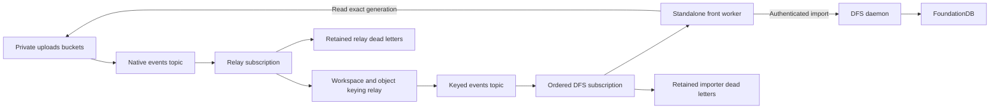

# GCS replication into DFS

## Decision and scope

Mirror live private-upload changes through native Pub/Sub notifications, a workspace/object keyed relay, and an ordered subscription into the canonical DFS service. The standalone `front` relay and importer do not use Temporal. GCS remains the source of truth; DFS is a read-only projection for consumers. The implementation lives in `front/workers/gcs_dfs` and the shared `front/lib/dfs` client. Terraform and Helm implementation is coordinated with `dust-infra-2/docs/gcs-dfs-sync.md`. See [Deployment contract](DEPLOYMENT_CONTRACT.md) for exact image entrypoints, configuration schemas, regional endpoints, probes, metrics and shutdown behavior.

Enroll private uploads only. Public uploads, data sources, tables, queues/staging, traces, webhook requests and snapshots are excluded. There is no historical backfill: untouched objects remain in GCS only. Enrollment is explicit for each supported private-upload bucket; the worker does not discover or enroll buckets. Notifications for unmapped objects remain recoverable in dead-letter subscriptions and never infer workspace ownership from untrusted metadata.

This is eventual replication of current live objects, not an audit archive of every historical body. An overwritten generation may already be unavailable when its event arrives. Source versioning can retain historical bytes when needed. Notification history and replica convergence are distinct properties.



## Source semantics

Subscribe to `OBJECT_FINALIZE`, `OBJECT_METADATA_UPDATE`, `OBJECT_ARCHIVE`, and `OBJECT_DELETE` with `JSON_API_V1` payloads. A write becomes visible at finalize; unsuccessful uploads have no live object to replicate. Copy, rewrite and compose produce finalized destination objects. Copy-and-delete renames produce destination and source events; native folder moves require separate coverage validation. Archive removes a generation from the live namespace even if versioned storage retains its bytes.

Validate notification configuration identity, bucket, object name, generation, event type and payload identity. Generations remain exact decimal strings. They are opaque identities: Google explicitly does not guarantee that a later version has a larger generation. Metageneration ordering is meaningful only within one generation. Pub/Sub message IDs and event timestamps cannot establish object version order. [GCS generation semantics](https://docs.cloud.google.com/storage/docs/metadata#_GenerationNumbers)

Treat every event as a reconciliation trigger. First read the durable DFS cursor, then fetch the current live GCS metadata without a generation selector. Fetch bytes pinned to that returned generation. If no live object exists, remove the current projection under fenced ownership, or confirm that it is already absent. An archive/delete for an old version therefore imports a live replacement when one exists instead of deleting it. Never use a generation-pinned metadata read to decide whether a retained historical object is still live. Permission errors, rate limits and backend outages remain failures; only an authoritative 404 means absence.

Each source is reconciled under distributed Redis ownership and a dedicated DFS session. Before reading either system, a successor revokes the previously registered session and waits for all admitted mutations to finish. It registers its own session before mutation. A worker that loses its lease cannot publish after its successor: Redis owner checks reject new work, and DFS session revocation fences requests already admitted. The cursor is stored with the file metadata before atomic namespace publication. Equal live observations are durable no-ops. Deletion removes the file; absence is the durable deleted state. Every retry acquires ownership again and rereads current GCS state, so historical delete/finalize notifications cannot recreate an absent source or remove a live replacement.

A source change between the live read and publication can still cause temporary staleness until another notification or explicit repair. This design depends on preserved Redis ownership history and one authoritative DFS session domain; a disposable cache or failover that loses acknowledged state does not meet the requirement. Recovery after coordination-state loss must stop all workers and fence outstanding DFS sessions before restarting. See the deployment contract for exact operational requirements.

## Namespace and ownership

A trusted configuration binds `(bucket, prefix)` to a workspace and DFS tenant, importer credential, and explicit reader principals. Prefixes are directory boundaries and overlapping bindings in a bucket are rejected. Each DFS credential binds one tenant. The server never accepts a request-selected tenant independently of that credential. The prototype uses a dedicated tenant namespace for the projection; consumer credentials carry no write grants.

Objects have a stable SHA-256 identity over the unambiguous pair `(bucket, full object name)`. Their physical projection is `<configured directoryId>/<object hash>` inside the tenant. Source identity and metadata are retained in file xattrs. This preserves arbitrary GCS names, including `a` together with `a/b`, trailing slashes, Unicode, and names longer than a POSIX component. It deliberately separates raw object identity from product-facing mount paths. The existing front GCS mount adapter continues to own conversation, pod and user path presentation; replacing those mounts is outside this replication change.

Source bindings, not GCS custom metadata, supply reader grants. The initial implementation can only provide explicit principal allowlists. Missing mappings or unresolved ownership fail closed. A private conversation must not become workspace-readable simply because its object path contains `w/<workspace>/`. GCS IAM subjects and Dust users/groups are different identities. Bucket public access does not grant DFS access. Ancestor directories grant only traversal/listing appropriate to the dedicated projection; file bytes require explicit read grants. Grants are replaced atomically with publication and removed on deletion. Existing DFS credentials and authority checks remain authoritative on reads.

GCS object notifications do not provide a complete Dust permission change stream. Membership, conversation sharing, space policy and bucket IAM changes need a separate trusted reconciliation trigger. Before production exposure, wire those changes to DFS's existing principal/group grant mechanisms, with revocation checks and repair. Until then, only operator-provisioned test readers may access the projection; no automatic end-user rollout.

## DFS import protocol

The source of truth is `dfs/protocol/proto/dfs.proto`, documented by `dfs/design-docs/API.md`, and the application client is `front/lib/dfs`. The previous PoC Frame/bincode implementation is superseded. All calls use typed `/dfs.v1.Dfs/<Method>` requests and bearer-key metadata. Server handler implementation is expected before shipment.

No protocol changes or new RPCs are required. The importer uses `CreateSession`, `RevokeSession`, `Stat`, `ListGrants`, `Lookup` and single-operation `Apply` requests through the shared client. Redis ownership and DFS session revocation serialize attempts per tenant/source; the API remains unchanged. `Validate` followed by `Apply` is not treated as compare-and-swap.

Each binding has distinct, preprovisioned final and private staging directories. Both attach DENY rw and ALLOW importer rw; the final directory additionally allows the trusted readers r. The worker verifies the exact explicit grants before each attempt. Files have no explicit grants, so moving a complete file into the final directory atomically changes its inherited reader visibility. The worker does not mutate grants.

Create a fresh UUIDv7 file in staging and write pinned-generation bytes at explicit offsets in chunks of at most 64 KiB. Bound total source content to 256 MiB and verify the streamed length and chunk hashes locally. Each request contains one operation, so per-operation failures cannot partially publish a batch. Set the source cursor, source metadata, MIME type and mtime on that private file, then publish with one `Rename(replace=true)`. The namespace points to either the previous complete version or the new complete version. Updates replace file IDs; consumers must resolve the current namespace rather than assume an old handle follows replacements. Delete uses one `Remove`.

Every mutation checks Redis ownership first. Session revocation on completion or error drains ambiguous outstanding mutations. A successor must repeat that barrier before reading state, so it cannot race a delayed predecessor. No mutation is blindly retried. Crashes can leave private staged files; cleanup requires a separately authorized, drained maintenance operation. No staged-file inventory scan or periodic repair is implemented.

## Keyed relay

The relay resolves the trusted workspace binding, validates the native envelope and allowlisted notification configuration, and republishes the original attributes and payload. Its key is `gcs-workspace-object-v1:` followed by hexadecimal SHA-256 of UTF-8 `JSON.stringify([workspaceId, objectName])`. Preserve names exactly and exclude generation. Bucket and generation remain in the envelope and DFS cursor. Publish through the cell's regional endpoint and acknowledge input only after a confirmed downstream message ID. Unknown or ambiguous mappings and failed publishes remain unacknowledged.

Ordered importer workers independently validate the source binding and recompute the expected key before any backend read. Same-key messages execute sequentially within a pulled batch; independent keys share bounded concurrency. A failure retains later messages in that key's batch for redelivery. Coalescing is not implemented. Delivery ordering does not recover GCS mutation chronology or replace distributed ownership, session fencing and live reconciliation.

## Worker lifecycle and recovery

Use Google ADC and the existing Google client dependencies. Pull bounded batches, cap concurrent object handlers, bound content memory, extend acknowledgement leases while requests are active, and acknowledge only a durable applied/stale result. Permanent malformed messages and unknown bindings remain unacknowledged for the configured Pub/Sub dead-letter policy. Transient failures are retried with backoff. Acknowledgement loss is safe because the server cursor is durable. Graceful termination stops pulls, drains admitted work with a deadline, and allows unfinished leases to expire; an abrupt kill leaves messages available for redelivery.

Log aggregate counters and structured failure classes without credentials, payloads or object names. The worker logs per-batch received, applied, duplicate/no-op, failed, lease-failure and duration counters. Production instrumentation should add content bytes, in-flight count and per-operation latency. Monitor Pub/Sub backlog age, dead-letter messages, FDB conflicts and storage growth. DFS outages must bound memory and stop acknowledgements rather than drop events.

The selected operating model uses notifications, end-to-end canaries, and health alerts. It does not run periodic source or DFS inventory reconciliation. Each delivered event still reads live GCS state and uses session-fenced publication. A missed event can leave a replica stale indefinitely until another event for that object or an explicit operator repair occurs; canaries do not prove event completeness.

No initial backfill is part of this rollout. Targeted outage repair is a separate operator action using the same publication checks; deletion repair must fence concurrent changes rather than infer deletion from missing notifications. Bucket deletion requires explicit retirement because object notifications are not a complete bucket lifecycle feed. No automatic scan, repair, bucket enrollment or policy mutation is implemented by the health probe.

The earlier [operator health runner](GCS_HEALTH.md) targets direct delivery and must not be deployed unchanged as a two-hop canary. Process probes are implemented separately. The [production canary](CANARY_CONTRACT.md) now uses normal front FileResource writes, verifies bytes, deletion and allowed/denied readers, emits canary producer/checker metrics, and checks both hops for drift. A live end-to-end run and instrumentation of all production front writes remain rollout work; neither replication process receives canary source-write privileges.

## Starting the standalone worker

Build both processes with `npm -w front run build:gcs-dfs`. For the importer, set `GCS_DFS_WORKER_CONFIG_PATH` to a protected JSON file, then run `npm -w front run start:gcs-dfs-worker`. Google ADC supplies source-object and real Pub/Sub access. The DFS token file contains the tenant key; consumers receive separate session keys. The worker also requires shared durable coordination through `REDIS_URI`. Example configuration:

```json
{
  "subscription": "projects/example/subscriptions/gcs-dfs",
  "pubsubEndpoint": "https://europe-west1-pubsub.googleapis.com",
  "orderedDelivery": true,
  "concurrency": 16,
  "leaseSeconds": 60,
  "requestTimeoutMs": 30000,
  "bindings": [
    {
      "bucket": "example-source",
      "prefix": "files/w/example/",
      "workspaceId": "example",
      "tenant": "example-tenant",
      "endpoint": "https://dfs.example.com:9841",
      "tokenFile": "/run/secrets/dfs/tenant.key",
      "directoryId": "0190c3a0b1c27d4e8f0a1b2c3d4e5f60",
      "stagingDirectoryId": "0190c3a0b1c27d4e8f0a1b2c3d4e5f61",
      "writerSubject": "gcs-importer",
      "readers": ["operator-test-reader"],
      "notificationConfigs": ["projects/_/buckets/example-source/notificationConfigs/1"]
    }
  ]
}
```

Use the full `notificationConfig` attribute emitted by the installed GCS configuration. An optional `pubsubEmulatorHost`, such as `127.0.0.1:8085`, switches only Pub/Sub to unauthenticated loopback transport. It does not simulate GCS reads; the experiment entrypoint explicitly substitutes its source adapter. The DFS endpoint URL selects gRPC transport security: `https://` requires TLS, while `http://` is accepted only on loopback. Canonical calls use `dfs.v1.Dfs` and bearer metadata; the server does not expose `--import-token-hashes`. Native folder moves and zonal in-progress writes require separate qualification before enrollment.

## Validation and dev experiment

Run real FoundationDB integration tests for out-of-order delivery, duplicate publication, delete-before-finalize, stale generation deletes, metadata updates, ACL isolation/revocation, replay after restart and cross-frontend races. Verify bytes through the existing DFS read API, not only the importer response. Validate normal DFS session authentication, RevokeSession draining, inherited directory permissions and publication limits over gRPC. Front tests exercise genuine notification envelopes and failure/retry decisions with only external transports mocked.

Provision only uniquely named resources in `dust-dev`: source bucket, topic, pull/dead-letter subscriptions, dedicated service account, VM with FoundationDB and DFS, and the standalone front worker. Record resource names before creation. The user approved a Pub/Sub emulator and simulated GCS source when the available dust-dev identity could not configure notification IAM. The volume experiment therefore validates the actual front worker and DFS/FDB using generated GCS-shaped events. Native GCS delivery and cloud IAM remain explicit production validation gaps. Run at least one million simulated document operations with a deterministic expected final state, including overwrite, metadata and delete operations, plus duplicate/reordered replay. Report source operations separately from Pub/Sub deliveries and DFS applied mutations. Record corpus hash, code revision, VM shape, concurrency, duration, throughput, backlog drain time, failures and final-state verification.

Keep raw results and a concise report in this directory. A smaller smoke test does not establish the million-operation result. Stop generators, drain or account for backlog, capture evidence, then remove all experiment-created notifications, subscriptions, topics, objects/versions/soft-deleted retention where configurable, bucket, VM/disks, service accounts and grants. Do not modify unrelated DFS experiments. Preserve source code and reports; stop temporary hive processes.

## References

- [GCS notification event types and delivery behavior](https://docs.cloud.google.com/storage/docs/pubsub-notifications)
- [Configuring notification IAM](https://docs.cloud.google.com/storage/docs/reporting-changes)
- [Pub/Sub subscription and dead-letter settings](https://docs.cloud.google.com/pubsub/docs/reference/rest/v1/projects.subscriptions)
- Canonical implementation: `dfs/protocol/proto/dfs.proto`, `dfs/server`, and `front/lib/dfs`.

## Delivery status

Implemented application pieces include notification parsing and live-source reconciliation, ordered relay, bounded Google transports, telemetry, process lifecycle, canary producer and drift checks. Reader transport now reuses the canonical shared DFS client. Import now uses Redis ownership, DFS session fencing and atomic rename without extending the protocol. Historical PoC publication code and test results are not a production implementation of the current API.
