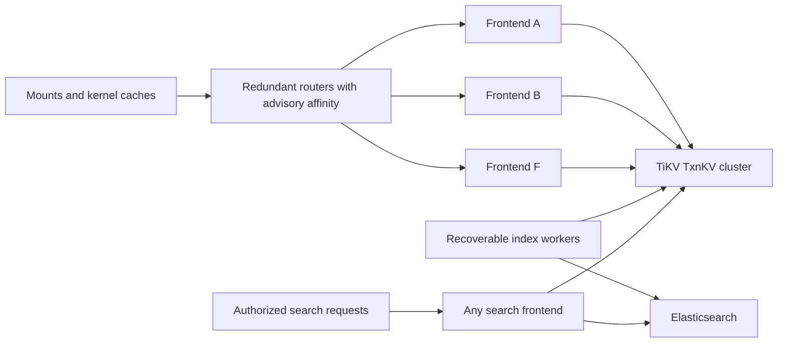
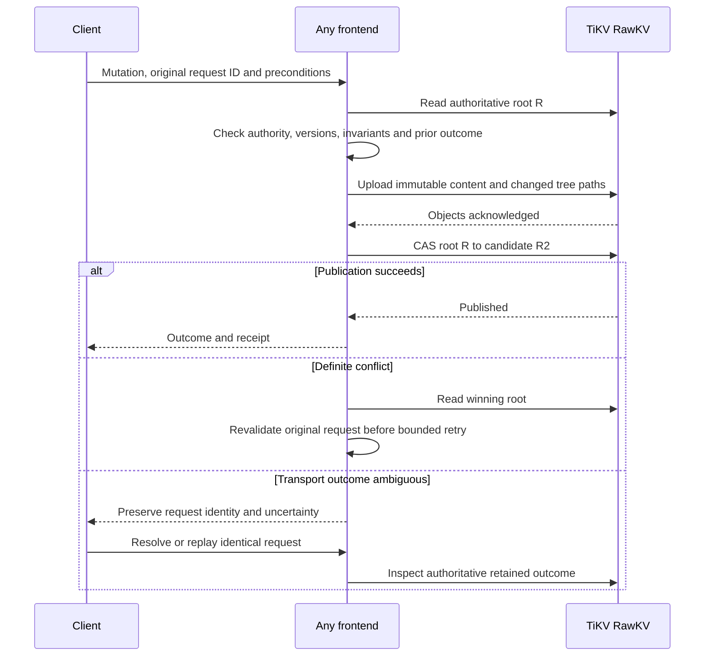

# Architecture: replicated storage, publication boundaries and derived views

[Current clean benchmark](../../dfs-bench/docs/RESULTS.md). Previous benchmark runs and timing reports were removed at the user’s request.

## Whole-filesystem freshness rework

The mount is a bounded-staleness replica of the authorized filesystem view. One shared validation epoch covers metadata and selected content generations. Read opens/closes should be local against shared view pins; ordinary head changes should use incremental projection updates. Existing descriptors must advance after expiry. Backend root publication, routing and indexing remain separate mechanisms. See [the active contract](CONSISTENCY.md) and [acceptance gates](ACCEPTANCE.md).

**Current implementation:** transactional TiKV records; interchangeable frontends; one-second metadata/revision validation; immutable content-hash caches and bounded read batches; asynchronous Elasticsearch indexing. Shared state/journal records remain a write contention point. [Current cache design](CONTENT_HASH_CACHE.md), [transactional storage](TXNKV_IMPLEMENTATION.md), [decisions](DECISIONS.md). Root/tree details later in this document describe the removed RawKV implementation.

## Responsibility and guarantee boundaries

TiKV replicates stored state (DDIA ch. 5). The application chooses publication/conflict boundaries (ch. 6–7). Mounts define cached reader observations (ch. 9). Elasticsearch maintains derived state (ch. 11–12). These layers compose a filesystem; none supplies all its semantics alone.

The deployed services run on VMs, with redundant managed ingress; see [actual host topology](TEST_TOPOLOGY.md). Routers prefer useful tenant caches using bounded, expiring cache/load/health hints. A hint confers neither authority nor ownership. Another frontend can continue using shared sessions, handles and outcomes after a process fails.

| State | Authority | Disposable acceleration |
|---|---|---|
| Namespace, inode metadata and content generations | TxnKV records selected by an MVCC snapshot | Frontend immutable-object cache |
| Chunks and manifests | Digest-checked immutable TiKV objects | Frontend, daemon and kernel caches |
| Credentials, sessions and filesystem policy | Shared configuration and authoritative TiKV state | Freshness-bound client observations |
| Handles, retry outcomes and receipts | TiKV | Process-local references |
| Index events and checkpoints | TiKV | Worker buffers |
| Search documents | Elasticsearch derived from TiKV | Search query snapshots |
| Cache affinity | Advisory router hints | Bounded local routing state |

## Replication is separate from write partitioning

TiKV divides its physical keyspace into Regions replicated with Raft. A cluster therefore has many replication groups rather than one global storage writer. Current filesystem transactions nevertheless share tenant state/journal dependencies. Different frontends can prepare concurrently, but those records remain a serialization point. The removed RawKV implementation had a single tenant-root CAS instead. See [TiKV Multi-Raft](https://tikv.org/deep-dive/scalability/multi-raft/).

A tenant root contains a revision and a pointer to an immutable metadata tree. Updating it copies affected tree paths, not the whole tenant's data. This distinguishes storage write amplification from publication contention. Tenant size, metadata cardinality, request rate and writer concurrency are separate load parameters.

[Root boundaries](ROOT_BOUNDARIES.md) gives file, directory, project and bucket alternatives. A scoped mount changes visibility, not the storage conflict domain. The current view API also scans tenant nodes before scope filtering, so a small mount does not yet imply small server-side metadata work.

## Historical atomic publication over RawKV

The removed code used `tikv_client::RawClient`. Its publication batch staged immutable objects and compared the exact observed root bytes. Current [PublicationBatch](../src/store.rs) delegates to TxnKV transactions; the diagram below explains the historical protocol. RawKV batch puts alone do not atomically expose a group of related filesystem records. See [the single-key CAS primitive](https://tikv.org/docs/5.1/develop/rawkv/cas/).

The selected tree contains related inode/entry/content changes, request outcome, receipt and indexing event. Readers traverse a captured immutable root and do not splice in another root midway. A conflicting root CAS requires fresh validation. A stale same-file precondition can fail even when internal publication retries remain available.

This is coarse optimistic concurrency control in DDIA chapter 7 terms. The application supplies transaction-like atomic publication, although it does not use TiKV's transactional API. A successful CAS is the publication point for that storage transition; it does not make the complete cached FUSE interface linearizable.

## Partial failure and replay

Shared control records make failover possible but also create write and retention costs. The historical baseline published every open/close. The current mount uses local descriptors with existing session/view pins. A pin preserves file identity across unlink and failover; authoritative version and permission checks fence every write. The [operation walkthrough](MOUNT_OPERATIONS.md) separates these phases and explains fsync receipt resolution.

## Reader observations and cache lifetime

The active client guarantee is bounded staleness of the complete filesystem view, including contents and already-open descriptors. A shared monotonic deadline starts with authoritative validation. Cache hits preserve that deadline; expired state requires demand validation and fails explicitly if validation fails. See [CONSISTENCY.md](CONSISTENCY.md).

Immutable byte buffers may be retained indefinitely within configured memory budgets, but their selection and authority expire. Revalidation of an unchanged head permits reuse. Changed file generations update size, EOF and selected chunks together. A file descriptor remains attached to its stable identity across unlink or rename-over, while subsequent operations on that identity follow current generations.

The kernel still caches names and attributes with remaining TTLs. The data-path rework currently uses direct I/O and a configurable daemon content cache, so every read can enforce the shared deadline without relying on size/mtime-based kernel invalidation. Each read pays a FUSE callback, including daemon-cache hits. Private mappings are readable but carry no live-view or whole-mapping snapshot guarantee, shared mappings are rejected, and mmap is explicitly outside the live-view guarantee. [Acceptance](ACCEPTANCE.md) links mounted proof and measurements.

Directory continuation retains coherent bounded snapshots. After expiry, validate unchanged entries and parent identity or require rewind. Independent syscalls are not one transaction. Cache freshness does not change backend atomic publication or ambiguous-retry handling.

## Metadata access is a separate scaling boundary

[MountCache](../src/mount_cache.rs) now requests `Changes` from its last validated cursor after expiry. An empty delta renews validation; ordinary changes update only affected nodes and entries. The cache validates identities, name uniqueness, bounds and cursor continuity before installing a delta under its projection lock. Policy/reset and incarnation boundaries fall back to an authorized snapshot.

[Engine::view](../src/engine/views.rs) still scans tenant nodes and establishes shared view pins for the initial/reset view. A small mount therefore does not yet imply small startup work. Incremental refresh addresses repeated work after ordinary edits; scoped demand loading is a distinct remaining scaling question. More than 128 unseen events requests a reset, regardless of whether they occurred within one second.

## Derived search and recoverable indexing

Filesystem publication durably includes an index event. Workers consume bounded batches, update selected ES documents with version checks and deletion tombstones, then advance a shared checkpoint bound to the index UUID. Another frontend can resume. A crash after ES acknowledgement and before checkpoint advancement causes replay; stale work must not overwrite a newer version.

Ordinary file edits are incremental. Replacing an index currently relies on retained-journal replay. File durability does not wait for Elasticsearch, and fsync does not mean the index is current. Current TiKV policy and file versions validate search candidates; stale index records cannot grant authority. Search pagination applies after authorization filtering and reports incomplete results when bounds, lag or source changes prevent completeness.

This is the system-of-record/materialized-view relationship from DDIA chapters 11–12. See [indexing design and races](INDEXING.md), [search query sequence](SEARCH_API.md) and [retention dependencies](RETENTION.md). Splitting file roots without reviewing the event sequence/checkpoint can leave another shared write bottleneck.

## Resource bounds and unfinished lifetime work

Caches, staging, scans, handles and admission have explicit bounds. A cache budget is not a bound on total process RSS. Limits may reject large views or requests; distributing storage does not remove those limits.

Immutable history, abandoned objects, expired control records and protected versions need safe reclamation. A collector must account for readers and still-eligible writers as well as current roots. Restarting a frontend does not reclaim authoritative TiKV data. [RETENTION.md](RETENTION.md) records the unimplemented protocol and required failure tests.

## Evidence and open design questions

The next architectural comparison is current shared-state TxnKV publication versus the proposed partitioned TxnKV metadata transactions. It must measure disjoint same-tenant writers, conflicting operations, metadata cardinality, mount startup, retained bytes and recovery—not just warm read throughput. [The proposal](TXNKV_DESIGN.md) states the invariant, lifetime and migration gates before any replacement.
