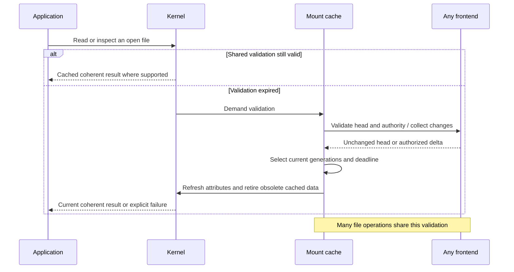

# One-second filesystem-view consistency

[Current clean benchmark](../../dfs-bench/docs/RESULTS.md). Previous benchmark runs and timing reports were removed at the user’s request.

The one-second deadline applies to **metadata, including file revision**. Immutable bytes may remain cached while validated metadata selects their revision and current authority allows access. Every mutation independently checks its expected revision atomically at the server; an observation less than one second old can still conflict. See the cross-backend [optimistic publication protocol](../../dfs/design/ONE_SECOND_VIEW.md).

A write can attempt an expired cached revision as its precondition: the conditional mutation performs the authoritative check, so it needs no separate preflight metadata fetch. This does not permit read/stat to return expired metadata, or renew READ authority after a WRITE-only authorization check. Rejection preserves the original payload's failure instead of silently rebasing it.

The client's filesystem view may lag committed authoritative state by at most its validation window: **500 ms** in the buffered-write revision, within the requested one-second metadata bound. This includes names, missing entries, directory entries, attributes, permissions, size, EOF and **file contents through an already-open descriptor**. Cache freely within that window. After expiry, demand must validate before reusing that state. Closing and reopening is not required to observe a remote edit to the same file.

**Implementation status: implemented, deployed and covered by GCP mounted tests.** This requirement supersedes metadata-only TTLs and immutable descriptors. [Acceptance](ACCEPTANCE.md) separates the new evidence from historical snapshot results and records benchmark and rollout status.

## Bounded staleness, coherent reads and publication

In DDIA terms, the client offers bounded staleness (chapters 5 and 9). Immutable generations provide coherent individual reads (chapters 3 and 7). Atomic backend publication and the client's validation window are separate mechanisms. A tenant-root CAS does not make a cached mount linearizable. Moving to [TxnKV](TXNKV_DESIGN.md) would not remove the cache protocol.

The window is elapsed monotonic time, not a wall-clock second bucket. Validation beginning at 12:00:00.800 expires at 12:00:01.300. A hit at 400 ms cannot grant another cache window. Start timing before the server request, so response latency consumes the window. A slow response cannot install a fresh cache window. If snapshot construction or delta transfer exhausts the window, the mount validates again from the installed cursor; bounded retry exhaustion returns a timeout rather than serving an expired projection. Operations already in flight can overlap a publication; this is not a promise of zero response latency or an atomic transaction spanning an application's separate system calls.

| Observation | Required behavior |
|---|---|
| Repeated access within the shared window | Reuse cached names, attributes, permissions and selected content generations; no RPC per access |
| First access after expiry | Validate authoritative state; coalesce simultaneous demand into the same refresh |
| No changes since validation | Renew the shared deadline and retain immutable bytes and metadata |
| Changed file | Select its new generation, size and EOF together; prevent old pages or delayed replies from being installed as current |
| Read on an existing descriptor | Follow changes to that file identity after expiry, including append, shrink and same-size/same-mtime rewrite |
| Rename over an open file | New path opens select the replacement; the existing descriptor remains attached to the old file identity |
| Unlinked open file | Preserve the old identity's lifetime, refresh link state and authority, and allow valid access through the retained pin |
| Changed directory during continuation | Validate and either continue an unchanged snapshot or require rewind explicitly; never silently mix entry generations |
| Refresh failure | Return an error for expired state; never silently serve it as a fallback |

One FUSE read reply binds its bytes and EOF to one generation. An application loop such as `read_to_end`, or a large syscall split into multiple FUSE requests, is not an atomic file snapshot; later requests can refresh to a newer generation.

A write acknowledgement updates the writer's own observable generation immediately. The one-second allowance is a maximum tolerated lag, not a reason to delay an update already known locally. Updating one cached file must not renew validation for unrelated files or hide another client's intervening commit.

## Shared validation and immutable caches

One mount-wide validation can cover many file operations. The fast path uses the authorized projection and local read handles. Existing session/view pins protect open-file lifetime across frontends without publishing an additional shared record on every ordinary read open and close. Writable descriptors also use session/view pins; each mutation still checks current permission and expected version at the frontend.

On expiry, validate the current filesystem head and authority. An unchanged head allows all covered immutable data to remain cached. A changed head should apply a contiguous authorized change set; reset, authority and incarnation boundaries require a validated replacement view. Installing a delta must be atomic from the cache's perspective. Do not advance a cursor without installing all its changes.

## Kernel data cache is a separate correctness boundary

Keep kernel names and attributes within the remaining shared deadline. Prefer kernel caching where it can enforce the content contract. Linux `FUSE_AUTO_INVAL_DATA` checks expired attributes for ordinary buffered reads, but automatic page invalidation compares size and mtime. A same-size rewrite with restored mtime therefore needs explicit generation-aware handling. Resident mmap pages may be read without entering FUSE at all. A metadata TTL alone does not prove content freshness.

Read/pread/stat must handle content changes without inventing a different public mtime or freezing an open descriptor. The initial rework uses direct FUSE data I/O and a 256 MiB default daemon content cache, configurable with `--content-cache-bytes`; kernel name/attribute caching remains enabled. This avoids unbounded page reuse and pays a FUSE callback for each read, even a daemon-cache hit. Performance must be measured before deciding whether additional kernel integration is justified. Local expiry/eviction is allowed; it is not a server notification channel. Any kernel caching mechanism must address delayed reads, concurrent faults, revocation and error paths before it is accepted. The user explicitly scoped the one-second promise to filesystem calls: mmap is not a live view. Existing mapped memory may retain older bytes and is not a revocation channel. With the current direct data path, shared mmap is rejected by Linux; private mappings are separate application-memory observations, not a way to obtain the live-view guarantee. The two-mount tests verify private mapping reads, shared-mapping rejection and live filesystem reads while a private mapping exists.

Primary implementation references: [Linux buffered reads and mmap](https://github.com/torvalds/linux/blob/v7.0/fs/fuse/file.c), [Linux attribute and inode invalidation](https://github.com/torvalds/linux/blob/v7.0/fs/fuse/inode.c). These explain the kernel boundary; mounted tests must establish the behavior of our actual release.

No remote Watch subscription or background head polling is required. Local cache timers may expire entries without network traffic. Remote validation happens on demand. Cache capacity and freshness are independent: configured memory limits bound retained working data, while validation controls whether retained state may be served.

## Historical evidence

[Operations](MOUNT_OPERATIONS.md), [decisions](DECISIONS.md), [architecture](ARCHITECTURE.md) and [benchmark method](BENCHMARKS.md) describe the consequences and remaining work.

## Buffered acknowledgements

The user approved a bounded client write buffer with durable fsync/unmount. The first implementation coalesces newly created files, their content and attributes; other mutations drain pending bytes before their existing synchronous path. Local acknowledgement updates the local view but is not proof of remote commit. One MiB/64-file batches become eligible for publication after 100 ms. Current authority and original version/entry fences are checked atomically at publication, with exact request replay on ambiguity and retained deferred errors after rejection.

The measured publication budget is 500 ms; combined with the 500 ms metadata TTL it targets one-second visibility during healthy operation. Publication stalls and partitions can exceed that target and are explicitly counted. Metadata still fails closed at expiry. See the [cross-backend protocol and measurement gates](../../dfs-bench/docs/WRITE_PATH_REWORK.md#bounded-client-publication-buffer).
