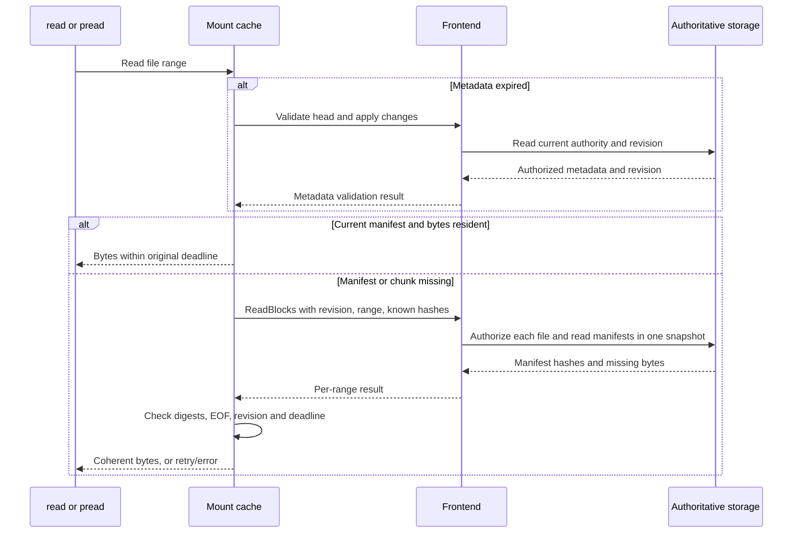

# Authorized manifests and immutable chunk reuse

[Current clean benchmark](../../dfs-bench/docs/RESULTS.md). Previous benchmark runs and timing reports were removed at the user’s request.

## What is cached

The one-second deadline covers metadata, selected revision, namespace and authority. It begins before validation is sent, so network delay consumes the window. A cache hit cannot extend it. Immutable chunk bytes have no TTL: validated metadata and a manifest determine whether those bytes may be used now. Reads through existing descriptors follow the current revision after validation; mmap is not a live view. Conditional writes still validate their original revision and current authority atomically at publication.

Each authenticated mount owns three bounded caches: manifest entries keyed by file identity, revision and chunk index; content bytes keyed by SHA-256; and previous hashes keyed by file identity and chunk index. Previous hashes only suggest bytes the client already holds. They never select a revision or grant access. Up to 8 MiB, or one eighth of the configured content budget, is divided between manifest entries and hints. The remainder holds bytes. Entry charges count toward that same budget; temporary admitted reads are separately bounded.

RocksDB retains its existing opaque storage chunk IDs. Its new read API derives wire hashes from verified stored bytes; known hashes save network payload, but this adapter still reads those local chunk records. TiKV and FDB already store content-hash chunk identities.

Changing mode or mtime advances the file revision but usually preserves its chunk hashes. The next manifest can therefore reuse all resident bytes. A partial rewrite replaces only the affected chunks. Sparse entries produce zeroes, short stored chunks zero-fill their remaining logical range, and the selected manifest controls EOF.

## Bounded miss protocol

`ReadBlocks` carries up to 16 file ranges and at most 32 expanded 64 KiB chunks in total. Each range includes file identity, immutable revision, offset, size, optional retained handle and known hashes. A range is limited to 1 MiB. The reply contains identity, revision, file size, first chunk index, manifest hashes and only unknown payloads. Expanded payload is bounded by 2 MiB before wire overhead.

A lazy worker drains already queued misses after yielding once; there is no timer or background prefetch. One batch has one server session/snapshot context, but each file and retained handle is authorized separately. The FDB rework uses one fixed native read version and transaction, bounded to four seconds. One invalid file produces an error for its range; invalid envelopes or unavailable context fail the batch. Batch concurrency is bounded by the configured read admission; shutdown drains admitted work. Range futures share one snapshot; FDB can overlap their storage reads. The TiKV adapter still serializes point reads within its transaction object, while independent batches can proceed concurrently. Serial workloads may still make one RPC per miss.

The client pins bytes named as known until the reply arrives, checks payload digests, identity, revision, range and EOF, then revalidates its metadata deadline and authority before installation or successful return. Revocation or a delayed remote truncate cannot turn an old reply into a fresh observation. Hash lookup is never an unauthenticated content API.

## DDIA interpretation and remaining costs

This is a disposable read replica over authoritative state, with bounded stale observations (chapters 5 and 9), immutable content addressing and application caches (chapter 3), and optimistic conditional publication (chapter 7). Storage partitioning (chapter 6) remains separate: batching reads does not remove TxnKV's shared journal/state write dependency or FDB's shared filesystem state/journal dependency. Neither implementation claims the partitioned filesystem writes specified in [TxnKV v2](TXNKV_DESIGN.md).

Direct I/O still incurs FUSE callbacks, copies and cache synchronization on resident reads. Reading many cold files serially still incurs repeated server contexts. Initial/reset views still scan the tenant. This change does not implement scoped metadata paging, garbage collection, kernel data coherence, concurrent mutation batching, or fsync receipt redesign.

## Code and rollout

| Layer | RocksDB | TiKV | FoundationDB |
|---|---|---|---|
| Cache and batching | [block_cache.rs](../../dfs/src/live/block_cache.rs) | [block_cache.rs](../src/block_cache.rs) | [block_cache.rs](../../dfs-fdb/src/block_cache.rs) |
| Deadline and authority | [mount_cache.rs](../../dfs/src/live/mount_cache.rs) | [mount_cache.rs](../src/mount_cache.rs) | [mount_cache.rs](../../dfs-fdb/src/mount_cache.rs) |
| Authorized snapshot reads | [engine.rs](../../dfs/src/engine.rs) | [content.rs](../src/engine/content.rs) | [content.rs](../../dfs-fdb/src/engine/content.rs) |
| Regression tests | [live.rs](../../dfs/tests/publication/live.rs) | [frontend.rs](../tests/frontend.rs) | [frontend.rs](../../dfs-fdb/tests/frontend.rs) |

The appended `Call::ReadBlocks` and `Reply::Blocks` preserve prior serialized variant tags. Old clients can use the updated frontend's old read API. New clients require updated frontends; there is no feature negotiation or fallback. Update frontends before mounts. The filesystem mutation protocol is unchanged.

RawKV's store, persistent-tree implementation, backend selector, RawKV storage tests and migration executable were removed. Existing RawKV datasets are not TxnKV datasets and are not silently converted. Historical benchmark reports and datasets were deleted; the clean comparison records current binaries.
