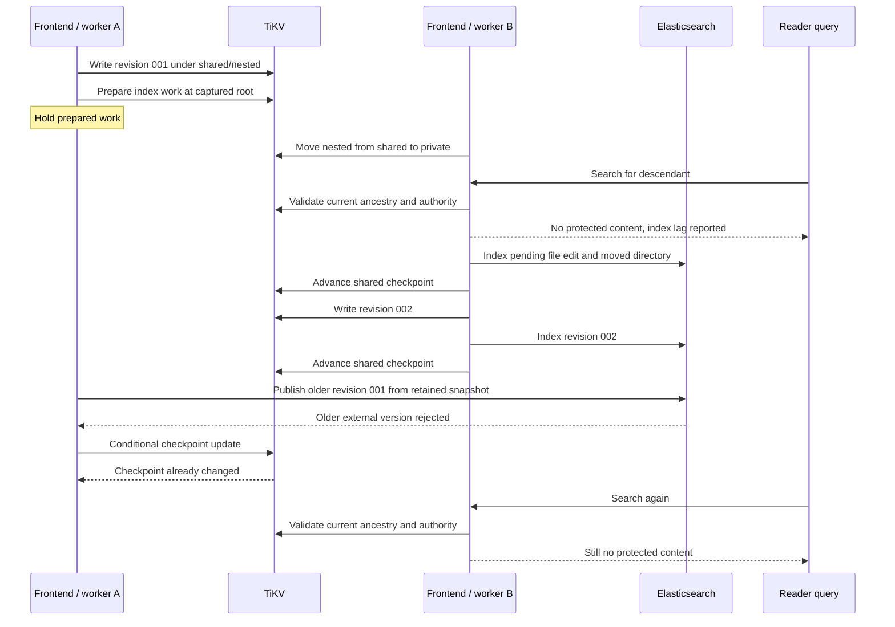

# Incremental indexing across interchangeable frontends

[Current clean benchmark](../../dfs-bench/docs/RESULTS.md). Previous benchmark runs and timing reports were removed at the user’s request.

## Whole-filesystem freshness rework

The one-second contract governs the mounted source filesystem, not Elasticsearch indexing lag. Source file generations refresh on existing descriptors; ES remains an asynchronous materialized view with explicit checkpoints and current-authority validation. File caching must not wait for ES progress. See [the active contract](CONSISTENCY.md) and [acceptance gates](ACCEPTANCE.md).

## Source of truth, change stream and materialized view

In DDIA chapters 11 and 12 terms, TiKV holds the system of record and Elasticsearch holds derived state. A filesystem publication includes its index event atomically; the worker later applies it to ES and advances shared progress. This avoids requiring a cross-system distributed transaction for each write, while making index lag and replay part of the contract.

A crash after ES acknowledgement but before checkpoint advancement causes replay. Version checks and tombstones make that replay safe for the tested interleavings. Current filesystem authorization remains authoritative; a stale derived document cannot grant access. Ordinary edits select affected documents. Replacing an index is a recovery operation and currently depends on retained journal history.

Partitioning this stream is a separate design problem from splitting file roots. A global per-tenant event sequence or checkpoint updated by every writer can recreate a hot key. A [TxnKV redesign](TXNKV_DESIGN.md) must preserve atomic source/event updates while reviewing those shared records. See [retention](RETENTION.md) for the journal-truncation gap and [primary design references](READING_GUIDE.md).

Every frontend can run an index worker. Workers read filesystem events and their shared checkpoint from TiKV, extract documents from an immutable snapshot, publish versioned Elasticsearch updates, and conditionally advance the checkpoint. No frontend owns a tenant's index progress.

An ordinary edit updates the affected file document. A directory move updates the moved directory's own metadata; descendant authorization is checked against current TiKV ancestry at query time. The index does not store inherited ACLs or denormalized ancestor paths as authority. Recreating the Elasticsearch index changes its UUID and triggers retained-journal replay; that recovery path is different from ordinary incremental edits.

Implementation: [event selection and extraction](../src/engine/indexing.rs), [publication and checkpoint orchestration](../src/search/mod.rs), [Elasticsearch requests](../src/search/elastic.rs), [worker loop](../src/search/worker.rs), and [search validation](../src/search/query.rs).

## Directory move during delayed index publication

The acceptance test deliberately retains worker A's prepared snapshot while frontend B moves the subtree, indexes it, and writes a newer file version. Worker A then tries to publish its older work.



## Performance boundary

The reworked worker range-reads at most 1024 contiguous events, coalesces node identities, and fetches at most eight documents concurrently. Encoded materialization is bounded to 64 MiB; capacity or snapshot deadlines reduce the attempted batch. It materializes source documents before Elasticsearch writes, sends bounded bulks without per-bulk refresh waits, and acknowledges one explicit refresh before checkpoint advancement. This includes passes containing version conflicts. Existing backlog is drained without a fixed sleep; a caught-up or failed pass retains the 500 ms pause. The [clean benchmark method](../../dfs-bench/docs/METHOD.md) keeps indexing enabled and reports catch-up separately. [Rework evidence and tradeoffs](../../dfs-bench/docs/WRITE_PATH_REWORK.md) distinguish the former 16-event loop from this implementation.

The old isolated-index measurements and their artifacts were deleted. The current [results](../../dfs-bench/docs/RESULTS.md) use the deployed worker, three dedicated ES hosts and the normal index settings.

## Correctness tests

On a GCP source host, supply the current test cluster endpoints:

```sh
DFS_TIKV_TEST_PD="$PD_ENDPOINTS" \
DFS_TIKV_TEST_ES="$ES_ENDPOINTS" \
cargo test --locked --test indexing -- --ignored --nocapture --test-threads=1
```

The [test source](../tests/indexing.rs) checks incremental edits, unchanged documents, delayed work and current authorization. These tests are separate from the single-client performance run. Safe reclamation of retained filesystem history remains unfinished; see [retention](RETENTION.md).

## Literal candidates and checkpoint dependencies

The current rework selects a `dfs-v2-` index identity with a `text.literal` wildcard multi-field. Literal substring queries escape wildcard syntax and use that field to select body candidates; basename substrings use the basename keyword field. Returned candidates still require current filesystem authority, matching revisions, and exact literal checks. This replaces the previous full candidate scan and one-body-request-per-document behavior. Existing v1 index checkpoints cannot establish completeness for the new mapping.

Checkpoint transactions now authenticate the unscoped administrator and fence the expected checkpoint without loading the filesystem tenant head. Filesystem transactions and search results retain their existing policy validation. [Implementation status and measured motivation](../../dfs-bench/docs/WRITE_PATH_REWORK.md) distinguish this revision from the first parallel extraction run.
