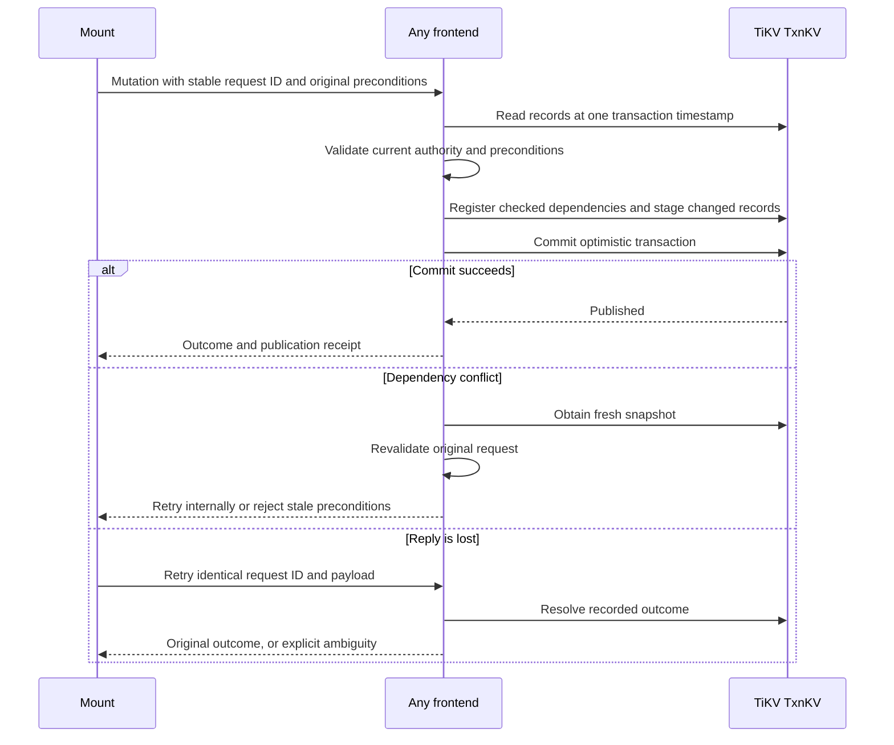
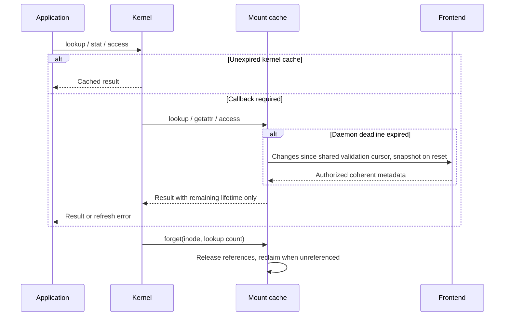
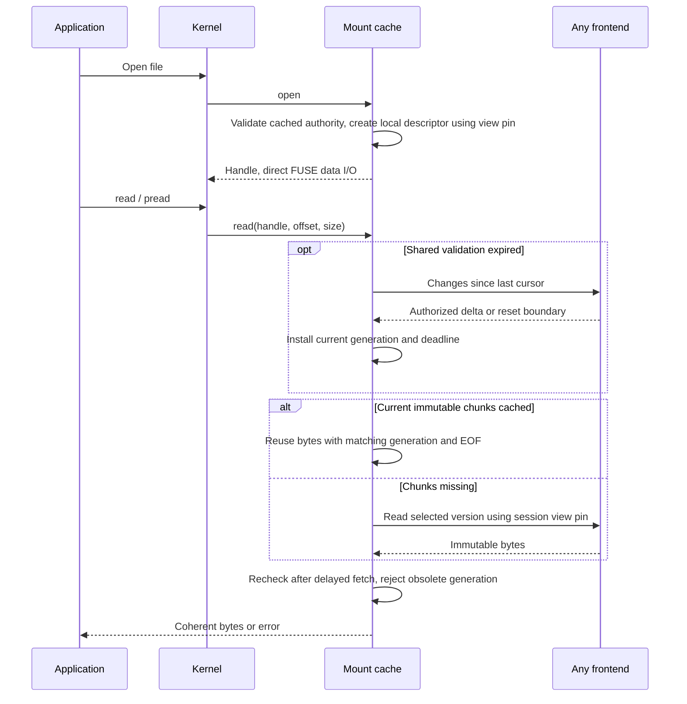
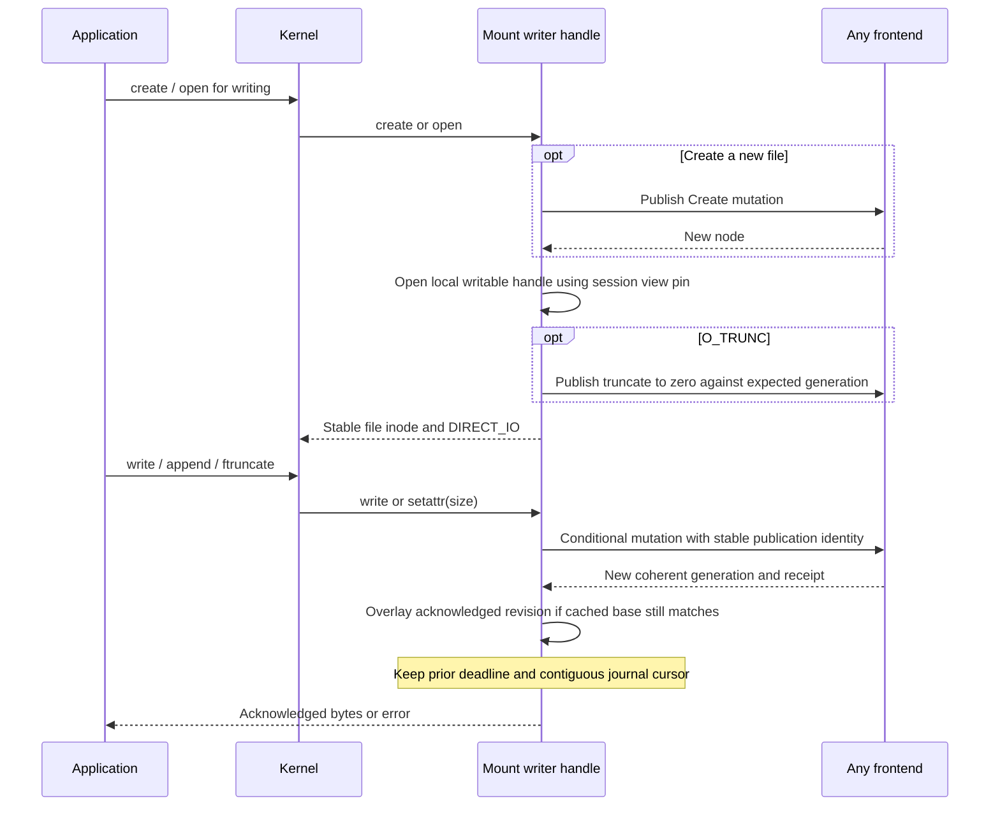
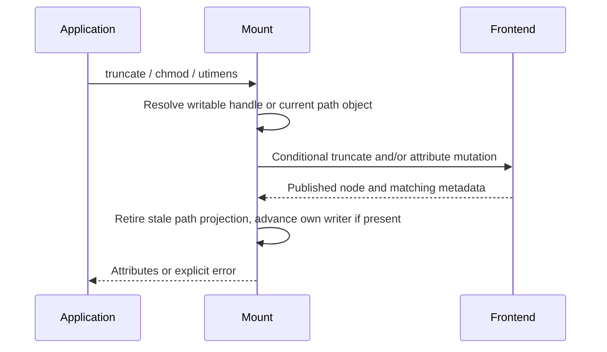
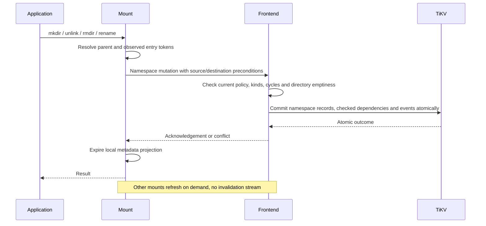
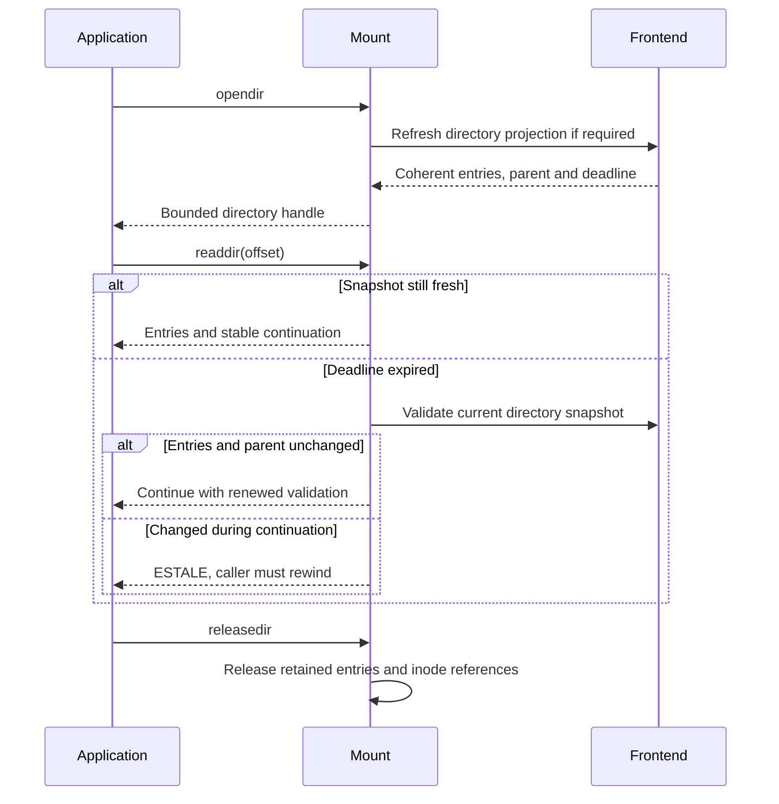
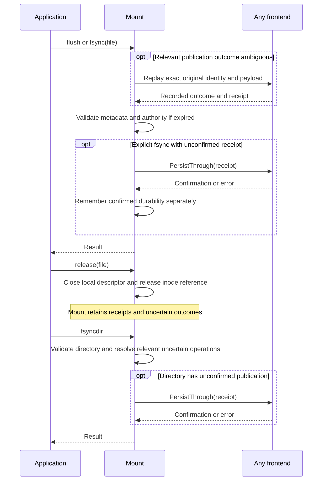

# FUSE operations with TiKV transactions

[Current clean benchmark](../../dfs-bench/docs/RESULTS.md). Previous benchmark runs and timing reports were removed at the user’s request.

The default mount uses a bounded new-file write buffer, local revision overlays, asynchronous content reads and mount-owned receipt tracking. The [cross-backend design](../../dfs/design/ONE_SECOND_VIEW.md) records the turbopuffer reference and the one-second metadata/revision rule. The [clean benchmark](../../dfs-bench/docs/RESULTS.md) records the exact current binaries.

## Buffered create/write/close path

The new default path coalesces newly created files, writes, truncations and attributes into one atomic `PutFiles` publication, bounded to 64 files and one MiB. Ordinary close preserves pending data; fsync and graceful unmount drain and confirm durability. Existing-file edits and namespace operations retain the synchronous sequences below after draining accepted buffered changes. The metadata TTL is 500 ms, and publication age is measured against a separate 500 ms budget.

The [cross-backend sequence diagram and failure boundaries](../../dfs-bench/docs/WRITE_PATH_REWORK.md#bounded-client-publication-buffer) describe this outer client path. For example, extracting 32 small files can perform 32 creates plus writes and attributes locally, then one transaction. If another client creates one of those names first, the batch publishes none of its files and retains the conflict for fsync; it does not overwrite that client's file. Losing the commit reply resends the same sealed request, so the 32-file group cannot be published twice.

The transaction sequences below remain the authoritative publication step; a local buffered acknowledgement precedes that step and is volatile until synchronization succeeds.

## Whole-filesystem freshness rework

The operation sequences describe live descriptors and shared validation. Read and write opens/closes reuse local state within the window; reads and fstat after expiry adopt the current file generation. Rename-over still preserves the original open file identity. Old snapshot behavior is not the active contract. See [the active contract](CONSISTENCY.md) and [acceptance gates](ACCEPTANCE.md).

## Reading these sequences through DDIA

Each mutation sequence has an invariant, a publication point and a retry outcome (ch. 7–9). Content preparation can happen concurrently; TiKV commits related records atomically, while shared tenant state/journal dependencies still make unrelated writes compete. A timeout after that point is an ambiguous result, not proof of abort. Reads use immutable generations plus the separate cache contract; transaction atomicity does not make cached observations globally linearizable.

For create and rename, track directory entries, inode state, authority and request outcomes together. For open/read/close, track the lifetime of an immutable version and the current authority to use it. For fsync, distinguish acknowledged source publication from eventual search indexing (ch. 11). The mutation sequences describe current TxnKV v1 publication. [Smaller roots](ROOT_BOUNDARIES.md) explain alternative conflict boundaries; [partitioned TxnKV transaction sets](TXNKV_DESIGN.md) remain v2 design work.

This describes the current standalone [mount](../src/mount.rs), [file handles](../src/mount_files.rs), and [cache](../src/mount_cache.rs). [Consistency](CONSISTENCY.md) defines the one-second deadline for the whole filesystem view. [Topology](TEST_TOPOLOGY.md) shows the actual GCP hosts.

## Distributed writers and atomic publication

Any frontend can handle any configured tenant. There is no designated writer or frontend owner. TiKV distributes and replicates records, but current filesystem mutations share tenant state/journal dependencies and can conflict even for unrelated files.

[PublicationBatch](../src/store.rs) uses [optimistic TxnKV transactions](../src/txn_store.rs). Metadata, directory entries, immutable manifests/chunks, request outcomes and indexing events commit coherently. Reads within an operation use one MVCC timestamp. The removed RawKV tree and root CAS are no longer the publication mechanism.

The earlier “one frontend per namespace” and “full Elasticsearch rebuild” limitations do not describe this implementation. Sessions, view pins, request outcomes and indexing checkpoints are shared in TiKV; ordinary mount descriptors are local. Ordinary edits generate incremental indexing work; an index replacement may require retained-journal replay. See [indexing](INDEXING.md). File publication does not wait for Elasticsearch.

## Lookup, getattr, access and forget

Scenario: client B repeatedly checks for a file that client A is uploading.

Kernel positive/negative entries and attributes share the daemon's validation deadline. A daemon snapshot validated 700 ms ago can grant at most 300 ms more cache lifetime, with a small conservative deduction for kernel timer rounding. Expired validation failure returns an error. A path stat observes current metadata after refresh; `fstat` on an existing descriptor refreshes its current generation, attributes and size after expiry.

`access` checks effective server policy verbs. Unix mode bits do not replace the policy model. Names must be UTF-8. `forget` is local reference accounting, not a remote delete.

The [fast-path follow-up](../../dfs/design/CACHE_FAST_PATH.md) populates kernel metadata through readdirplus and completes valid resident-data hits synchronously; cache misses and expired validation retain bounded asynchronous handling.

## Open and read

Scenario: B keeps a report open while A rewrites it. B may reuse its validated version within the window; after expiry, another read or fstat on the same descriptor observes the current generation. An append becomes readable without reopening.

The inode identity remains stable across edits. Version fences belong to selected content and write preconditions, not a permanently frozen read inode. The initial data path uses direct I/O with daemon caching to avoid indefinite kernel-page retention; kernel buffered caching and mapping modes require explicit proof before acceptance. See [the kernel boundary](CONSISTENCY.md).

## Create, write, append and truncate

Scenario: A uploads a report, performs a sparse write, then truncates it. Writers use direct I/O, so there is no deferred kernel writeback buffer. Each acknowledged publication binds its matching size and blocks. A large application write may become several FUSE requests and publications; whole-upload atomicity is not promised. Publish to a temporary name and rename when whole-file visibility matters.

Readers and writers refer to the same stable file identity. Writers publish against their selected expected generation; concurrent modification can return ESTALE even inside one second. Refreshing the view supplies a new base, but must not silently replay an ambiguous mutation with a new identity or payload. No writer has priority.

## Setattr

`setattr(size)` publishes truncate, including sparse extension. Mode and mtime changes publish metadata updates. Acknowledged changes advance the writer immediately; other descriptors refresh within the shared bound. Inode identity does not change merely because file content changes.

Arbitrary ownership changes, independent atime changes, and attribute flags are unsupported. Noatime is the normal mount setting.

## Mkdir, unlink, rmdir and rename

Scenario: publish a completed temporary report by renaming over the old report. Existing readers of the old target keep its contents; subsequent path opens see the replacement after metadata refresh.

Ordinary rename and `RENAME_NOREPLACE` are supported. Exchange/whiteout flags are not. An open unlinked file remains readable through its retained shared handle; its link count must refresh after expiry.

## Opendir, readdir and releasedir

Scenario: `ls` spans multiple kernel reads while another client moves the directory or changes its entries.

The mount omits kernel directory-page caching so continuation reaches the daemon. Kernel name/attribute caching remains enabled with bounded TTLs. Directory handles and aggregate snapshot memory have explicit limits.

## Flush, fsync, fsyncdir, release and shutdown

The mount separates deferred-error handling from explicit persistence confirmation:

TxnKV publication acknowledgements precede successful namespace replies. The mount keeps bounded receipt and ambiguous-request tracking at mount scope so close/reopen does not lose an obligation. Flush resolves deferred publication errors; explicit fsync confirms outstanding durability and remembers success. Confirmed receipt state never renews metadata or permission validity. Directory fsync can resolve tracked uncertain mutations affecting that directory; it cannot reconstruct an unrecorded request from another mount.

TiKV confirms already committed transactional receipts; RocksDB additionally needs its local WAL persistence barrier. See [the RocksDB-specific persistence distinction](../../dfs/design/ONE_SECOND_VIEW.md#durability-is-separate).

SIGINT/SIGTERM detaches the mount and joins its request thread and drains admitted asynchronous read replies before shutting down the async runtime. Lazy unmount can wait for open descriptors to close. The benchmark gives the mount 60 seconds to exit before forced termination and records its exit status; close application descriptors before stopping it for graceful teardown.

## Unsupported operations and evidence

`statfs` returns `EOPNOTSUPP`. Hardlinks, symlinks/readlink, xattrs, explicit locking, fallocate, copy-file-range and other optional callbacks are not implemented. This is not a full POSIX compatibility claim.

[Acceptance](ACCEPTANCE.md) links real GCP kernel tests, standalone process tests and rollout/failure evidence. The new daemon cache can avoid network work on repeated reads; the current direct data path still uses FUSE callbacks; [current measurements](../../dfs-bench/docs/RESULTS.md) must retain their stated cache, topology and workload boundaries.
