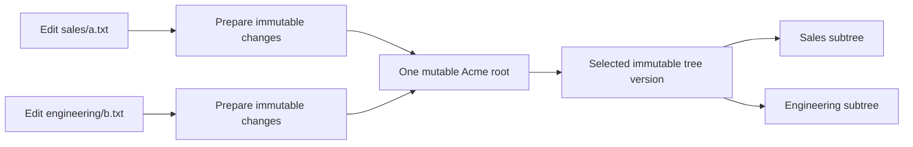

# Choosing roots and transaction boundaries

[Current clean benchmark](../../dfs-bench/docs/RESULTS.md). Previous benchmark runs and timing reports were removed at the user’s request.

## Whole-filesystem freshness rework

A publication root defines an atomicity/conflict domain; a client validation epoch defines maximum observation age. They need not have the same granularity. Smaller roots must still let a mount validate all accessed state within one second. Mount scope and client caching do not require tenant-wide rewrites or per-open publication. See [the active contract](CONSISTENCY.md) and [acceptance gates](ACCEPTANCE.md).

**Status:** the tenant-root CAS below describes removed RawKV code. Current TxnKV stores transactional records but still has shared tenant state/journal dependencies. Smaller independent filesystem publication domains remain v2 design work. See decisions D01, D02 and D17 in [DECISIONS.md](DECISIONS.md).

## Four meanings of root

| Term | What it selects | Example |
|---|---|---|
| Namespace root | Where pathname traversal begins | `/` in a mount exposing only `/projects/payments` |
| Immutable tree root | One particular data-structure version | A digest identifying a persistent metadata tree |
| Publication root | The mutable record selecting currently published state | The current tenant record containing revision and tree pointer |
| Storage partition | Where the database places and replicates keys | A TiKV Region; it is not a filesystem root |

The first three can be related without being identical. Mounting `/projects/payments` chooses a visible namespace. It does not create an independent publication key, divide the tenant's write conflicts, or necessarily limit metadata work to that subtree. The current server builds a view by scanning tenant nodes before scope filtering; see [view construction](../src/engine/views.rs).

In DDIA's vocabulary, replication determines how copies survive failures; partitioning and transaction boundaries determine where load and conflicting work accumulate. These are separate design decisions. Our tenant root is an application publication boundary layered over TiKV's physical Regions. Chapter references throughout these documents use the first edition; [the reading map](READING_GUIDE.md) records the sources and limits of the analogy.

## What the current root actually does

Imagine tenant Acme contains a million files. Alice edits `/sales/a.txt`; Bob edits `/engineering/b.txt`. Both read root R100 and prepare different immutable tree paths. Alice publishes R101. Bob's CAS against R100 fails, even though the files are unrelated. Bob must reload and revalidate before publishing R102. It is the shared publication key that creates the conflict.

Changing the pointer does **not** copy a million files. The persistent tree copies affected paths and shares unchanged subtrees. The costs are path copying, failed preparation, root contention and retained history. A whole-view metadata refresh is a separate read-side cost.

This boundary is justified if an application genuinely needs an atomic snapshot of the entire tenant, or if measured write demand is small enough that simplicity wins. Our selected semantics require coherent files and directory enumeration; they do not establish a requirement for atomic tenant-wide publication. That makes the present boundary a choice to revisit.

## Concrete alternatives

| Boundary | Example and atomic unit | What can proceed independently | What still needs coordination |
|---|---|---|---|
| File/inode | `inode/123/current` selects generation, size, attributes and manifest | Rewriting invoice 123 and report 456 | Create/unlink, link lifetime, permissions, retries and indexing events |
| Directory | `directory/42/current` selects its entry map | Creates in `/sales` and `/engineering` | Two creates in one hot directory; rename between directories |
| Project/repository | `project/payments/release` selects a complete project snapshot | Publishing payments and analytics releases | Concurrent edits to one project; cross-project moves |
| Fixed bucket | `bucket/hash(inode)%256/current` selects a metadata partition | Mutations assigned to different buckets | Hot buckets and operations spanning buckets; bucket count changes |
| Tenant | `tenant/acme/current` selects all tenant state | Acme and another tenant | Every changed publication within Acme |

### File roots: independent edits

Store directory entries as `name → stable inode ID`. Store the file's changing generation separately. Updating invoice 123 then changes its file head without updating the directory's content identity.

If a directory instead embeds each child's current content hash, every edit changes the directory hash, then its parent's hash, up to a shared mutable ancestor. Merely drawing several roots underneath a tenant pointer does not remove contention if every edit still replaces that pointer.

A file root alone is insufficient for atomic create: the directory entry, inode metadata and retry outcome must appear together. This is where short multi-key transactions are attractive. A file root is also separate from the immutable generation selected for an individual read. An existing descriptor must refresh that selection after its one-second window.

### Directory roots: namespace operations

Creating `/sales/january.csv` affects the sales directory and the new inode. Creating `/engineering/build.log` can use different records. Renaming january.csv into engineering must remove one entry and insert another atomically, while preserving replacement and authorization rules.

One directory root makes a coherent directory listing straightforward, but concentrates creates in a busy directory. With per-entry transactional records, a directory generation or guard may still be required for emptiness checks and enumeration. The invariant, not the word “directory,” decides which operations must conflict.

### Project roots: deliberate whole-project snapshots

A static website release may need `index.html`, scripts and assets to become visible together. Publishing a single release pointer is a good fit. Several users editing unrelated documents generally do not need this release-level atomicity for each keystroke.

Git supplies a useful structural analogy: refs name commits, which identify immutable repository history and trees. That explains a mutable selector over immutable state; it does not establish our distributed failure or authorization guarantees. See [Git references](https://git-scm.com/book/en/v2/Git-Internals-Git-References.html) and [Git objects](https://git-scm.com/book/en/v2/Git-Internals-Git-Objects).

### Bucket roots: distribute load independently of paths

Hashing stable inode IDs across 256 buckets can spread unrelated content updates even if all files are under one mounted directory. A subtree mount may touch many buckets. This is useful when write distribution matters more than pathname locality, but cross-bucket namespace operations still require coordination. The number 256 is illustrative, not a measured recommendation.

## How to choose

1. List the invariants that must change atomically: file generation, entry/inode relationship, rename, authority, outcome and index event.
2. Map actual operations to the records they read and write. Include negative checks such as “destination is empty” and “move creates no cycle.”
3. Identify hot shared records: root, parent generation, quota counter, session counter, journal sequence or checkpoint. Splitting only file heads can leave the same bottleneck elsewhere.
4. Define read snapshots and their lifetimes. One served file read, one directory enumeration and one explicit project release have different lifetimes; opening a file no longer freezes its version. A mount path is an access scope, not proof of ownership.
5. Measure disjoint writers within one tenant, overlapping writers and cross-boundary operations. Compare conflicts, successful throughput, latency and retained bytes as tenant metadata grows.

The preferred candidate is [TxnKV metadata transactions](TXNKV_DESIGN.md) with immutable file generations. Its atomic boundary is the operation's bounded record set; a permanent tenant-wide publication root need not participate. Snapshot isolation still requires explicit conflict guards for filesystem invariants. This proposal does not yet establish a safe key layout, migration or measured throughput improvement.
