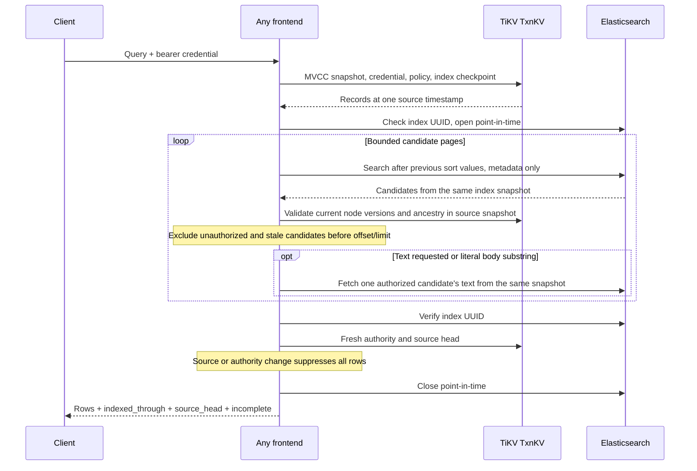

# Distributed search API

[Current clean benchmark](../../dfs-bench/docs/RESULTS.md). Previous benchmark runs and timing reports were removed at the user’s request.

## Whole-filesystem freshness rework

Search remains an explicitly lagging derived view. The new one-second bound applies to mounted filesystem observations, including open-file content; it does not turn ES results into an atomic source snapshot or remove current-authority validation and incomplete-result signaling. See [the active contract](CONSISTENCY.md) and [acceptance gates](ACCEPTANCE.md).

## Query consistency over derived data

Using DDIA chapters 11 and 12, this API joins a derived search projection with authoritative filesystem state. An Elasticsearch point-in-time stabilizes candidate enumeration; a TiKV snapshot supplies policy and file versions. They are not one cross-system transaction. Final source/authority validation and explicit incomplete results handle the tested changes and lag rather than claiming simultaneous visibility.

This distinction matters after rename, revocation and replacement: indexed text can remain searchable internally while no longer being returnable to the caller. [INDEXING.md](INDEXING.md) explains publication/replay, [CONSISTENCY.md](CONSISTENCY.md) distinguishes mounted observations, and [READING_GUIDE.md](READING_GUIDE.md) supplies design references.

Enable HTTP search inside any frontend with `--search-listen 127.0.0.1:7545`, alongside its `--elasticsearch` and `--index-tokens` configuration. For a private-network listener, supply the same `--tls-cert` and `--tls-key` used by RPC. The implementation refuses non-loopback plaintext listeners.

Each frontend serves the same tenants from TiKV and Elasticsearch. HTTP queries authenticate the bearer credential against a fresh TiKV snapshot and do not create persistent filesystem sessions, take a writer lock, or publish a tenant root. A replacement frontend needs the shared configuration and cluster endpoints; it has no query state to recover from the previous process.

The [OpenAPI document](../search/openapi.json) is also served at `/lexical/openapi.json`.

```http
POST /v1/workspaces/my-tenant/lexical/documents/query
Authorization: Bearer <credential>
Content-Type: application/json

{"query":{"type":"match","terms":"release checklist"},"k":20,"offset":0,"include_text":true}
```

| Table | Queries | Returned data |
|---|---|---|
| `nodes` | `all`, `node`, `exact`, `prefix`, `substring` | Current visible name, kind, size, modification time, content status, node ID and source version |
| `documents` | `all`, `node`, `match`, `phrase`, `substring` | Node ID, source version, score; text when requested |

Requests use the shared lexical API shape. Elasticsearch uses its standard analyzer and native scores for word/phrase queries; ranking and tokenization are not guaranteed identical to the sibling Tantivy implementation. Name matching and literal substrings are case-sensitive. `match` requires all analyzed terms. Queries with no analyzed terms return no matches. Binary files and files larger than 8 MiB have searchable metadata but no indexed body.

## Query sequence



Elasticsearch is a derived index, not an authorization store. Body queries require `READ`, even when metadata is visible through another permission. Grants and group membership come from the captured TiKV state. Moving a directory changes inherited authority immediately without rewriting every descendant's Elasticsearch document. Candidate content version, entry token, size, and modification time must match that state.

The final TiKV read checks that the credential/session is still valid and the source head and authority have not changed. If a mutation occurred during the query, rows are suppressed and `dfs.incomplete` is true. This is conservative: a write to an unrelated file can require retrying the query. As with filesystem reads, a revocation published after the final authority check cannot retract a response already in flight.

Pagination counts accepted matches before applying `offset` and `k`. An unauthorized hit does not consume a result slot. `dfs.incomplete` also reports indexing lag, discarded stale versions, or exhaustion of the candidate budget. A missing index, partial shard response, timeout, or storage error fails the request; it is not converted into an empty successful result.

## Bounds and current limits

There are at most eight active queries per `Search` instance, 100 metadata candidates per page, 10,100 examined candidates per query, 100 returned rows, and an offset up to 10,000. Requests are limited to 16 KiB, queries to 30 seconds, and serialized result rows to slightly below 16 MiB. Each extracted file is at most 8 MiB. Elasticsearch responses are separately bounded by the internal client. These limits bound admitted work and buffers; they are not a total RSS guarantee.

Literal substring matching currently scans candidates and verifies the actual string. It can exhaust the candidate/time budget on large corpora. It does not yet have a dedicated substring index. Other queries use Elasticsearch predicates. Point-in-time handles expire after one minute if a process dies or cancellation prevents explicit closure. Pagination is internal to one HTTP request, following Elasticsearch's [point-in-time and search-after API](https://www.elastic.co/guide/en/elasticsearch/reference/8.19/paginate-search-results.html).