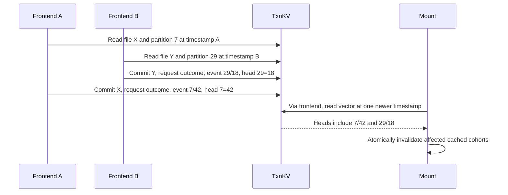
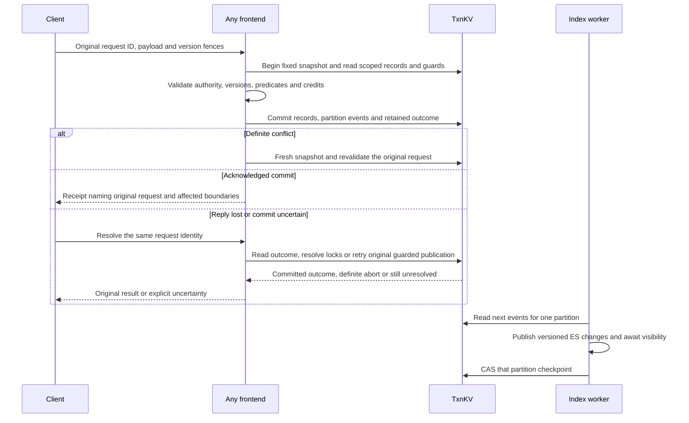

# Transactional filesystem design

[Current clean benchmark](../../dfs-bench/docs/RESULTS.md). Previous benchmark runs and timing reports were removed at the user’s request.

The design delegates atomic multi-record commit to TiKV. It gives each file a stable identity and each directory an explicit membership boundary, and replaces tenant-wide mutation bookkeeping with bounded partitions. A tenant remains an authorization and quota boundary, not the record that every write must replace. DDIA chapter numbers below refer to the first edition.

RawKV runtime support has been removed. [Content-hash reuse and bounded read batches](CONTENT_HASH_CACHE.md) are implemented in the v1 mounts; they do not implement the partitioned write/scoped metadata requirements below.

## Requirements and decisions

| Requirement | Decision |
|---|---|
| Atomic file update | Commit the node's generation, size, attributes, bounded content edits, request outcome and affected journal events together |
| Distributed writers | Any frontend may operate on any partition; no frontend ownership or local writer mutex |
| Independent files | No mandatory tenant-wide write or optimistic read lock in the ordinary write path |
| Directory correctness | Explicit membership guards for insertion, removal, emptiness and coherent enumeration |
| Current authority | Snapshot reads plus partitioned authority fences; revocations conflict with affected in-flight mutations |
| One-second freshness | Demand validation, shared within a bounded cache cohort; no Watch or background remote polling |
| Open/unlink lifetime | Stable inode identity and shared discovery pins; opens/closes remain local |
| Bounded memory/work | Paged scope-local reads; bounded transaction edits, ancestry, validation batches and maintenance batches |
| Retry safety | Original request identity and payload survive retries; ambiguous commit never means definite abort |
| Derived search | Atomic outbox events, independent per-partition checkpoints, monotonic per-document versions |
| Recovery | Expiry and generation fences survive paused processes; collection never depends only on local time or process ownership |

Transactions use the pinned Rust client's ordinary optimistic two-phase commit initially. Async commit, one-phase commit and pessimistic transactions are separate experiments. Optimism means preparing without an exclusive application owner and checking conflicts at commit; it does not mean omitting dependencies or assuming a one-second window makes races harmless. [TiKV's isolation discussion](https://tikv.org/deep-dive/distributed-transaction/isolation-level/) explains why snapshot isolation alone permits write skew.

## Publication boundaries and concrete examples

A root has several meanings here. The tenant's namespace root is a stable inode used for reachability. A mount root is its authorized subtree or virtual projection. Neither is a database publication pointer in this design. The transaction boundary is the set of records required to preserve one operation's invariants.

- Updating `/sales/quote.txt` touches that file, its content, retry outcome, quota account and journal partition. It does not change `/sales` membership or a tenant root.
- Updating `/engineering/build.txt` concurrently uses a different file record. It may collide in a bookkeeping partition; it is not required to collide with every write in the tenant.
- Creating two children in `/sales` shares `/sales`'s membership guard. Directory membership is a deliberate contention boundary, unlike overwriting existing unrelated children.
- Renaming `/sales/quote.txt` into `/archive` atomically changes both directory entries, the file's parent/name and both directory membership generations. Cross-directory rename remains one transaction.
- Moving a directory or revoking a broadly inherited permission uses a wider fence because it changes many operations' ancestry or authority. These relatively rare operations may conflict with ordinary writes across the tenant. That tradeoff is explicit.
- Mounting `/engineering` starts with that root and lazily loads its children. Its cost depends on visited objects, requested directory pages and ancestry, rather than every tenant node.

This applies DDIA chapter 6's partitioning distinction to application invariants. TiKV Regions determine physical placement; filesystem records and guards determine logical conflicts. A partition is not assigned to a frontend or assumed to occupy one Region.

## Versioned record layout

Use a new `dfs-txn-v2` namespace and explicit schema version. Never reinterpret existing `dfs-txn-v1` records in place. Partition count is fixed at creation, initially **64**, and recorded in the immutable schema configuration. This is an initial engineering choice, not a measured optimum. Changing it requires migration to a new epoch; online resharding is outside this version.

| Logical record | Contents / purpose | Writers |
|---|---|---|
| `config` | Schema, tenant root ID, partition count, limits, deployment epoch | Bootstrap or offline migration |
| `node/<id>` | Parent, name, kind, content generation, size, attributes, link state, monotonic document revision | Operations affecting that inode |
| `entry/<directory>/<name>` | Node ID and entry token | Namespace operations |
| `directory/<id>` | Membership generation and child count | Membership changes; guards emptiness |
| `chunk/<file>/<object>` and `manifest/<file>/<generation>` | Immutable content and bounded generation metadata | File publication; reclamation |
| `content-ref/<file>/<object>` | References from retained manifests within one file | File publication and reclamation |
| `partition/
` | Journal head/floor, authority/topology fence, write-admission epoch, quota credits/usage | Operations assigned to this partition; wide fencing operations |
| `event/
/<sequence>` | Changed node/directory IDs and operation identity; durable index outbox | Same transaction as filesystem mutation |
| `request/<principal>/<epoch>/<id>` | Original digest, result, touched objects and receipt | Original publication or expiry collection |
| `session/<id>`, credential/grant/member indexes | Current validity and policy | Login/logout, provisioning and administrative changes |
| `pin/<node>/<session>` | Session-bound identity lifetime; no independent authority | First discovery in a session, then collection |
| `index-checkpoint/<index-uuid>/
` | Last contiguous search-visible event | Independent index workers |
| `maintenance/<partition>` | Resumable GC/import progress and generation | Maintenance transactions |

All stored records retain checksum/size validation. Keys include tenant and namespace identity. Content sharing is file-local in v2 so physical deletion does not need a namespace-wide content reference census. Cross-file deduplication is intentionally excluded from this version.

For every node, `partition(node) = first_u64_be(SHA256(node_id)) mod partition_count`. IDs and assignments never change on rename. Each publication updates the partitions of all logically changed nodes and directories. It emits at most one event per touched partition, listing only that partition's changed objects. A file overwrite normally touches one partition; a replacement rename touches a bounded set. Hash collisions create false contention and must be measured. The cap of 64 partitions is a throughput limit, not a claim of unlimited scaling.

## Explicit read dependencies

The current adapter locks every point read in a committing batch. Simply removing the `state` write would leave shared session, credential, root and ancestor read locks as potential hot keys. The v2 adapter needs two distinct operations:

1. **Checked read:** a point read included in optimistic commit validation. Use for records that the operation changes, request identity, entries and explicit invariant guards, including missing entries.
2. **Snapshot read covered by a guard:** read at the same start timestamp without a point lock, but require a previously selected checked guard whose writers cover every invalidating mutation. This API is internal to the audited engine context, never a general caller opt-out.

An ordinary mutation checked-reads and rewrites its affected `partition` record(s). Session validity, credential, grants, membership and ancestor topology are read from the same snapshot without individual locks, covered by these partition fences. Every authority-changing operation, session logout, credential change, directory move and directory removal rewrites **all 64 partition fence records atomically**. Consequently a transaction that read old authority/topology cannot commit after such a change without a conflict. If it commits first, the later revocation takes effect afterward. A transaction beginning after the revocation observes it. The proof depends on complete coverage of administrative writers, not just the main mutation RPC.

Ordinary file rename also writes all fences: otherwise moving a file into a different authority path could race with a writer using its old ancestor permissions. This conservative rule can later be narrowed with per-subtree fence sets, but the first v2 design chooses a bounded, auditable wide rename path. Ordinary file write/create/unlink do not all need a shared tenant key; file unlink must checked-read/write its inode and affected directory and preserve the inode's former authority anchor. Directory removal uses the wide path.

Login changes session-capacity accounting but does not revoke existing authority. It uses a dedicated login guard rather than serializing file writes. New sessions can then write independently. Configuration changes and maintenance admission changes must either use all affected fences or require an offline deployment epoch change. Expiry is checked again before commit submission; a delayed submitted transaction may finish or be resolved afterward, so expiry never permits replay under a new identity.

### Operation read/write sets

All mutations also validate request identity, current authority, original client preconditions and quota credit; atomically store the outcome and events; and enforce transaction size/ancestry bounds. `P(S)` means checked partition records for changed object set `S`.

| Operation | Checked records / predicates | Changed records | Scope-specific rule |
|---|---|---|---|
| Read / stat / lookup | One read-only snapshot of session, authority, inode and requested entry/content | None, except a separate first-discovery pin transaction when required | No committing read locks; deadline and current-generation validation govern cache reuse |
| Create / mkdir | Parent inode, directory guard, missing destination entry, request, `P(parent,new inode)` | Entry, new inode, directory generation/count, initial manifest where needed | Parent must remain linked and directory-kind; same-name creation conflicts on absent entry |
| Write / append / truncate | File inode, expected generation, request, `P(file)` | Inode, immutable content/ref records, outcome/event | Append uses the validated current EOF; stale base fails rather than silently rebasing user bytes |
| chmod / utimens | Target inode, request, `P(file)` | Attributes, document revision, outcome/event | If an attribute changes authority in the permission model, use the wide authority path |
| Unlink file | Parent directory guard, entry token, inode, request, `P(parent,file)` | Entry deletion, parent generation/count, unlinked inode, outcome/event | Preserve identity and authority anchor for discovered/open clients |
| Rmdir | Same as unlink plus directory guard and zero child count; all partition fences | Entry deletion, unlinked directory, parent membership, outcome/event | Every child insertion/removal changes this guard; no unguarded empty-range predicate |
| Rename / replace | Source/destination entries, affected directory guards and inodes, destination type/emptiness, ancestry; all partition fences | Entries, parent/name/link state, directory generations/counts, outcomes/events | Reject ancestor cycle, stale tokens, incompatible replacement and nonempty replacement directory |
| Grant / revoke / membership / credential update | All partition fences and exact policy records | Policy plus fence generations, policy event and outcome | Covers inherited permissions and absent/new membership entries |
| Logout | Session validity plus all partition fences | Remove validity, advance fences | Existing cached observations expire by their original one-second deadlines |
| Discover / retain inode | Inode and pin identity, affected partition fence | Missing session/node pin only | Revalidate same session, identity and authority; never pin a replaced path target accidentally |
| Read open / release | Validated local descriptor and discovery pin | None | No per-open/per-close storage publication |
| fsync / written close | Original receipt identity, session/current authority | None for already retained, resolved publications | Resolve uncertainty; do not manufacture a new mutation or tenant-wide durability counter |
| Index checkpoint | Expected checkpoint and index UUID | One partition checkpoint | After all affected ES writes are acknowledged and search-visible |

Supported FUSE operations remain those in [MOUNT_OPERATIONS.md](MOUNT_OPERATIONS.md). Unsupported callbacks retain explicit errors. This redesign does not add hardlinks, writeback leases or live mmap semantics.

The wide rename fence prevents the classic write-skew cycle: moving A under B and B under A cannot both commit from an initially acyclic snapshot. The directory guard prevents an insertion from committing against a concurrently removed empty directory. Session/authority fencing prevents a stale writer from bypassing a concurrent revocation. These are concrete DDIA chapter 7 invariant checks; the transaction API alone supplies none of them.

## Journal ordering and mount cursors

Each touched partition increments its own head and writes its event in the filesystem transaction. Committed sequences are contiguous within that partition. Aborted transactions consume no sequence. There is no global sequence allocator and no post-commit event insertion.

A cursor is `(deployment_epoch, schema_epoch, heads[64])`. A validated boundary contains all 64 heads and fence generations read at **one MVCC timestamp**. An event transaction changing multiple partitions is all-or-nothing in that snapshot. Clients install its invalidations or updates as one validation result; they never expose partially installed batches. If a response is paginated, intermediate pages must not advance the installed cursor.

Do not use transaction start timestamps as resumable event order. Writer A can obtain an older start timestamp, pause, and commit after writer B; a reader that advanced past B would then miss A. A timestamp value in an event is diagnostic, not the cursor. Do not fake the vector as a packed `u64`: the existing scalar `head` cannot represent its semantics.

## Scoped metadata and one-second cache validation

The deadline applies to metadata **including the selected file revision**, rather than to the lifetime of immutable byte buffers. The cross-backend [one-second view design](../../dfs/design/ONE_SECOND_VIEW.md) defines the selected contract for RocksDB, FoundationDB and TiKV transactions. A cached revision is an optimistic precondition, never proof that no other writer has committed. Even an expired revision can be attempted without a preflight fetch when the mutation itself checks it atomically; expired metadata still cannot be returned by read/stat.

The architectural reference is turbopuffer's use of caches over authoritative storage and storage-enforced conditional publication. The [mapping and primary sources](../../dfs/design/ONE_SECOND_VIEW.md#turbopuffer-as-the-architectural-reference) distinguish that analogy from turbopuffer's default strong reads and write-batching interval. For this filesystem, the optimization is to reuse cached observations and install acknowledged revisions without redundant round trips; transaction validation still decides every conflicting publication.

Every mutation checks that original revision, namespace entry tokens and current authority atomically with publication. On conflict, reject the operation and invalidate its observation; do not substitute the newest revision and replay the old payload as a new write. An uncertain reply instead retains its original request identity and payload for outcome resolution. An acknowledged local revision may replace that file's cached metadata, but must not renew unrelated deadlines or advance a journal cursor over unseen events. These are independent of TiKV transaction isolation and remain necessary with any backend.

Add a versioned service with explicit capability negotiation: `BeginScope`, `Lookup`, `ListDirectory`, `Validate`, `Read`, `Mutate`, `Resolve`, `PersistThrough`. Preserve existing `Call`/`Snapshot` formats and tags for v1 datasets. A v1 client is rejected explicitly for a v2 namespace rather than receiving a scalar approximation. New server/router support deploys before new mounts; retries retain original identities across either frontend. See [PROTOCOL.md](PROTOCOL.md).

`BeginScope` returns session/scope identity, one authorized root (or a bounded page of virtual roots), schema/deployment epoch and vector boundary. It does not materialize all nodes or pin the tenant. A scoped mount walks only the requested ancestor chain and subtree. An unscoped non-admin projection discovers accessible roots through grant-by-subject indexes, with bounded membership/grant pages and the existing virtual-root visibility rules. Huge grant sets yield explicit pagination/capacity limits, never a hidden full-node scan.

`Lookup` reads the named entry and current authority at one snapshot. `ListDirectory` scans only that directory's entry prefix. Pages carry directory membership generation, fixed snapshot identity, scope and authority boundary, continuation key and expiry. They may be served by another frontend. If the snapshot expires or authorization changes, enumeration returns an explicit restart/error; it never silently mixes pages. Readdirplus can return attributes with that same generation. An open descriptor retains identity, not an old content generation.

On demand after the one-second deadline, `Validate` reads the vector and current caller authority at one snapshot. Unchanged partitions renew the covered cache cohorts. Changed partitions either return bounded events for cached objects or invalidate their covered cohorts; an oversized backlog or journal-floor gap invalidates those cohorts and triggers scoped reload. It does not trigger a tenant scan. A directory change invalidates its positive/negative names and membership generation; file changes invalidate generation/size/attributes. Wide authority changes expire all affected authority observations. Retained unlinked descriptor IDs are explicitly included in validation, even though pathname traversal no longer reaches them.

Validation pages and delayed responses cannot renew an earlier deadline. If batching requires multiple snapshots, each batch has its own request-start deadline and covered set. Cache hits cannot extend deadlines. A failed refresh makes expired observations unusable. One FUSE read binds data and EOF to one selected generation. Larger application reads spanning multiple FUSE requests may observe subsequent coherent generations. Read-only validation and receipt confirmation should batch independent point reads to avoid the measured sequential-RPC cost.

Keep direct FUSE data I/O and daemon immutable-content caching for this evaluation; kernel metadata uses only the remaining validation TTL. Kernel data caching is a separate experiment because size/mtime equality does not prove content-generation equality. Mmap remains outside the live-view contract. See [CONSISTENCY.md](CONSISTENCY.md).

For example, clients A and B cache revision 7 at time zero. B publishes revision 8 at 100 ms. A's read may select its coherent cached revision 7 before the original one-second deadline; A's write with expected revision 7 must fail immediately after B's commit. Once the deadline expires, A must validate and select revision 8 before reusing bytes. If validation cannot complete, fail the filesystem call rather than serve expired state. A same-size rewrite that restores mtime still changes the revision and follows this rule.

Revision validation and durability confirmation have separate lifetimes. Remembering a successful `PersistThrough` avoids repeating the same durability work, but does not extend authority or revision freshness. Conversely, fresh metadata does not establish a RocksDB WAL persistence boundary. Close must resolve deferred publication errors; explicit fsync must confirm the required durability boundary, including writes whose descriptor was closed and reopened. The RocksDB port must retain receipts across that descriptor lifetime.

## Quotas without a counter on every tenant write

Partition quota accounting uses escrow: preallocate byte/node credits such that the sum of all issued credits never exceeds the tenant limit. Each file's retained logical content is charged to its stable partition. A transaction checks and consumes only affected partition credits, including outcomes/events and control records charged by their defined owner. A bounded rebalance transfers unused credit between two partition records atomically; it cannot mint credit. Budget exhaustion triggers rebalance or an explicit retry/quota error, never overcommit.

Strict total live-node and retained-logical-byte limits remain enforceable without a tenant counter on the normal path. Credits can be stranded in idle partitions, so quota utilization and rebalance latency are measured. Physical TiKV bytes also include MVCC, Raft logs, replicas and compaction overhead; they are operational capacity metrics, not falsely equated with logical credits. Login/session-capacity enforcement stays on a separate bounded control path. Quota reduction below issued usage requires an explicit administrative procedure, not an optimistic local estimate.

## Search and asynchronous derived data

The same filesystem commit emits an event for each changed object's partition. Workers consume contiguous events with an `(index UUID, partition, sequence)` checkpoint. No globally writable checkpoint is required. A node's `document_revision` increases for every indexed change including unlink. Elasticsearch receives that monotonic revision with external versioning and retains deletion tombstones; delayed workers cannot overwrite newer content or resurrect deletions. Equal-version retries must carry identical content or be rejected. [Elasticsearch's versioning API](https://www.elastic.co/docs/api/doc/elasticsearch/operation/operation-index) supplies the storage primitive; the application must supply the ordering invariant.

Do not use a timestamp or one partition's sequence as the version for another partition's document. A node's partition remains stable through rename. Indexed ancestry/ACL data remains advisory; query candidates always undergo current TiKV authority and source-generation checks. To avoid cascading updates on directory moves, the first v2 index stores node-local searchable fields and content, and resolves paths/authority from current metadata. Existing path-dependent query semantics must use that validation path or explicitly bounded materialization; a directory rename cannot claim a constant-size transaction while synchronously rewriting descendants.

After index loss or journal truncation, rebuild into a new index UUID using a bounded, restartable scan of current nodes. Page scans can use different snapshots: record the starting vector before scanning, then replay every later event through a final vector boundary, using document revisions and tombstones to suppress stale page writes. Retain the needed journal while rebuilding. Mark the index complete only after scan completion and contiguous replay in every partition; ordinary serving continues against the old index until swap. Crash/retry uses durable scan and vector checkpoints. Journal retention and rebuild leases have bounded expiry, after which the rebuild must restart.

## Lifetime, reclamation and delayed writers

One second is a cache-freshness bound, **not** a safe deletion interval. Four protections are separate: database snapshot lifetime, publication eligibility, application identity/content references and retry/index retention. DDIA chapters 3, 7 and 8 explain why these cannot be replaced by replication or wall-clock age.

1. **Short database snapshots.** Keep the adapter's 120-second maximum and bounded I/O deadlines. Restart expired directory/index pages explicitly. An open file is never a long-lived database transaction. A collector must protect every still-valid snapshot, including independent frontends, before advancing the cluster MVCC safe point.
2. **Publication fencing.** Every mutation writes its partition fence with the expected admission epoch. Maintenance that retires generations changes that epoch first. A paused writer using an older snapshot conflicts, even if its local timeout did not run while paused. All chunk/ref/outcome writes in a bounded filesystem operation are in the same TxnKV transaction; no unfenced external staged upload can later become reachable.
3. **Logical content ownership.** Each current or retained manifest owns references to file-local chunks. Creating/removing manifests changes corresponding counts in the same bounded transaction; zero-count chunk deletion checked-reads its count so it conflicts with concurrent reuse. Large generation cleanup is a persisted state machine: retire the manifest from future selection, then process reference decrements in idempotent bounded batches. Current generation and retained retry/index needs block retirement. MVCC preserves an already protected old snapshot's logical values until the safe point permits physical reclamation.
4. **Unlinked identities.** Discovery pins are node-centric and session-bound. Pin creation and node collection conflict on the inode; pathname discovery cannot recreate a collected or replaced identity. Pins do not grant authority. Keep the unlinked inode's authority anchor and any ancestor records needed to resolve current policy while a live pin exists. Explicit reference accounting prevents collecting those anchors first. Logout/expiry makes pins eligible for bounded cleanup, not instant physical deletion.
5. **Requests and receipts.** Preserve results through their retry expiry and all accepted in-flight transactions. Expired resolution returns explicit expiry, never “absent therefore aborted.” Collect only after the request epoch is fenced against new publication. The original request key still resolves an uncertain in-flight transaction through TiKV lock recovery before any replay is accepted.
6. **Journal and index history.** Advance each floor only past required consumer/rebuild checkpoints or after those consumers' fenced leases expire. Mounts behind the floor reload affected scopes. Old index workers must be fenced by index UUID and document revision before tombstones can be dropped; recreating a new index UUID is the initial tombstone-compaction mechanism.

Use shared active-snapshot leases registered before exposing a timestamp to any operation and read by the GC coordinator. Registration and safe-point advancement need their own admission handshake: a registrar first obtains a protected lower bound, installs its lease while that bound is fenced, then starts at a timestamp no older than the bound. GC closes an admission epoch, waits/resolves existing bounded leases, advances only to the proven minimum, then reopens admission at the new lower bound. No new reader may register below an already published safe point. Renewals after expiry fail, and a restarted worker cannot resurrect an expired lease. Batch registrations at the frontend only while their shared lease remains valid; loss of renewal stops serving protected snapshots. This introduces bounded control-plane work, not per-file open publications.

The first collector deliberately uses an admission pause for safe-point advancement, with these durable stages:

1. Transactionally change the cluster admission record from `open(epoch)` to `draining(epoch)`. Frontend lease creation/renewal and namespace creation checked-read this record; ordinary file commits do not. New admission fails retryably while draining. Read leases protect a minimum timestamp, have at most a 120-second lifetime, and cannot be extended through a draining boundary.
2. Wait for all registered leases to drain or expire, using PD timestamp time for shared lease decisions. Frontends check their monotonic local deadline before and after each operation and never return an expired snapshot. No collector treats an unreachable frontend as an expired lease before its recorded expiry.
3. Page through every registered namespace and increment every partition's publication-admission fence in bounded transactions. Persist a checkpoint. Namespace creation remains closed, so the inventory cannot grow behind this scan. A prepared writer from the drained epoch either commits before its partition is fenced or conflicts afterward; it cannot publish after reclamation using an old preparation. Another collector resumes the checkpoint after a crash.
4. Resolve outstanding transactions through TiKV, verify lease drain and completed fencing, then advance the safe point no further than the timestamp recorded when draining began. Any unresolved lock or incomplete partition inventory stops this phase. This retains data newer than that boundary and does not assume a process pause kills its transaction.
5. Publish the new protected lower bound and reopen admission under a new epoch. Fresh frontend leases use timestamps at or above that bound. Reopening is forbidden until the safe-point result is known; an ambiguous update is resolved before retrying this transition.

This conservative collector can pause new operations for up to the drain/recovery duration; it is not a zero-downtime GC design. Measure that availability cost explicitly. A later continuously advancing service-safe-point design would need equivalent reader-registration and delayed-writer proofs before replacing this barrier. The chosen initial design favors an executable safety protocol over an unproven claim of uninterrupted collection.

The cluster is TxnKV-only. Its MVCC collector must account for every namespace using that cluster, including test/import workers. The [pinned client GC API](https://docs.rs/tikv-client/0.4.0/tikv_client/struct.TransactionClient.html#method.gc) resolves old locks before advancing the safe point; it does not decide the application's retention obligations. [TiDB's GC overview](https://docs.pingcap.com/tidb/stable/garbage-collection-overview/) is background material, not evidence that a standalone TiKV deployment already runs our collector. If reader-admission or lock-resolution safety cannot be established, stop GC and alert; do not delete optimistically.

## Commit outcomes and failure behavior

Absence of an outcome at a snapshot is not proof of abort. Retrying uses the same request key, payload and original client fences; a competing unresolved transaction must conflict or resolve before a duplicate can commit. Do not turn deadline, network failure or failed rollback into a definite abort. All retries and wait times are bounded and observable.

The [atomicity experiment](TXNKV_ATOMICITY.md) already tests crashes after all prewrites and after primary commit across three Regions. It does not cover partial prewrite with missing primary, network partitions, lost primary-commit replies, storage-node crashes or reclamation. Those are explicit tests below, not assumed consequences of “ACID.”

## Migration, compatibility and rollback

RawKV and its historical copy tool were removed. V2 needs a schema-aware importer from the current v1 direct records because the logical representation changes; no automatic migration is provided.

Quiesce source writes and stop source index workers. Record source roots, deployment identity, corpus hashes, tenant inventories and retry-expiry boundaries. Import nodes, entries, policy, sessions/pins if supported by the cutover contract, manifests/chunks/ref counts and unexpired request outcomes. Recompute directory counts, node revisions, quota credits and partition assignment. Initialize per-partition journal baselines and checkpoints explicitly; do not claim a scalar v1 cursor translates into a v2 vector. Validate content digests, reachability, no cycles, entry/inode agreement, retained identities, quota sums and imported retry outcomes with a streaming semantic comparison. Byte-for-byte record hashes are insufficient across changed schemas.

Activate a new deployment epoch and require mounts to reconnect/revalidate; existing v1 cursors fail explicitly. Requests issued before cutover must either resolve from the imported outcome table or return a defined retired-epoch result; they must not execute afresh in both namespaces. Fence the source before enabling target writers. Start the new index rebuild and declare any search incompleteness until its boundary is established.

Before target writes, rollback is routing back to the intact quiescent source. After target writes, rollback requires quiescing/fencing the target and performing a verified reverse logical export into a new source dataset, or an explicitly accepted loss window. Merely switching a flag would discard acknowledged target writes. This version selects offline cutover and offline reverse migration; dual writes and online rollback are excluded.

## Implementation order and acceptance matrix

The specification chooses the architecture; acceptance depends on executable evidence. Implement each step behind the v2 backend/protocol selection while preserving the existing matched baseline.

| Step | Required implementation | Required evidence | Current status |
|---|---|---|---|
| 1 | Direct-record optimistic transactions and immutable cache fencing | Disjoint records, fixed snapshots, conflict/retry and checksum tests | Implemented and measured in v1 experiment |
| 2 | Scoped guard API, 64 partition records, journal vectors and escrow | Independent frontend writes on disjoint files/partitions; deliberate collision and hot-file tests; authority/rename/rmdir races | Specified here; not implemented |
| 3 | Versioned scoped RPCs, lazy mount metadata and cohort validation | Small subtree in growing tenants; no tenant node scan; one-second read/pread/stat including unlinked handles and same-size rewrite | Specified here; not implemented |
| 4 | Per-partition outbox/checkpoints and document revisions | Concurrent workers, crash after ES acknowledgement, rename/revoke validation, journal-gap rebuild and stale tombstone replay | Specified here; existing scalar index tests do not satisfy it |
| 5 | Snapshot admission, fenced GC and bounded lifetime accounting | Paused reader/writer, lost renewal, concurrent collectors, retry boundary and sustained storage plateau | Specified here; no collector claim |
| 6 | Schema-aware migration and reverse migration | Complete semantic equality; reject old cursors; no duplicate pre-cutover request; preserve post-cutover writes on rollback | Existing v1 copy passed; v2 migration unimplemented |
| 7 | Pinned-client failure matrix | Partial prewrite/missing primary, lost commit response, TiKV process/VM failure and recovery; no torn state/duplicate mutation | Two acknowledged-boundary crash tests passed; remaining cases open |
| 8 | Matched complete performance publication | Full filesystem rows, concurrent-file and scoped-startup matrices, storage/latency attribution and raw artifacts | Full v1 experiment results available; no v2 numbers |

For the final comparison rerun RocksDB, FDB, v1 TxnKV and v2 TxnKV on the same corpus and recorded binaries. Keep the existing cache/durability differences explicit. Alternate backend order across at least five complete rounds; distinguish first traversal from deliberately cold-cache tests. Report all 24 filesystem rows, startup, individual samples, median and tail latencies where sample counts support them, conflicts/retries, RPCs/bytes, CPU/RSS and disk growth. Concurrent filesystem runs use independent frontends and 1/4/8/16 writers, with disjoint files in separate directories, disjoint files in one directory, hash-colliding partitions, a hot file and directory renames. Scoped-startup tests hold the mounted subtree constant while increasing unrelated tenant nodes.

Pass criteria are correctness first: zero torn generations, duplicate mutations, missed journal events, unauthorized post-validation reads, cycles or quota overshoot; expired validation fails closed. Disjoint-file throughput must exceed the single-writer baseline with recorded variance and no mandatory shared-key conflict, while hot-key degradation is disclosed. Scoped startup must show bounded unrelated-node work. Retained storage must plateau under the defined steady-state workload after maintenance catches up. Failures remain in the report alongside corrected reruns.

## DDIA mapping and alternatives

| DDIA topic | Application decision | Rejected shortcut |
|---|---|---|
| Ch. 3, storage | File-local immutable generations plus bounded reclamation | Assuming replication controls history growth |
| Ch. 4, evolution | New schema/protocol with explicit negotiation and epoch fencing | Reusing the scalar cursor with new semantics |
| Ch. 5, replication | TiKV replication and durable commit remain unchanged | Calling a frontend pool replication or proof of writer scaling |
| Ch. 6, partitioning | Stable file ownership, bounded journal/quota partitions | One tenant state update per mutation |
| Ch. 7, transactions | Atomic related records plus explicit point/predicate guards | Treating snapshot isolation as universal serializability |
| Ch. 8, failure | Stable request identity, outcome resolution, delayed-writer fences | Treating timeout or absent receipt as abort |
| Ch. 9, consistency | Coherent operation snapshots and a one-second cache contract | Calling cached filesystem observations linearizable |
| Ch. 11, derived data | Atomic partition outboxes and replayable index checkpoints | Writing events after metadata commit |

[DECISIONS.md](DECISIONS.md) is the choice inventory; [ROOT_BOUNDARIES.md](ROOT_BOUNDARIES.md) gives additional examples; [READING_GUIDE.md](READING_GUIDE.md) links primary material. This specification does not claim DDIA prescribes 64 partitions or this guard scheme: those are application choices to test.
