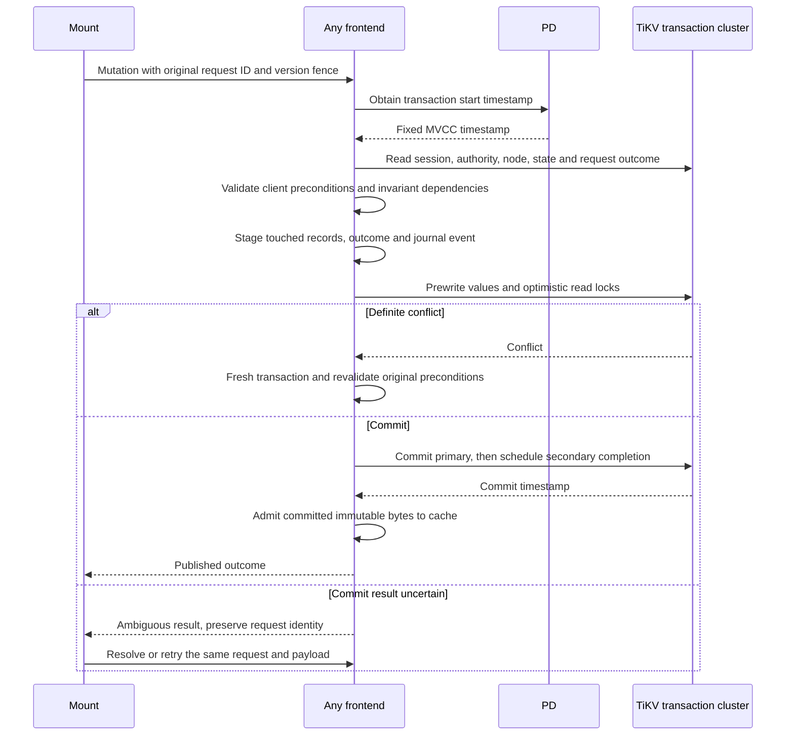

# Direct-record TxnKV implementation

[Current clean benchmark](../../dfs-bench/docs/RESULTS.md). Previous benchmark runs and timing reports were removed at the user’s request.

[Cross-Region atomicity and crash recovery](TXNKV_ATOMICITY.md) describes the source-level fault hooks and validation requirements; retained experiment evidence is limited to the current clean report.

This is a deliberate first experiment. It removes the persistent metadata tree and tenant-root CAS, but preserves the tenant state record and ordered journal. It therefore measures direct-record access and transaction cost without claiming independent same-tenant filesystem writers or scoped metadata loading.

## Record layout and publication

[store.rs](../src/store.rs) exports [txn_store.rs](../src/txn_store.rs) directly. TxnKV maps an existing logical record to:

```text
dfs-txn-v1/{namespace}/{sha256(tenant)}/{logical-key-bytes}
value = sha256(serialized-record) || serialized-record
```

The existing key encoder separates components with NUL bytes. Filesystem records keep their existing serialization: nodes, entries, sessions, pins, handles, policy, request outcomes, receipts, chunks, manifests, changes, index events and checkpoints. There is no metadata treap or root pointer in this backend. Tenant and namespace prefixes isolate records; checksums and size checks run before decoding stored values. Prefix scans are ordered and continuation-exclusive.

A storage snapshot obtains a TiKV timestamp. Every read in that operation uses that MVCC timestamp. Its lifetime is capped at 120 seconds; an open file descriptor does not retain a database transaction. A snapshot, including its clones, can create only one writable batch with this client adapter. Other clones can still perform snapshot reads. That restriction keeps the batch at the timestamp already exposed to callers.

The pinned `tikv-client` 0.4.0 uses optimistic transactions and ordinary two-phase commit. This experiment enables neither async commit nor one-phase commit. Lock-resolution backoff uses 24 attempts (2 ms initial delay, 500 ms cap), within the existing 15-second operation timeout. The default ten-attempt budget totals about 1.5 seconds, below the client’s 3-second minimum lock TTL; it failed a write after a frontend SIGKILL. Extending the bounded retry budget lets TiKV resolve expired locks without changing ambiguous-outcome handling. The application stages direct record changes and asks TiKV to commit them atomically. Point reads through a publication batch register optimistic `lock_keys` dependencies, including absent keys, so a committing mutation checks the values it used. Read-only operations do not commit locks.

A scan locks the rows it returns, which does **not** protect an empty range or prevent insertion phantoms. Filesystem mutations still read and write the tenant `state` record, providing a conservative conflict guard for namespace, quota, authorization-generation and journal invariants. Login additionally writes a shared `session-capacity` guard before counting sessions. These guards are part of correctness, not merely performance overhead. Removing them requires replacement invariants and tests.

| Operation | Direct records and retained conflict boundary |
|---|---|
| Write / truncate | Current node, immutable chunks/manifest, retained generation, authority/session reads, request outcome, pins, change/index events, tenant state |
| Create / unlink / rename | Affected nodes and entries, ancestor/authority reads, replacement/emptiness/cycle checks, outcome/events, tenant state |
| Login | Credential/session records, session-count scan and `session-capacity` guard |
| Read / stat / lookup | One timestamp for current session, authority, node and selected content; no commit for a read-only batch |
| View pin / legacy handle / checkpoint | Their own changed records plus the point dependencies read by the existing engine; state reads can still conflict with filesystem mutations |
| Disjoint storage records | Independent transactions can commit; this is tested separately from filesystem mutations |



A definite conflict permits engine retry with the original client preconditions. A stale file version still fails rather than silently overwriting another writer. Unknown commit errors and timeouts are treated as ambiguous. Retained request records fence replay across frontends. The filesystem process-kill test covers publication-before-reply; separate [cross-Region tests](TXNKV_ATOMICITY.md) now cover crashes after all prewrites acknowledge and after primary commit, before secondary commit. Partial prewrite, storage-client commit-reply loss and delayed-writer recovery remain adoption gates.

## Caches and bounds

Only immutable chunks and manifests enter the TxnKV frontend cache. Mutable metadata is read at the current operation's timestamp. Cache entries carry the timestamp at which the bytes were observed, or their successful commit timestamp. A snapshot older than that timestamp bypasses the entry; a later cached value cannot manufacture a record in an older snapshot. Failed or uncertain writes never populate this cache. Successful writes warm it so cache-affinity routing still reflects useful committed content.

The TiKV and FDB benchmark frontends use a 64 MiB object budget; all three clients use a 256 MiB daemon content budget. These are charged cache bounds, not total process-memory bounds. Defaults also bound keys to 4 KiB, values to 1 MiB, staged logical bytes to 32 MiB, mutations and committing read/write sets to 4,096, scan pages to 4,096 items / 8 MiB, concurrent storage requests to 64 and individual operation waits to 15 seconds. No automatic application-history or TiKV MVCC garbage-collection worker is introduced.

The one-second filesystem window is unchanged. Cached `read`, `pread` and `stat` must reach generation/authority validation after expiry; read opens and closes remain local. Kernel metadata TTLs use the remaining shared window, while file data uses direct FUSE I/O and the daemon's immutable cache. Mmap is not a live view. See [CONSISTENCY.md](CONSISTENCY.md).

## Dataset compatibility

Current TiKV runs use a fresh TxnKV-only cluster. The historical RawKV implementation, copy executable and benchmark datasets were removed. A different prefix cannot reinterpret RawKV objects as direct transactional records. No automatic migration or rollback path is shipped; retained external datasets would require a separately validated offline importer. The current [comparison](../../dfs-bench/docs/METHOD.md) generates new independent datasets.

## DDIA interpretation and remaining work

Chapter 3: direct records remove application-level tree traversal and path-copy amplification; the physical TiKV engine still has its own storage structure. Chapter 7: TiKV now owns atomic multi-key commit, while the application still owns read dependencies, predicates and filesystem invariants. Chapters 6 and 11: keeping the ordered tenant journal preserves an application hot key even though the original root has disappeared. Chapter 8: uncertain replies still require stable operation identities and recovery evidence. Chapter 9: transaction atomicity does not make a cached filesystem linearizable.

The next redesign must split or replace ordered journal allocation and quota/state accounting, then supply authority, rename/cycle and directory-predicate guards at the intended concurrency boundary. It must also replace initial full-view materialization with scoped metadata loading, prove failure recovery during two-phase commit, and define safe history/MVCC reclamation. The storage microbenchmark cannot substitute for those filesystem proofs.

Primary implementation reference: [`Transaction` methods and optimistic `lock_keys`](https://docs.rs/tikv-client/0.4.0/tikv_client/struct.Transaction.html). See [the reading map](READING_GUIDE.md) for transaction isolation and replication material, and [the decision record](DECISIONS.md) for application choices.
