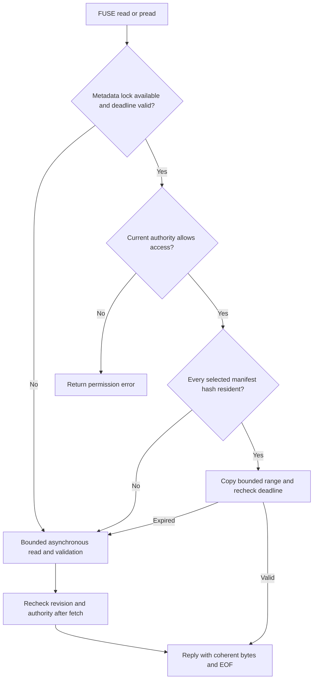

# One-second cache: reducing FUSE work

[Current clean benchmark](../../dfs-bench/docs/RESULTS.md). Previous benchmark runs and timing reports were removed at the user’s request.

## Implementation

`readdirplus` returns directory entries and attributes together, with only the remaining shared metadata lifetime. This lets the kernel avoid separate lookups/stat callbacks. Each entry actually added to the reply earns one inode lookup reference; a full reply buffer earns no reference for the rejected entry. Failed replies roll back those references. Directory continuation refresh replaces the attributes as well as the deadline, and changed entry identities require a rewind.

A resident file-data hit now completes synchronously in the FUSE request thread. It takes the metadata cache lock without waiting, verifies the descriptor's identity and authority, selects the current revision, copies only that revision's resident chunks, and checks expiry again. The bounded copy is at most the existing maximum I/O size. Expiry, a busy metadata lock, missing chunks or an unlinked identity use the existing bounded asynchronous path, which validates again after fetching. Cache residency never extends metadata validity.

Source: [RocksDB mount](../src/live/mount.rs), [RocksDB cache](../src/live/mount_cache.rs), [TiKV mount](../../dfs-tikv/src/mount.rs), [TiKV cache](../../dfs-tikv/src/mount_cache.rs). Direct file-data I/O remains enabled; this optimization delegates metadata caching to the kernel without allowing indefinitely cached file pages to bypass revision checks.

## Deadline-boundary failure and correction

The corrected path revalidates a directory whose reply deadline has elapsed or whose encoded TTL would exceed the remaining window. It compares all previously selected attributes, identities and authority with the current authorized snapshot. Unchanged values can be returned using the new validation, provided that validation covers the already encoded TTL. Changed values return `ESTALE`; slow validation cannot extend a stale observation. Lookup-reference rollback still applies to every rejected reply.

[The focused RocksDB tests](../tests/publication/live.rs) cover unchanged-directory revalidation, rejection of changed attributes, cached ranges crossing chunk boundaries, EOF, local revision changes, expiry, kernel metadata population and repeated cached reads. Existing two-mount tests continue to cover revocation, delayed replies, same-size/same-mtime rewrites and unlink/rename identity. TiKV now uses TxnKV only; RawKV has been removed.

## Evaluation boundary

The one-second contract is the default in `dfs-mount`; `dfs-mount-legacy` retains the Watch-driven kernel-cache path. Direct I/O preserves the revision/authority validation boundary but adds FUSE callbacks and copying on resident reads. The [clean benchmark](../../dfs-bench/docs/RESULTS.md) measures the current default across the three storage architectures. It does not isolate this fast-path change or compare against the legacy kernel-cache mount.
