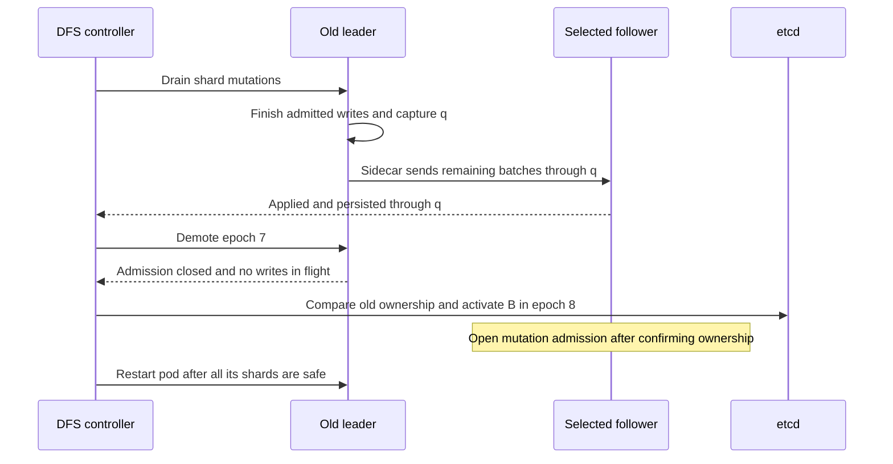
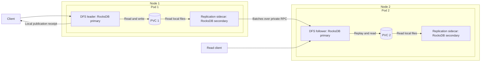
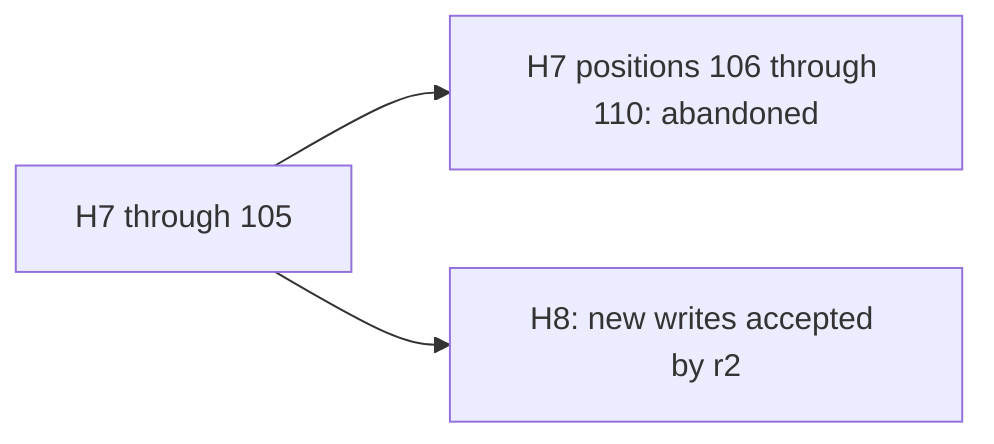
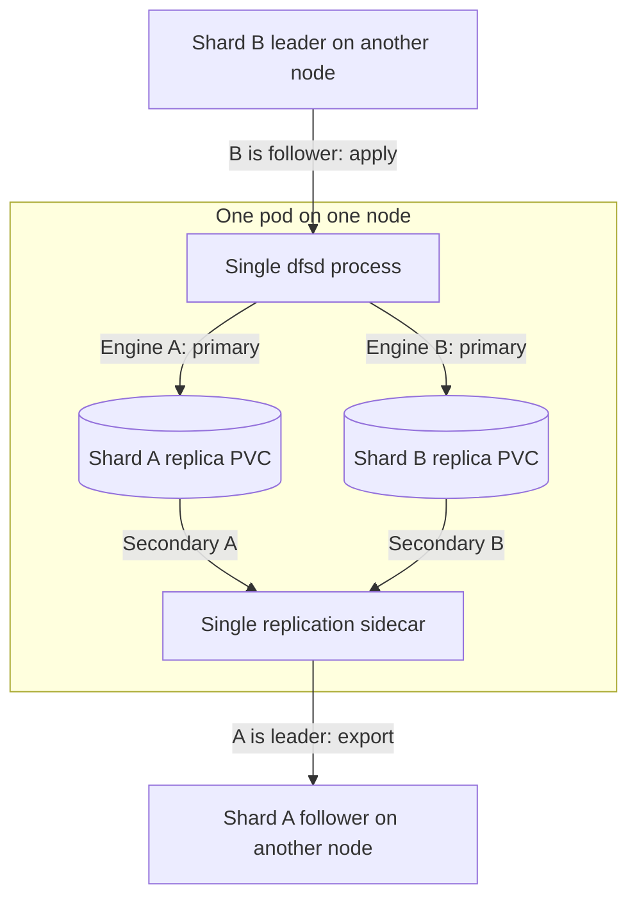
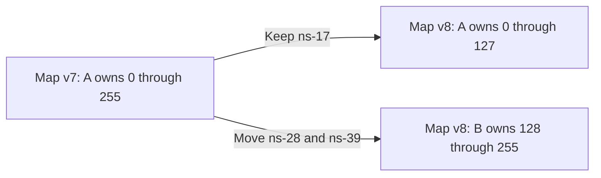
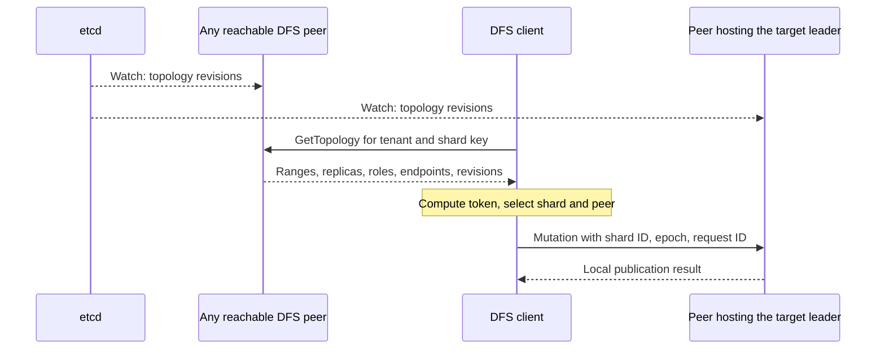
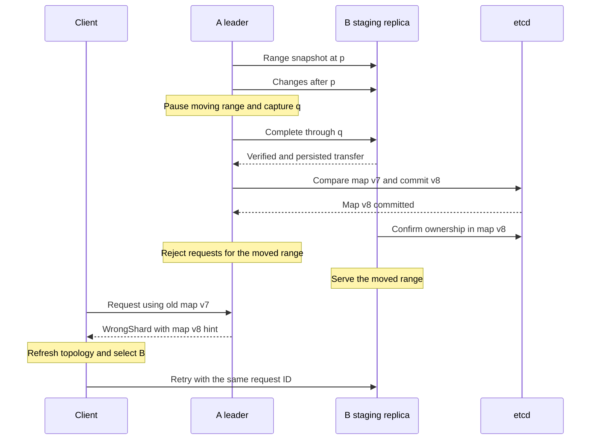

# DFS HA and sharding

## Direction and status

- **Selected:** one leader per shard; the writer publishes locally and replies without waiting for replicas. A separate replication sidecar ships changes to independently stored followers. Followers can serve reads.
- **Routing:** clients choose peers directly. Every peer can return its view of the shared topology; no gateway is required.
- **Coordination:** etcd's built-in Raft manages ownership and topology. File mutations do not go through etcd or another consensus log.
- **Operational questions:** [rolling deployment](#rolling-a-new-deployment-all-pods-must-eventually-restart) and [unexpected pod/node loss](#a-pod-or-node-goes-down-unexpectedly) are specified first.
- **Implementation references:** Kvrocks for WAL/checkpoint replication; Patroni and Valkey Sentinel for HA recipes, adapted to etcd coordination. The four investigations below cover implementation, memory, routing, and failure tests.
- **Open:** follower count, partition boundary, and operating budgets. Diagrams show one follower for readability, without fixing the count.
- **Evidence:** inspected DFS and its pinned `rocksdb 0.24.0` / native RocksDB `10.4.2` sources. No distributed implementation or runtime validation is claimed. Code below sketches proposed interfaces.

## Definitions

| Term | Meaning |
| --- | --- |
| Tenant | Customer isolation boundary; its data may span shards. |
| Shard key | Tenant-scoped search/routing scope, such as `documents`, containing a set of shards. |
| Partition / partition key | Proposed grouping of application records that move together / the immutable application identifier used to route them. Not a database, volume, or tenant-within-shard ID. Namespace versus file remains open. |
| Token | Fixed hash of `(tenant ID, shard key, partition key)`. |
| Shard | Identified token range containing whole partitions. |
| Replica | One copy of a shard: its source RocksDB database and search projection. A replica can own a PVC; several replicas of different shards may instead use separate directories on a pod PVC. |
| Leader / follower | DFS roles: accepts client mutations / replays the leader's mutations and can serve reads. |
| RocksDB primary / secondary | Opening modes: writable database owner / separate read-only process following that owner's files. **Both DFS leaders and DFS followers open RocksDB as primary.** |
| Sidecar | Separate container/process that exports changes from local leader replicas. It never writes their databases. |
| History / position | Identified sequence of source batches / end sequence of a complete batch within it. Positions are comparable only within the same history. |
| Leader epoch | One leadership tenure recorded in etcd. Separate from history identity and client session incarnation. |
| Snapshot / checkpoint | Consistent read view / consistent database copy used for recovery. |
| Peer | One DFS server process and its network endpoint; it can host replicas of several shards and serve topology to clients. |
| Client | DFS library or mount daemon that obtains topology from peers, selects destinations, and sends requests directly. |
| DFS controller | Proposed control-plane component that coordinates replica placement, leadership changes, and pod rollouts through etcd. It does not handle client mutations. |
| Routing map / replica directory | Token ranges to shard IDs / shard IDs to replicas, endpoints, roles, and leader epochs. |
| Pod / node | Kubernetes execution unit / worker machine. |

## The two operational questions

**Proposed behavior:** a rolling deployment transfers leadership deliberately and preserves every completed publication through each transfer. An unexpected leader failure recovers from an available complete copy and may lose its missing suffix. Ordinary writes remain asynchronous in both cases.

### Rolling a new deployment: all pods must eventually restart

**Restart one pod at a time, after moving all its leader roles to surviving peers.** The unit being restarted is a pod; the safety checks apply to every shard hosted there. A pod may lead A and follow B, so there may be no globally “follower-only pod” to update first.

Proposed first implementation: use a retained-PVC StatefulSet with `OnDelete`, and let the DFS controller authorize each pod replacement after the steps below. Kubernetes creates the replacement with the new image. A bare `rollout restart` with automatic updates does not execute this protocol. PDBs help with eviction-based maintenance, but do not constrain Deployment/StatefulSet rolling updates or establish per-shard data readiness. [StatefulSet update strategies](https://kubernetes.io/docs/concepts/workloads/controllers/statefulset/#update-strategies), [PDB boundaries](https://kubernetes.io/docs/concepts/workloads/pods/disruptions/#pod-disruption-budgets).

1. **Check the next pod.** Record its old boot ID and target image in a durable rollout record. Every hosted shard needs a healthy surviving replica on another node. Verify old/new binaries can exchange replication messages and read the existing storage format. If a shard has no surviving copy, stop the rollout or first create a temporary follower. Keep etcd available throughout; upgrade its members separately while preserving quorum.
2. **Prepare destinations.** For each leader on this pod, select a compatible follower and let it catch up while writes continue. Mark the pod as draining in topology so clients stop selecting it for new reads. Existing direct connections still require server-side admission checks.
3. **Transfer each leader.** Briefly stop new mutations for that shard, finish admitted mutations, capture final source position `q`, and sync it locally. Keep the sidecar running until the selected destination has applied and persisted through exactly `q`, including retry outcomes. Record the source/destination boot IDs, final boundary, and transfer phase in etcd so another controller can resume the handoff. Other shards continue normally.
4. **Demote and switch ownership.** Under the old leader's writer gate, durably disable authoritative admission for that epoch, including mutations and leader read barriers, and acknowledge that no old mutation remains in flight. Then conditionally replace ownership in etcd with the prepared destination and a new epoch/history anchored at `q`. Compare the recorded transfer, old ownership, and prepared destination identities. The old process cannot re-enable itself without a newly authorized transition. This acknowledged demotion is the planned-path fencing mechanism; it does not require powering off a healthy node.
5. **Restart the pod only after every transfer completes.** Stop its DFS process and sidecar, preserving PVCs. Both restart on the new image with fresh boot IDs and initially closed admission. They consult etcd and join their assigned roles; they never infer leadership from pod name or old local configuration.
6. **Recover before advancing.** With compatible intact data, resume from the recorded source cursor. If WAL history is missing or the local history diverged, install a checkpoint. Reopen only compatible search artifacts. Verify a captured leader boundary has been reached, replication is progressing, and required source/search readiness is restored before restarting the next pod.



**Example with two replicas per shard, purely to illustrate the rollout:**

| Step | Pod 1 | Pod 2 |
| --- | --- | --- |
| Before upgrade | A leader, B follower; old image | A follower, B leader; old image |
| Prepare Pod 1 | Transfer A to Pod 2 | Leads A and B |
| Update Pod 1 | Restart on new image, recover A and B as followers | Continues serving A and B |
| Prepare Pod 2 | After catch-up, receive A and B leadership | Drain and demote A and B |
| Update Pod 2 | Continues serving A and B | Restart on new image, recover both as followers |

All pods have now restarted. Rebalance leadership afterward only if useful; do not move it back merely to restore the original arrangement. Each surviving pod must have enough capacity for the temporary workload.

- **Client effect:** reads move to eligible peers; writes to a transferring shard briefly wait/retry. The client refreshes topology and resolves lost replies using the same request ID. New sessions may be required under the current recovery contract; transparent migration of live file handles is not yet implemented.
- **Data loss:** a completed planned transfer loses no publication through `q`. Waiting for one final catch-up during maintenance does not add replica waiting to ordinary writes. If the old leader fails before that boundary is transferred, this becomes the unplanned-failure case below and can lose a suffix.
- **If catch-up or demotion times out:** pause the rollout. While old ownership remains valid and no demotion was committed, the controller may explicitly cancel the drain. After demotion/ownership change, do not simply reopen the old writer. Resume the recorded transition or run failover if its outcome cannot be completed.
- **Mixed versions:** test old-leader/new-follower and new-leader/old-follower operation. Delay incompatible storage/protocol features until all required replicas understand them. If that is impossible, this release needs a separate migration procedure. Restarting with an older image is not automatically a safe rollback after a format change.
- **With only two replicas:** restarting one temporarily leaves a single serving copy. A second concurrent failure can interrupt service or lose data; the rollout cannot promise continued availability through that additional fault. More replicas or temporary replicas change that tradeoff; follower count remains open.

**If all pods restart simultaneously:** there is a full service outage. Recover the surviving PVCs, select valid histories/prefixes under etcd ownership, and reestablish leaders before serving. A graceful cluster-wide shutdown could drain/sync first; an uncontrolled restart is crash recovery. Neither is the rolling procedure above.

### A pod or node goes down unexpectedly

| Failure | Immediate behavior | Recovery and possible loss |
| --- | --- | --- |
| Replication sidecar only | Leader keeps publishing; follower lag grows. | Restart exporter and resume from receiver cursor; checkpoint if retained WAL is insufficient. No promotion just because the sidecar failed. Leader failure during this gap can lose the missing suffix. |
| Pod hosting only follower roles | Clients choose other eligible replicas; existing leaders continue writing. | Restart with its PVC and catch up, or replace lost storage from a checkpoint. No leadership change is required. |
| Pod hosting a leader, node reachable | Its shards lose write service until an owner is activated; other shards continue. | Confirm old writer termination, serialize replacement through etcd, and select a verified copy. The restarted intact replica can be a candidate if it is ready in time; Kubernetes restarting it does not itself grant leadership. |
| Node unreachable or partitioned | Every hosted replica becomes suspect. Clients refresh topology; affected leader writes wait/fail until recovery. | Fence the node before promoting affected shards. Promote from survivors without waiting for the failed PVC to reattach. Restore replacement followers afterward. |
| No eligible copy, no etcd quorum, or fencing cannot complete | No new authoritative leader can be established. | Remain unavailable instead of assigning an empty or competing leader. A readable local copy alone does not establish current ownership. |

**Concrete example:** A's old leader published H7 through 110, while surviving follower `r2` has a complete H7 prefix through 105.

1. A client times out and asks another peer for topology; that observation alone cannot authorize promotion.
2. After the owner lease is absent, the controller reserves recovery in etcd. Confirm the old process is stopped, or complete infrastructure fencing if its node cannot be trusted.
3. Prepare compatible surviving candidates and select the furthest verified complete prefix. If `r2` wins, sync its prefix and activate epoch 8/history H8, inheriting H7 through 105.
4. Peers advertise the new owner; clients reconnect directly to it. Writes resume from that recovered state. Default current follower reads also need authority from the new leader, so they may pause during the ownership gap.
5. H7's 106–110 may have been acknowledged and are now lost. Their absent retry outcomes remain unknown. A returning old leader is rebuilt onto H8 before serving; its extra writes are not merged into the new history.

An intact old PVC containing more data can reduce loss **if it is recovered and selected before activation**. After H8 begins accepting writes, discovering H7:110 is no reason to switch histories back. Recovery time is detection + fencing + candidate preparation + activation + client refresh, not just the lease TTL. [Detailed election procedure](#deterministic-election-and-fencing), [trial timers](#when-is-a-peer-considered-dead).

### Recipes borrowed from Patroni and Sentinel

- **Patroni:** distinguish planned switchover from failure recovery; check candidate lag/history and expose replication-aware readiness. We adapt these to per-shard operation and require exact `q` coverage for our planned transfer. [Switchover and readiness](https://patroni.readthedocs.io/en/latest/rest_api.html), [asynchronous durability](https://patroni.readthedocs.io/en/latest/replication_modes.html).
- **Patroni watchdog:** stop the old writer if its ownership loop cannot run. A watchdog must expire before ownership can be reassigned; access to the device and behavior under node/VM stalls need validation. With many shard leaders on one node, feeding a node watchdog must account for every owned shard, not merely one healthy renewal. Keep confirmed infrastructure fencing as the fallback until that design is proven. [Watchdog implementation rationale](https://patroni.readthedocs.io/en/latest/watchdog.html).
- **Valkey Sentinel:** separate a local suspicion from an authorized failover, use deterministic candidate selection, and publish new ownership to clients. Sentinel uses its own voting; **DFS keeps etcd transactions and Raft**. Sentinel ranks priority before replication offset; DFS's proposed rule remains compatible history, greatest recovered position, then priority/replica ID to favor retaining data. [Sentinel failure detection and selection](https://valkey.io/topics/sentinel/).

## 1. Can the sidecar replicate RocksDB WAL?

### Process and storage layout



- The two containers in a pod mount the same volume: writable in `dfsd`, read-only in the sidecar. The secondary also needs its own writable scratch directory.
- Different replicas use different PVCs. There is no shared database filesystem across nodes. The follower's sidecar exports only after that replica becomes leader; it does not echo received batches back.
- A PVC can be shared by containers in one pod. Across pods, access depends on the volume/driver: `ReadWriteOnce` restricts attachment to one node, `ReadWriteOncePod` to one pod, and `ReadWriteMany` permits multiple nodes. None supplies database replication or independent failure recovery. [Kubernetes volume access modes](https://kubernetes.io/docs/concepts/storage/persistent-volumes/#access-modes).

### How Apache Kvrocks replicates RocksDB

Inspected [Kvrocks commit `6678b3a`](https://github.com/apache/kvrocks/tree/6678b3a61c4e5911612224743405d22fee7e5e75), dated 2026-10-02. Its [replication overview](https://kvrocks.apache.org/docs/replication/) describes incremental synchronization followed by full synchronization when the retained log cannot satisfy it. The inspected implementation uses checkpoints for its current full-sync path and retains an older backup-based path.

The actual incremental path is:

```text
Leader storage DB
  -> GetUpdatesSince(next_sequence)
  -> TransactionLogIterator batch
  -> WriteBatch::Data() serialized into a network frame
  -> follower constructs WriteBatch from those bytes
  -> follower DB::Write(batch)
```

| Step | Kvrocks code | What it does |
| --- | --- | --- |
| Reconnect | `ReplicationThread::tryPSyncWriteCB` | Requests the sequence after the replica's current local sequence, optionally with a replication history ID. |
| Accept incremental sync | `CommandPSync::Execute` / `checkWALBoundary` | Checks requested history when enabled and whether the next complete batch is available. Otherwise requests full synchronization. |
| Export | `FeedSlaveThread::loop` / `Storage::GetWALIter` | Uses `GetUpdatesSince`, checks exact batch sequence continuity, sends serialized batches, and advances by their operation count. Reopens exhausted iterators and bounds network send time. |
| Apply | `incrementBatchLoopCB` / `ReplicaApplyWriteBatch` | Reconstructs the batch and calls the follower's writable `DB::Write`. Runs application notification handling afterward. |
| Replace missing history | `ReplDataManager::GetFullReplDataInfo` / `fullSyncReadCB` | Creates/reuses a RocksDB checkpoint, transfers its files, restores the receiver, then reconnects for incremental sync. Checks checkpoint freshness against retained WAL before reuse. |

Pinned source: [replication threads](https://github.com/apache/kvrocks/blob/6678b3a61c4e5911612224743405d22fee7e5e75/src/cluster/replication.cc), [PSYNC command](https://github.com/apache/kvrocks/blob/6678b3a61c4e5911612224743405d22fee7e5e75/src/commands/cmd_replication.cc), [storage and checkpoint implementation](https://github.com/apache/kvrocks/blob/6678b3a61c4e5911612224743405d22fee7e5e75/src/storage/storage.cc).

**What we take for DFS:** replay materialized RocksDB batches, preserve batch boundaries, resume a retained stream when possible, and use checkpoint replacement when not. We do not need to re-execute client filesystem operations. Example: receiver covers source sequence 100; sender starts at 101. A batch with three operations occupies 101–103, so the next begins at 104. This is Kvrocks' native C++ iterator convention; our Rust wrapper's argument convention differs, as detailed below.

**What needs adaptation:**

- Kvrocks' export/receive code runs in threads using the server's storage object. It does not establish that our separately opened secondary sidecar can export safely. Preserve that requested process boundary and test it; a local WAL-tail RPC remains the fallback.
- Kvrocks applies raw serialized batches against its shared column-family layout. DFS must verify matching IDs/schema before adopting that fast path, or use the named-column-family mapping below. Its receiver resumes using its local sequence; DFS's extra atomic replay-cursor writes mean we must use the explicit **source** cursor instead.
- Kvrocks can tag batches with a replication ID via `PutLogData` and persists a new ID when starting a history. In this inspected revision, `use-rsid-psync` defaults to `no`, and compatibility paths can use sequence-only PSYNC. DFS should always require history identity and reject incompatible resume requests. [Configuration](https://github.com/apache/kvrocks/blob/6678b3a61c4e5911612224743405d22fee7e5e75/kvrocks.conf#L322).
- A receiver acknowledgment reports replication progress; it need not gate ordinary client success. DFS keeps the selected local-publication acknowledgment policy. Checkpoint installation stays non-serving until source identity, replay progress, and application caches are consistent.

### What the pinned APIs support

| Requirement | Source finding | Consequence for DFS |
| --- | --- | --- |
| Second process opens the writer's files | Rust exposes `DB::open_cf_as_secondary` and `try_catch_up_with_primary`; native secondary requires `max_open_files = -1`. | Candidate sidecar API; account for its memtables and open files. |
| Read ordered WAL batches | `DBImplSecondary` inherits `DBImpl::GetUpdatesSince`. The iterator's readable sequence follows the secondary's recovered state. | Catch up, then tail batches; refresh the iterator after rotation. This combination still needs a two-process runtime spike. |
| Discover missing history | Secondary catch-up can tolerate a WAL file already purged by the primary. | Successful catch-up does **not** prove that the sidecar can export every intervening batch. Check continuity separately. |
| Receive a remote WAL | RocksDB exposes batches, not a network replication service. | DFS supplies transport, validation, deduplication, and atomic replay into the follower's primary. |

Evidence: [secondary opening rules](https://github.com/facebook/rocksdb/wiki/Read-only-and-Secondary-instances), pinned [secondary class](https://github.com/facebook/rocksdb/blob/v10.4.2/db/db_impl/db_impl_secondary.h), [catch-up implementation](https://github.com/facebook/rocksdb/blob/v10.4.2/db/db_impl/db_impl_secondary.cc), [WAL export implementation](https://github.com/facebook/rocksdb/blob/v10.4.2/db/db_impl/db_impl.cc), and [replication helpers](https://github.com/facebook/rocksdb/wiki/Replication-Helpers).

### Preparing and applying a mutation

**Writer:** preserve the existing path in [Engine::mutate](../src/engine.rs) and [Store::publish](../src/store.rs): validate under the shard's writer gate, resolve IDs/timestamps, atomically write content + metadata + grants + retry outcome, publish notifications, reply. WAL stays enabled; ordinary writes keep `sync = false`. No replica RPC, acknowledgment, or pending-replication gate enters this path.

**Exporter:** proposed `src/bin/dfs-replicator.rs` owns one secondary handle per hosted shard. Actual binding calls, surrounded by proposed DFS helpers:

```rust
let mut options = rocksdb::Options::default();
options.set_max_open_files(-1);
let secondary = rocksdb::DB::open_cf_as_secondary(
    &options,
    source_path,
    secondary_path,
    column_family_names,
)?;

secondary.try_catch_up_with_primary()?;
let mut wal = secondary.get_updates_since(cursor.end_sequence)?;
for item in wal.by_ref() {
    let (first_sequence, batch) = item?;
    let decoded = decode_supported_batch(&batch, &column_families)?;
    let envelope = make_envelope(&cursor, first_sequence, decoded)?;
    cursor = send_and_confirm(envelope).await?;
}
wal.status()?;
```

- Run RocksDB calls in bounded blocking workers; network I/O runs outside them. The sketch shows ordering, not the final async task structure. Each follower has its own recovered cursor and bounded byte queue.
- **Cursor detail:** Rust 0.24 skips batches whose starting sequence is at or before the argument. Pass the previous complete batch's **end**, not `end + 1`. A three-operation batch starting at 41 ends at 43; the next starts at 44. Passing 44 would skip that next batch. Check iterator status even after it returns `None`. [Pinned Rust iterator](https://github.com/rust-rocksdb/rust-rocksdb/blob/v0.24.0/src/db_iterator.rs).
- `decode_supported_batch` accepts the producer's Put/Delete operations and preserves order. Map numeric source column-family IDs to stable names, then to receiver handles. Do not assume independently created databases have identical numeric IDs.
- The binding's `iterate_cf` callback surface is insufficient for a general fallible decoder. Add a small native adapter that exposes column-family IDs and returns decoding errors; reject unsupported operations and validate decoded operation count against the batch count. Freeze the replication schema initially; external SST ingestion cannot silently bypass this stream.

Proposed wire schema; `Put`/`Delete` contain a column-family name, key, and value where applicable:

```rust
struct ReplicateBatch {
    protocol_version: u32,
    schema_version: u32,
    shard_id: ShardId,
    leader_epoch: u64,
    history_id: HistoryId,
    first_sequence: u64,
    end_sequence: u64,
    predecessor: Cursor,
    payload_digest: Digest,
    operations: Vec<KvOperation>,
}

struct Cursor {
    history_id: HistoryId,
    end_sequence: u64,
    batch_digest: Digest,
}
```

**Receiver:** add a private authenticated replication service alongside [rpc.rs](../src/rpc.rs), using the existing tonic transport. Under the destination shard's writer gate:

1. Verify sender membership, current leader epoch, history, payload digest, and exact predecessor. Require `first_sequence = predecessor.end_sequence + 1` and `end_sequence = first_sequence + operation_count - 1`; reject empty/unsupported batches, gaps, and conflicts. A known duplicate returns the recorded cursor without reapplying old values.
2. Rebuild one local `WriteBatch` from the resolved operations. Add the receiver's source cursor to that **same batch**, in replica-local metadata. Call `Store::publish` once.
3. Run a shared `after_publish` hook to update engine counters, invalidate affected authorization/handle caches, and notify watches/indexing. Then return the applied cursor to the sidecar. That reply never gates the leader's client reply.

The follower writes its own WAL. Its native sequence differs because replay also writes local cursor metadata; never compare that sequence with the source sequence. On reconnect, the receiver's recovered cursor determines replay, not the sender's last remembered acknowledgment. Old duplicates outside the retained verification window require reconciliation instead of blind application.

[Engine::open](../src/engine.rs) currently provisions roots and session state. Split provisioning from `open_existing` so followers recover copied identities instead of creating new roots. Keep boot identity and receiver metadata distinct from replicated tenant data. After promotion, start a new source history anchored to the selected parent prefix; never export the follower's old replay WAL as a new stream of client writes. Writer restart must also establish an unambiguous history boundary before native sequence numbers can be reused after recovery. The new export anchor follows replica-local initialization; no receiver-cursor writes occur while serving as leader.

### Snapshots and replacement replicas

- RocksDB writes changes into both its WAL and in-memory tables. Once those tables have been written to database files on disk, the corresponding WAL is no longer needed for the leader's own recovery. The sidecar may still need it to catch up a follower.
- `max_total_wal_size` makes RocksDB write those in-memory tables to disk when live WAL grows too large, allowing old WAL files to leave the live set. It does not reserve that much history for followers.
- Configure `wal_ttl_seconds` and/or `wal_size_limit_mb` on the primary to archive old WAL files instead of deleting them immediately. The first deletes archives by age; the second deletes the oldest archives when their total size exceeds the limit. With both enabled, either can cause deletion. Cleanup is periodic, and neither setting checks follower progress. [Pinned RocksDB option definitions](https://github.com/facebook/rocksdb/blob/v10.4.2/include/rocksdb/options.h#L960).
- Example: a follower disconnects after batch 100 and reconnects when the leader is at 150. If batches 101–150 remain in live or archived WAL, the sidecar sends them. If batch 101 has already been deleted, install a newer checkpoint and continue from there. The writer keeps accepting writes while the follower recovers, subject to its own local disk capacity.
- Request checkpoint creation from the writable DFS process: secondary `GetLiveFiles`/deletion-control APIs are unsupported. For the first prototype, hold the shard's writer gate while recording a batch boundary and creating a checkpoint; release it before transfer. Measure this local maintenance pause.
- Copy the checkpoint into a non-serving destination directory; verify schema, history, checksums, and boundary. Initialize destination-local identity/cursor from the checkpoint manifest instead of adopting the source replica identity; install it, then replay retained batches after that boundary. Abort and restart from a newer checkpoint if retention expires during transfer. Checkpoints never require holding the writer gate for a remote transfer.

### If secondary WAL export fails the spike

| Approach | Concrete implementation | Tradeoff |
| --- | --- | --- |
| Secondary exports WAL | Sidecar follows shared local files and sends resolved batches. | Closest to the requested separation; duplicate secondary state and file-lifetime races need measurement. |
| Primary exports WAL to sidecar | Add local `TailBatches(after, byte_limit)` RPC; a background worker uses the existing primary handle's `get_updates_since`. Sidecar owns remote delivery. | Avoids secondary API limitations and duplicated memtables; background export runs in `dfsd`. Client writes still never wait for replicas. |
| Replicate resolved operations | Persist a `ResolvedMutation` outbox entry atomically with the source write; sidecar sends it through RPC and receiver applies it once. | Extra encoding/storage and another schema, but replay remains independent of client traffic. |

Sending today's public `Mutation::Create` again is incorrect: [engine.rs](../src/engine.rs) generates IDs and timestamps during execution. The receiver would generate different state. A resolved operation must include those values, source preconditions/result, and all effects. The existing `Change` invalidation journal lacks content, grants, and retry outcomes. An in-memory “send after success” queue alone cannot recover events lost when the exporter crashes.

### Acknowledgments and permitted loss

[DESIGN.md](../DESIGN.md) prioritizes fast atomic publication and permits a lost recovery suffix, including recent namespace/grant changes.

| Event | Meaning in this design |
| --- | --- |
| Ordinary write success | Entire batch published on leader; no follower progress implied. |
| Default client `fsync()` | Publication/error reconciliation under the existing contract. |
| `--durable-sync` success | Prefix persisted on that replica's storage. It does not prove replication. |
| Promotion of a lagging follower | May discard successful writes, including writes persisted only on the old leader. Report the new history and reconcile clients. |

For example: leader published through 110; the available follower recovered through 105. Promotion chooses the complete prefix through 105. Positions 106–110 may be lost; keeping 107 while losing its predecessor is forbidden. There is no bounded replication RPO during an arbitrarily long sidecar/network outage. Strong durability across failover would need an additional mechanism and is not promised by this async design.

### Deterministic election and fencing

The goal is to restart writes on one surviving replica, using its complete copy of the data. With asynchronous replication, that copy may be behind the failed leader. We must choose the recovery boundary explicitly and prevent the old leader from continuing to serve independently.

The procedure below is a **proposed controller workflow**, not something etcd performs for us. The DFS controller would run it; etcd supplies transactions and leases. No controller or etcd call is added to the ordinary mutation path.

#### What etcd stores, and why

Use one coordination store for the DFS deployment, not an etcd cluster per shard. A dedicated DFS etcd cluster is the initial deployment proposal; a suitable existing application etcd service could also host this metadata. Kubernetes' internal etcd is not an application API.

Example records for shard A; names and representation are illustrative:

| Record | Example | Purpose |
| --- | --- | --- |
| Membership | `revision=12, replicas=[r1,r2,r3], priorities={r2:1,r3:2}` | Which replicas may participate; which wins a tie. Three replicas here only illustrate selection, not a settled count. |
| Durable control state | `epoch=7, last_leader=r1, phase=active` | Remembers the last owner even after its lease expires. Epoch increases for each replacement attempt and is never reused. |
| Leased owner | `replica=r1, boot=b31, epoch=7, endpoint=...` | Names the active process. Its lease must be renewed; expiry removes this record. |
| History | `H8: parent=H7, inherited_through=105` | Records that the new stream retains H7 through position 105 and abandons its later writes. |
| Promotion | `id=p9, epoch=8, old_boot=b31, phase=selected, candidate=r2, parent=H7:105` | Makes the replacement procedure resumable if its controller crashes. Also records fencing evidence and the membership revision used. |

A lease is a renewable expiry timer attached to the owner record. It tells the controller that ownership was not renewed; it cannot tell whether the process died, paused, or lost its network connection. etcd transactions condition updates on the record revisions read earlier. Two controllers racing to replace epoch 7 cannot both commit different replacements for that same state. [etcd API guarantees](https://etcd.io/docs/v3.6/learning/api_guarantees/).

Replica progress stays in the replicas and their RPC reports. We do **not** update etcd for every replicated batch. A watch wakes the controller; an authoritative read and conditional transaction establish whether it can act.

#### Why lease expiry does not stop the old writer

Consider this sequence:

1. `r1` accepts writes as leader in epoch 7.
2. Its process pauses, or its connection to etcd breaks. Its PVC and some client connections may still be usable.
3. Its lease expires. The controller sees no active owner and wants to promote `r2`.
4. `r1` resumes with an old in-memory belief that it is still leader.

Changing an etcd record cannot prevent step 4 from reaching a local RocksDB write. Checking ownership and then writing also leaves a pause point between the two actions. **Fencing means making the old process unable to keep serving as leader before activating its replacement.**

For an unplanned failure, the proposed first implementation is below. A healthy planned transfer instead uses the drained and durably acknowledged demotion described in the rollout procedure.

- On a reachable node, terminate the exact old writer process and confirm it exited. Prevent its supervisor from reopening client admission under the old epoch; every process startup begins non-serving and must establish its current role. Stopping `dfsd` affects all shards it hosts.
- If the node cannot be reached, use the infrastructure API to stop its VM and confirm completion. Prevent automatic restart from restoring old ownership. An alternative network-isolation method would have to block every client and replication path; deleting a Service endpoint alone does not do that.
- Record the fenced node/process identity and operation result in the promotion record. Delayed controller actions must target that old instance, never whichever process happens to occupy its former endpoint.
- If neither termination nor isolation can be confirmed, leave the shard unavailable for authoritative operations. Replication being asynchronous does not make two independent writers safe.

Kubernetes force-deletion removes the Pod object without confirming that its process stopped. It therefore cannot supply this evidence. [Kubernetes force-deletion behavior](https://kubernetes.io/docs/tasks/run-application/force-delete-stateful-set-pod/).

This infrastructure approach is conservative and may be slow. It also affects unrelated shards on the VM. **It remains a proposal to validate**, with failover time and node-wide impact measured. Avoiding it needs a separately justified mechanism that prevents a paused writer from serving after ownership changes; an epoch number alone does not enforce that on its private PVC.

#### How we choose the replacement

Suppose these are complete source positions in history H7:

| Replica | State when replacement begins | Eligible? |
| --- | --- | --- |
| `r1` | Old leader last observed at 110; now unavailable and fenced | No; an old report is not an available database. |
| `r2` | Reachable follower containing H7 through 105 | Yes, after preparing and verifying that prefix. |
| `r3` | Reachable follower containing H7 through 103 | Yes, after preparing and verifying that prefix. |

1. The controller reserves the promotion with an etcd transaction: the leased owner must be absent, and the membership/control revisions must still match. It records the attempt and reserves epoch 8. While this attempt is active, membership changes for A are serialized with it.
2. Fence the former writer. Ask each reachable candidate to `PreparePromotion(attempt, epoch)`: stop admitting replication from epoch 7, finish any batch already applying, then capture its source cursor under its shard writer gate. This is what **freeze replay** means. Delayed old batches are rejected afterward, so the reported position cannot move during selection.
3. Each candidate verifies that its installed checkpoint and contiguous replay belong to H7, that the cursor was stored atomically with the data, and that recovery found no incomplete batch. Sync that prepared prefix locally before reporting it. Report replica ID, boot ID, attempt, history, complete position, and integrity status. A large sequence number alone is not proof of a valid copy.
4. Collect reports for a bounded interval, then record the reports used and the chosen candidate. Pick the largest verified position; for equal positions, use configured priority, then replica ID. Here `r2` wins with 105. If it were unavailable, `r3` could win with 103 under the declared suffix-loss contract.
5. Persist the selection with an etcd transaction against the same attempt/configuration. Controllers that lose this transaction use the recorded decision. Once selected, a late report does not silently replace the winner. If the winner fails, advance the recorded recovery procedure and reserve a fresh epoch before another selection.

“Deterministic” applies to the same recorded set of eligible reports. Controllers with different network visibility might initially propose different candidates; etcd establishes one decision. Waiting for every configured replica would prevent recovery whenever one remains unreachable. With no eligible candidate, wait or restore from a verified backup; do not invent an empty replacement.

Compare **source history positions**, not each database's native RocksDB sequence. The receiver writes its replay cursor alongside data, so its local sequence can differ. H6 at position 900 also cannot outrank H7 at 105: these are different histories, and H6 may lack an earlier promotion's accepted changes.

#### How the new leader starts serving

For the selected `r2`, the controller records a new history H8 with parent `H7:105`. This states which old data the new stream inherits:



- `r2` durably records its prepared epoch/history and source WAL anchor while client writes remain disabled. It already has RocksDB open as primary; promotion changes the DFS role, not RocksDB's opening mode.
- Grant a lease for the selected process. In one conditional etcd transaction, verify the selected attempt/configuration, absence of an active owner, and recorded fencing completion; publish `owner=r2, boot=..., epoch=8, history=H8` and mark the attempt active. A lost transaction reply is resolved by reading the recorded state.
- `r2` confirms that the active record names its exact boot/epoch before opening admission. Peers learn the endpoint through etcd watches; clients obtain it through topology refreshes from peers. If the owner lease disappears first, `r2` stays non-serving and recovery resumes. Search has its own readiness check.
- Its sidecar exports only H8 after the recorded anchor. Receiver RPCs carry the epoch/history; followers accept that stream only after joining H8. Delayed messages from the old leader cannot extend it.
- The leader renews ownership in the background and rejects new authoritative calls when ownership can no longer be established. Normal mutation admission checks local role/lease state under the shard gate, without a per-write etcd transaction. The fencing procedure handles the pause/resume case that local checks alone cannot eliminate.

If the controller crashes after preparing `r2` but before activation, another controller resumes from the durable promotion record. If it crashes after activation, it discovers the existing owner rather than promoting someone else. Candidate preparation and activation must be idempotent for the attempt and boot ID.

#### What happens to the other replicas and clients

- **Follower behind the chosen prefix:** `r3` at H7:103 needs 104–105 before joining H8. Use a controller-authorized join transfer of retained source batches through exactly 105, otherwise a checkpoint from `r2`. This does not reopen the old leader's replication stream. Promotion does not require waiting for `r3`.
- **Old leader returns ahead:** `r1` still contains H7 through 110, but H8 inherited only through 105. Its 106–110 may conflict with new writes. It stays non-serving and is rebuilt from an H8 checkpoint. Keep discarded data separately for diagnosis if needed; never automatically replay it into the new leader.
- **Why not just truncate WAL?** The unwanted changes may already be in RocksDB database files. Removing old log bytes does not undo those changes. Checkpoint replacement is the initial recovery method for a divergent replica.
- **Clients:** establish new sessions after promotion; old handles cannot continue with stale assumptions. A retry outcome present in the recovered prefix can be resolved. An absent outcome is unknown: the write may have succeeded on `r1` and then been discarded. The client must reconcile instead of silently issuing it again.
- **Policy:** if a grant or revocation occurred in 106–110, it may also be lost under the selected contract. All authoritative operations must use the recovered policy consistently. A returning old leader cannot keep serving its different policy.

Automatic failover therefore has four measurable components: detecting lost ownership, fencing the old writer, preparing/selecting a surviving copy, and activating it. Losing etcd availability prevents ownership changes; losing the infrastructure fencing path can block promotion even when a follower has all the data. Those are explicit availability costs of this initial proposal, to test before calling it HA.

## 2. Multiple shards, volumes, and memory

### Kubernetes deployment and operator scope

**Can one pod host several shards, each on its own PVC, with one DFS process managing them all?**

Yes: one DFS process can open multiple independent RocksDB databases. Kubernetes can mount multiple PVCs into the same pod. The source change is replacing the single `Arc<Engine>` in [Service](../src/rpc.rs) / [dfsd](../src/bin/dfsd.rs) with a shard registry. Each engine retains its own writer gate, persistence state, sessions, and search projection.



Proposed runtime ownership:

```rust
struct DfsRuntime {
    shards: RwLock<HashMap<ShardId, Arc<ShardRuntime>>>,
    admission: ProcessAdmission,
    rocksdb_env: rocksdb::Env,
}

struct ShardRuntime {
    engine: Engine,
    role: RwLock<ReplicaRole>,
    memory: ShardMemory,
    replication: ReplicaProgress,
}

struct ShardMemory {
    block_cache: rocksdb::Cache,
    write_buffers: rocksdb::WriteBufferManager,
    queries: ByteBudget,
    indexing: ByteBudget,
}
```

- Registry lock covers lookup only; clone the `Arc`, then release it. A busy shard must not hold a process-wide writer lock. Role transitions and replay serialize with that shard's writer gate.
- Prototype separate PVCs at `/shards/A`, `/shards/B`; each contains source/WAL/projection state. Sidecar scratch goes under `/secondary/A`, `/secondary/B` on a separate writable mount. One volume per replica simplifies replacement, but increases volume count, attachment limits, and cost.
- One PVC with separate shard directories is also possible; it couples disk capacity, I/O, and replacement for all hosted shards. Measure that tradeoff instead of requiring one volume layout universally.
- Replicas of the same shard belong on different pods **and nodes**. Different shards of the same shard key may share a pod. That does not violate replica isolation.
- PVC mounts are part of pod specification; do not assume an arbitrary new PVC can be hot-added to a running process. Placement changes may require pod replacement. Drain/migrate hosted leaders first; retain volumes and expose readiness per shard. [Kubernetes volumes](https://kubernetes.io/docs/concepts/storage/volumes/).

### Shared buffers or per-shard buffers?

**Proposal: per-shard caches and write-buffer managers, governed by a process-wide budget.** Share engine workers where useful. This gives each shard an attributable working set without implementing PostgreSQL's interprocess shared-memory architecture.

| Resource | Proposed owner | Why |
| --- | --- | --- |
| RocksDB block cache | One per shard, shared across that shard's source/projection column families | A scan of A cannot evict every hot block of B. |
| Write-buffer manager | One per shard, covering its RocksDB instances | Memtable pressure in A does not stall all shards through a global manager. |
| Query scratch, Tantivy, pinned snapshots | Per-shard admission charged to the process governor | Cache capacity alone does not bound these allocations. |
| RocksDB background workers | Bounded shared `Env`, with recovery admission | Avoid multiplying the current background-job settings by shard count unchecked. |
| Sidecar secondary state and queues | Separate sidecar process/container budget | An `Arc<Cache>` cannot share memory across processes. Secondary memtables/metadata are additional memory. |

The binding exposes `Cache::new_lru_cache`, `BlockBasedOptions::set_block_cache`, `WriteBufferManager`, and `Options::set_write_buffer_manager`. Wire these through `Store::open` instead of treating each column family's current 32 MiB write-buffer setting as the whole memory budget. A cache-backed write-buffer manager needs accounting that does not count memtables twice. [RocksDB memory consumers](https://github.com/facebook/rocksdb/wiki/Memory-usage-in-RocksDB), [write-buffer manager behavior](https://github.com/facebook/rocksdb/wiki/Write-Buffer-Manager).

Example, **illustrative reservations only**: a 6 GiB managed allowance across four shards starts with 1 GiB per shard and a 2 GiB process/recovery reserve. A governor can lend idle capacity to a hot shard; borrowed capacity must be reclaimable before admitting more work. A single shared cache offers that elasticity automatically, but weakens isolation. Compare both under one hot shard plus three steady shards, including sidecar catch-up. The container limit needs additional headroom for native allocations and file cache; the sidecar has a separate allowance. [Memory ownership and pinned generations](POSTGRES_LESSONS.md#give-memory-a-common-owner-and-leave-a-reclaim-reserve).

## 3. Routing and adding shards

### Tenant partitioning

**Does a partition own a volume, or identify a tenant's data inside a shard?**

Neither. The storage owner is a **shard replica**: one copy of shard A has one source RocksDB database, and in the separate-volume layout, its own PVC. Another copy of A has another database/PVC on another node. A partition is only a proposed application grouping of records within that database; it does not create another database, mount, or volume.

The decision hidden behind the word is: **what identifier do we hash so related records stay together?** If we choose namespace ID, all records of `ns-17` hash together. We called that collection a partition, and `ns-17` its partition key. Choosing file ID would make a file and its dependent records the grouping instead. This is still a proposal, not an additional storage layer already selected.

Example using namespaces, all belonging to tenant `acme` and shard key `documents`:

| Namespace ID used for routing | Before splitting A | After splitting A | Own database/PVC? |
| --- | --- | --- | --- |
| `ns-17` | Shard A | Shard A | No; records in each A replica's database. |
| `ns-28` | Shard A | Shard B | No; moves into each B replica's database. |
| `ns-39` | Shard A | Shard B | No; shares B's databases with `ns-28`. |

So a tenant can have several partitions in one shard and others in another shard. A partition key identifies the same application grouping **before and after a move**; it is not an identifier generated for `(tenant, current shard)`. The same key can exist in another tenant because routing includes the tenant and shard key as well.

- **Namespace as the grouping:** rename/ancestry checks stay local; one huge namespace cannot split across shards.
- **File as the grouping:** distributes a large namespace; path lookup, directory listing, rename, and inherited authorization need a distributed metadata design.
- Keep each atomic operation's dependencies together or define a cross-shard protocol. The current engine also assumes tenant-wide groups/quotas/progress: those need explicit placement/coordination before claiming that only search crosses shards.
- A tenant spans shards within each shard key; point requests carry the chosen immutable application identifier. Never hash mutable paths. The document's `documents` shard key names the search scope; the namespace/file ID chooses placement within it.

### Routing algorithm

Separate data placement from process placement. Compute a stable token, look it up in a versioned range map, then resolve that shard's current replica endpoint:

```text
(tenant, shard key, partition key)
  -> fixed hash of versioned encoding
  -> token
  -> routing map: shard ID
  -> replica directory: leader or eligible follower endpoint
```

Use a fixed 64-bit hash space and keep the hash algorithm and input encoding stable across releases. Each peer obtains both maps from etcd; clients obtain them from any reachable peer and perform the lookup themselves. The topology protocol below defines refresh and stale-map behavior. Increasing pod count changes replica placement; increasing shard count splits ranges.

**Example:** tenant `acme`, shard key `documents`, with namespace IDs as the routing input. Use an 8-bit token space only to make the ranges readable below; production would use 64 bits. The token values are illustrative, and selecting namespace ID rather than file ID remains open.

| Namespace ID used for routing | Token | Map v7 | Map v8 |
| --- | ---: | --- | --- |
| `ns-17` | 42 | A | A |
| `ns-28` | 170 | A | B |
| `ns-39` | 220 | A | B |



- Updating a file in `ns-28` always hashes to 170. Before the split it reaches A; afterward the same identity reaches B. Renaming within that namespace changes neither token nor object ID.
- The range map changes only after B has the data. A client with an old map reaching A receives a redirect, refreshes from a peer, and retries with the same request ID; copied retry outcomes prevent double execution.
- `hash % shard_count` fails this requirement: changing the count remaps data immediately without describing whether it has been copied. Consistent hashing also needs a migration protocol; the explicit range map gives us control of that transition.
- Choose boundaries using bytes/load between distinct partition tokens. Equal ranges need not have equal traffic, and no hash can divide an indivisible hot partition.

### Client routing and topology discovery

**How does a client find the right peer without a gateway?**

Every DFS peer watches the shared etcd topology and exposes `GetTopology` to clients. The client caches the reply, computes the target shard, and connects directly to the chosen peer. A peer can answer topology requests even when it hosts none of the client's shards. etcd members run Raft; DFS peers consume the agreed state rather than each becoming another Raft voter.



- **Bootstrap:** configure several seed peer addresses, or DNS that discovers peers. They are discovery entry points; subsequent file requests go directly to selected peers. Remember additional peer endpoints for later refreshes.
- **Topology reply:** include cluster identity, hash/encoding versions, routing version, etcd revision, ranges, replica endpoints, roles, leader epochs, and whether the peer's watch is connected. Return the client's authorized topology scope. Read eligibility also depends on source/search readiness, not just a role label.
- **Consistent cache:** each peer initially reads a coherent topology snapshot, then watches from its revision. Apply related changes atomically to an immutable local view. After a watch gap/compaction, fetch a new snapshot before claiming an up-to-date view. Do not mix half of one topology change with half of another.
- **Freshness:** a peer can return its last complete cached view while disconnected from etcd, explicitly marked as such. A connected watch still does not prove that no newer update exists. For an explicitly fresh topology request, use a linearizable etcd read and return a view covering that revision, or report unavailable. A client that already has a newer revision does not replace it with an older reply. [etcd watch and read guarantees](https://etcd.io/docs/v3.6/learning/api_guarantees/).
- **Routing:** writes go to the advertised leader; reads go to an eligible replica with the required freshness protocol. Requests carry shard/routing/epoch information. The receiver verifies its current assignment and role. A wrong destination returns `WrongShard` or `NotLeader`, with a newer topology hint if available; the client refreshes and chooses again.
- **Retries:** refresh from another peer on redirects, connection failures, or expired cached assignments. Use bounded retry/backoff and an overall operation deadline. Keep the same mutation request ID when resolving an ambiguous response; never send a write to an arbitrary follower just because the leader timed out. New-history reconciliation follows the failover rules above.
- **Search:** the client selects one eligible replica per shard, fans out requests, and merges the results. The client library/DFS mount daemon owns this behavior, so each application does not have to implement it.

Ordinary file reads/writes use cached routing. Topology reads on cache refresh and etcd transactions during ownership changes remain separate from those requests. Peers checking the receiver's role and ownership keep an old client map from authorizing a second writer.

### When is a peer considered dead?

**There are separate decisions: stop using an endpoint for this request, and replace the leader globally.** A timeout can establish the first; it cannot prove that the remote process has stopped. A peer may be alive but unreachable from one client, or be responding to topology requests while one hosted shard is stuck.

The following numbers are **starting values for a GCP experiment**, not agreed production settings or measured guarantees:

| Timer | Trial value | What happens when it expires |
| --- | --- | --- |
| Connection establishment | 1 second | Client tries another discovery/read endpoint or refreshes the leader assignment. |
| Small metadata/topology RPC | 2 seconds | Mark that endpoint temporarily suspect for this client; refresh/retry within the caller's overall deadline. Large reads/search/transfer use separate budgets. |
| Client retry backoff | 200 ms growing to 2 seconds, with jitter | Limits repeated requests during a failure; the overall deadline still bounds waiting. |
| Leader lease renewal | Every 2 seconds, requesting a 10-second TTL | Ownership renewal runs independently of request/indexing work. Use etcd's granted TTL, which can differ from the requested one. |
| Local ownership uncertainty | Trial cutoff: 6 seconds without confirmed renewal for that 10-second TTL | Stop admitting authoritative operations. Tune a conservative deadline using renewal request timing and monotonic time; this is an early stop, not the proof that the old process is fenced. |
| Leader replacement trigger | Controller observes owner-key expiry in etcd | Reserve a promotion attempt and fence the old writer. Do not promote based solely on a client's 2-second RPC timeout. |
| Candidate report collection | 2 seconds after candidates are asked to prepare | Choose among the verified reports received; late/unready candidates are excluded from this attempt. |

etcd controls lease expiration; clients do not independently count ten seconds and declare a new leader. A delayed watch, etcd outage, or infrastructure fencing delay can extend unavailability. [etcd lease API](https://etcd.io/docs/v3.6/dev-guide/api_reference_v3/#service-lease-etcdserveretcdserverpbrpcproto).

Example: at `t=0`, the old leader becomes unreachable just after renewing. At approximately `t=2s`, a client request times out and that client asks another peer for topology. The reply may still identify the old leader: no replacement has been authorized yet. Around the lease's expiry, the controller can start promotion. The new leader becomes available only after fencing, candidate preparation/selection, and activation finish. **A 10-second lease therefore does not promise 10-second failover.**

A slow follower can be removed from a client's read choices without changing its membership or promoting anyone. A stuck leader shard on an otherwise responsive peer needs shard-level health detection and voluntary demotion, or a controller-driven fencing/replacement procedure; process heartbeats alone miss that case. Evicting replicas and creating replacements uses a separate operational grace period, to avoid copying whole databases after brief network interruptions.

Measure RPC latency under compaction, scheduling pauses, and node recovery before tightening these timers. Shorter leases can reduce detection time but cause more unnecessary stop/promotion attempts. Test asymmetric partitions, stale topology replies, and redirect loops as well as complete process death.

### Online shard split

Start with a short cutover pause for the moving range. “Seamless” means stable client identity and automatic routing/retry, not a promise of zero latency impact.

1. **Prepare:** record split ID, A/B IDs, range, source history, and expected map version in etcd. Create B's replicas as non-serving.
2. **Copy:** export a consistent range snapshot at position `p`, including dependencies and retry outcomes. A continues to serve; retain changes after `p`.
3. **Catch up:** replay changes for that range into B. This requires partition ownership in the storage encoding/exporter; existing raw WAL cannot safely be filtered by guessing which keys belong together. Track scanned source positions even for batches containing no moved records.
4. **Drain:** pause new mutations for the moving range, finish admitted operations, and capture final position `q`. Confirm B has the exact range state through `q`; persist transfer state on source/destination. Planned moves explicitly wait for copy completion, outside ordinary write acknowledgment.
5. **Switch:** conditionally replace the map in etcd. A rejects the moved range; B serves only after confirming ownership. Resume retries and retain redirects/receipt translations for the supported client lifetime.



Recovery consults persisted split state and authoritative etcd ownership before either shard serves the range. A recovered stale snapshot cannot revoke an already committed transfer. An ambiguous etcd response requires a read, not a second independent switch. Failed source history during migration requires revalidation against its selected recovery prefix; never attach copied data from an abandoned branch. Retain the source copy until the destination's configured recovery copies are ready; an ordinary successful split must not lose successful writes.

### Reads, clients, and search

- Leader reads use its locally published snapshot immediately; replication lag does not hold back publication or indexing.
- Follower at position 79 cannot satisfy a current read after leader position 81. For the default current-read contract, obtain a leader barrier **after request arrival**, wait for the follower to cover it in the same history, then read and authorize against one local snapshot. The barrier captures source progress under the writer gate; it does not wait for follower progress. Reroute or time out if necessary.
- A client's write receipt gives a read-your-writes minimum; it does not prove freshness relative to other clients. Explicit stale reads would be a separate API contract, especially for authorization. Do not silently make existing reads stale to offload the leader.
- Followers can perform the expensive read/search work, while the leader supplies a small freshness/ownership check. Search additionally needs a compatible projection and the existing current authorization validation.
- The client pins a routing version for search, queries one eligible replica per shard in that shard key, and merges results. If a split invalidates that version, retry or expire its pagination cursor. Do not query both A's old full range and B's new range.
- A routing version is not a tenant-wide snapshot. Cross-shard ranking, progress receipts, and any consistent multi-shard read need their own semantics.

## 4. Failure model and Jepsen campaign

### Contract to test

[DESIGN.md](../DESIGN.md) assumes roughly ten reads/stats per write, mostly folder-local access, and rare conflicts. Those guide the normal workload; they do not excuse incorrect behavior when conflicts or failures happen. Preserve atomic publication, exact authorization against authoritative recovered state, and a complete recovery prefix. Default persistence may lose a suffix, including a recent grant/revocation; new sessions must observe the recovered policy consistently.

The [Jepsen framework](https://github.com/jepsen-io/jepsen) separates clients, workload generators, fault injection (the nemesis), and history checkers. Build a DFS RPC client and infrastructure-specific nemesis; retain the operation ledger outside the failed pods. Use the [analyses](https://jepsen.io/analyses) to select faults, not to import stronger durability promises:

- **NATS 2.12.1:** distinguish lost suffixes from holes and split histories, and process death from loss of OS-buffered writes. Those distinctions directly match DFS's relaxed persistence model. [Analysis](https://jepsen.io/analyses/nats-2.12.1).
- **etcd 3.4.3:** exercise a paused owner resuming after its lease expires. Coordinator correctness does not automatically fence the storage process. [Analysis](https://jepsen.io/analyses/etcd-3.4.3).
- **jetcd 0.8.2:** exercise ambiguous responses and automatic retries; a timeout cannot establish that an operation did not execute. This is a test lesson, not a claim that DFS's Rust client has the Java client's defects. [Analysis](https://jepsen.io/analyses/jetcd-0.8.2).

### Experiments before calling it HA

| Fault/workload | Concrete injection | Required result |
| --- | --- | --- |
| Rolling deployment | Upgrade every pod with mixed shard roles, old/new versions, active writes/search, and dropped handoff replies | Each planned transfer covers final `q`; no lost completed publications, no two leaders, and no next pod restart before recovery gates. |
| Interrupted rollout | Kill the source/controller/destination before and after demotion and etcd activation | Resume recorded transition or enter declared failover; never silently reopen a demoted epoch. |
| Full cluster restart | Restart all DFS pods together, with intact PVCs and then controlled PVC loss | Report outage, recover verified prefixes under etcd, and reconcile clients before serving. |
| Healthy baseline and conflicting writers | Read/stat-heavy folder-local workload; separately race two writes using the same expected version | Current reads see completed publications; only one conflicting write succeeds; rename/content/grants remain atomic. |
| Exporter outage | SIGSTOP/SIGKILL leader sidecar while `dfsd` keeps writing | Writer keeps publishing without replica waits. Resume gives contiguous catch-up or explicit checkpoint replacement. |
| Lost replication replies | Drop replies after receiver apply; duplicate/reorder delivery | Same batch applied once; gaps rejected; retry cannot overwrite a later value with an older batch. |
| Receiver crash | Kill before/after batch publication and before/after reply | Source changes and replay cursor recover together; sender resumes from recovered receiver state. |
| Process versus host failure | Kill `dfsd` with OS alive; separately reset VM or discard unsynced storage in a controlled fault layer | Distinguish page-cache survival from persistence. Recovery is a complete prefix; report any lost suffix. |
| Lagging-follower promotion | Leader reaches 110, follower 105; fence leader and promote follower | New history extends prefix 105, with possible loss of 106–110. No holes, torn mutations, or silent replay of unknown old requests. |
| Former leader resumes | Pause writer past lease expiry; partition etcd/data links asymmetrically; resume after promotion | Old writer cannot serve authoritative operations or inject batches into the new history. Promotion waits if fencing fails. |
| Follower freshness and grants | Delay replication; revoke access; read via follower | Default current reads wait/reroute/fail, never authorize using stale grants. Policy rollback is permitted only at the declared recovery boundary. |
| Retention and replacement | Rotate/archive/delete WAL during catch-up; interrupt checkpoint transfer | Missing history is detected; install a verified checkpoint or stay non-serving. Never skip a missing batch. |
| Storage errors | ENOSPC, failed sync, truncated/corrupt WAL, missing PVC | Errors surfaced; recover/repair a verified prefix, never salvage a history with gaps and call it complete. |
| Multi-shard pressure | Hot shard plus steady shards; concurrent catch-up/compaction; node hosting several leaders fails | Bound aggregate memory/queues/recovery; measure unaffected-shard latency and correlated recovery time. |
| Client topology and routing change | Serve stale maps from an isolated peer; time out direct client calls; split during writes/search/retries and crash cutover phases | One owner per range; no successful-write loss from a completed planned move; no missing/duplicate search ranges. |

### What the checker records

- For every attempt: request ID, invocation/completion, success/definite failure/unknown, partition, history/epoch, receipt position, durability mode, and read barrier/applied position. Lost replies remain unknown.
- Use sequence-numbered test records plus atomic companion records (content/version/namespace/grants) to detect holes and partial batches. Compare snapshots at declared positions, not racing reads from different replicas.
- Within one uninterrupted history, check the ordinary current-read and conditional-write contract. Across recovery, allow a declared suffix rollback and require the new history to extend exactly the selected parent prefix. Do not require global linearizability across acknowledged loss.
- Include operations whose replies were lost in the possible history; checking only successful replies can falsely label a valid recovered prefix corrupt. Keep independent client evidence and source publication tracing for diagnosis.
- Track replication lag in bytes/time, lost published/local-durable receipts, catch-up rate, failover time, split pause, p99 latency, and both containers' memory. A correctness pass alone cannot justify the pod packing density.

### Implementation gates

1. **WAL feasibility on GCP:** two processes sharing a volume, then a remote receiver. Cover single/multi-operation batches, multiple column families, rotation, secondary restart, purged logs, checkpoint boundary, and source rollback. Compare source/receiver snapshots and measure sidecar memory/CPU.
2. **One shard end to end:** asynchronous export, atomic replay, readable follower with freshness barrier, retained-WAL replacement, planned switchover, and etcd failure promotion with fencing. Test every handoff crash boundary and mixed-version replication before claiming rolling-deployment support.
3. **Multiple shards:** registry, independent volumes/caches, shared worker budgets, mixed roles, and correlated node failure. Run a full rolling deployment across pods with mixed leader/follower roles, then an all-pods restart. Implement partition-aware split/export and test routing changes afterward.

All builds, correctness tests, and benchmarks run on GCP project `dust-dev`, as required by [DEPLOYMENT.md](../DEPLOYMENT.md). This document records source investigation and proposed experiments; none of these HA gates has been run yet.
