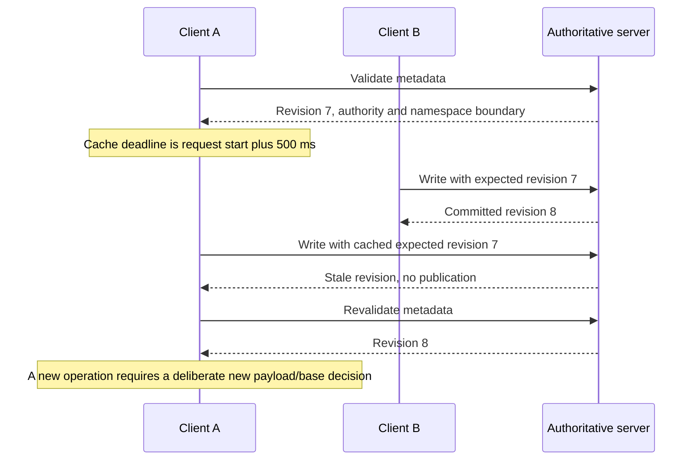

# One-second metadata validation and optimistic publication

The implementation includes [authorized content-hash reuse and bounded read batching](../../dfs-tikv/docs/CONTENT_HASH_CACHE.md). Earlier measurements below retain their original source identities.

This is the default cache contract for RocksDB `dfs-mount`, FoundationDB, and TiKV mounts. The implementation lives in RocksDB's `src/live/`; `dfs-mount-live` remains a compatibility alias of `dfs-mount`. The previous Watch/kernel-data-cache executable is now `dfs-mount-legacy`. The explicit default change selects the one-second guarantee despite the measured warm-read cost. Historical benchmarks retain their original binary names and hashes. This contract supersedes the earlier direction in [CLIENT_CACHE_DESIGN.md](CLIENT_CACHE_DESIGN.md).

The default preserves endpoint, token/TLS, mountpoint, UID/GID and allow-other options. `--cache-bytes` aliases `--content-cache-bytes`; metadata and directory limits remain configurable. With allow-other, kernel permission checks supplement remote authorization. Explicit fsync is always durable; legacy publication-only sync, Watch, prefetch and kernel-writeback tuning flags belong to `dfs-mount-legacy` and are rejected by the new default. Mmap is not a live view.

## Approved buffered publication

The current rework adds a bounded client buffer to all three default mounts. Newly created regular files can combine creation, bytes and attributes into one atomic batch. Directory creation and attributes of existing non-root directories share the same batch, bounded to 128 node updates and two MiB of file payload (buffer-11). Existing-file data writes, root attributes, rename and unlink retain their synchronous path. Ordinary write and close may succeed before remote publication; fsync and graceful unmount drain accepted changes and confirm durability. Sealed requests retain their identity on ambiguity and definite errors remain visible across close. Abrupt client loss can lose unsynchronized accepted bytes.

The metadata TTL is **500 ms** in this revision. Publication becomes eligible after 100 ms, with a measured 500 ms budget from the oldest accepted change to confirmed publication. Together these budgets target one-second cross-client visibility under normal operation. Delayed storage or a partition can miss the publication budget; that must be recorded, and cannot be called a hard one-second visibility guarantee for unpublished data. The one-second maximum age of metadata itself remains enforced by request-start deadlines and failure on expired validation.

See the [implementation, sequence diagram and measurement gates](../../dfs-bench/docs/WRITE_PATH_REWORK.md#bounded-client-publication-buffer). Incremental refresh now admits 4096 contiguous journal events before a full-view fallback, with bounded distributed journal/node/pin reads.

## What expires

The one-second bound applies to metadata: file identity, revision, size, attributes, namespace entries (including absence), authority and server incarnation. Cache lifetime starts when authoritative validation begins, not when its reply arrives or when the cache is hit. Kernel entry/attribute replies receive only the remaining time. Failed or delayed validation cannot extend an expired observation.

Cached bytes are immutable and keyed by incarnation, file identity and revision. They need not be deleted every second. They may be served only while current validated metadata still selects that revision and permits the read. Revision validation is what makes contents follow remote changes, including a same-size rewrite with restored mtime. Existing descriptors retain file identity across rename/unlink and follow its current revision after metadata expiry. Mmap is outside the live-view promise.

One shared validation can cover many cached objects. Unchanged head/authority renews the covered metadata cohort; ordinary changes apply contiguous deltas. Installing a partial delta or accepting one's own newer write must not skip another client's changes or renew unrelated metadata. Initial/reset full-view loading remains an implementation limit, independently of this contract.

## Turbopuffer as the architectural reference

The intended analogy is an optimistic cache over authoritative storage. Turbopuffer documents disposable compute caches, routing for cache locality, and concurrency control delegated to storage; its conditional writes evaluate conditions atomically with the write. These are the principles we reuse, with the filesystem revision as the write precondition. This is our adaptation, not a claim to reproduce turbopuffer's internal implementation. [Architecture](https://turbopuffer.com/docs/architecture), [guarantees](https://turbopuffer.com/docs/guarantees).

| Principle | Application to DFS |
|---|---|
| Cached state is usually usable | Serve cached metadata and revision-keyed bytes within the existing deadline; no remote coordination for every open or read |
| Storage decides what committed | Prepare from cached revision; publish only if original revision, entry identities and authority remain valid |
| Successful writes update the local cache | Install the acknowledged file revision immediately without a redundant fetch; preserve unrelated deadlines and the contiguous event cursor |
| Cache placement is an optimization | A warm frontend can be preferred without making it the correctness owner of a TiKV namespace |
| Conflicts and failures have explicit recovery | Refresh after a definite conflict; resolve the same request identity after an uncertain outcome |

Turbopuffer's default strong reads check storage for the latest writes. Our selected filesystem contract deliberately amortizes metadata validation over at most one second. Its documentation also describes write batching over up to a second; that batching interval is a separate concern. The user separately approved bounded local acknowledgement for DFS, with durable fsync and unmount; this is an explicit filesystem failure-semantics choice. [Read tradeoffs](https://turbopuffer.com/docs/tradeoffs), [WAL and batching](https://turbopuffer.com/docs/concepts).

The useful optimization target is the dependency chain: eliminate unnecessary validation, publication and refetch round trips. Where useful, preparation or immutable-data fetch can overlap metadata validation, but the result cannot be returned after the old deadline until the relevant revision and authority have been validated. Speculation requires bounded admission and discarding/retrying work whose generation changed. Turbopuffer describes this use of speculative parallel work in its [storage-engine talk](https://turbopuffer.com/blog/video-andy-pavlo-cmu); applying it to FUSE is a design proposal requiring its own tests.

This does not select a tenant-wide root by itself. The compare-and-swap or transaction boundary still follows the filesystem invariants. Both FDB and TxnKV now use native transactions over direct records, with shared filesystem state/journal dependencies; partition guards remain proposed work. Likewise, RocksDB remains locally owned by one server: copying the cache strategy does not create replicated or multi-server RocksDB writes.

## Optimistic concurrency protocol

1. A client selects expected revision `v` from its cached metadata. It need not fetch a new revision immediately before each mutation, even when that cached observation has expired: `v` is a speculative precondition, not metadata being served to the application. The conditional mutation itself must validate it authoritatively.
2. It sends the original request identity, expected revision, byte range/payload and any namespace entry tokens.
3. The server checks current session/authority and original preconditions atomically with publication. RocksDB uses its publication lock and batch; FDB uses native serializable transactions over touched records; TxnKV uses checked record dependencies and commit.
4. Success returns the new revision and receipt. Update the writer's local selected revision immediately, without extending unrelated cache deadlines or advancing past unobserved journal events.
5. A competing update causes an explicit stale-version conflict. Invalidate/revalidate before constructing a new operation. Do not silently rebase the rejected payload onto another writer's revision.
6. A timeout is an ambiguous outcome. Resolve or replay the same request identity and payload; never issue a new logical append because a reply was lost.

A concrete consequence: another client restoring mtime still changes the file revision. A subsequent truncate based on the old revision returns `ESTALE`; the caller must observe the new metadata and deliberately retry. Metadata-only changes are not silently ignored by the write fence.

Reads and stat cannot return expired observations; writes can attempt an expired precondition because commit-time validation either rejects it or returns a new authoritative revision. A successful write does not renew cached READ authority or unrelated metadata. The one-second window bounds reader staleness. It is not a grace period for stale writes: a server must reject an obsolete expected revision even one millisecond after another writer commits.



Creates check a missing destination, unlink checks its entry identity, and rename checks both source and destination identities plus directory invariants. A cached negative lookup is not permission to overwrite a concurrently created name. The server's current authority check remains mandatory for every mutation.

## Cache implementation and expected costs

The candidate uses direct FUSE data I/O with bounded daemon content caching. Keep kernel metadata caching within the shared one-second deadline. This makes ordinary read/pread enter the revision/authority gate even when a kernel page would otherwise be resident. No server-to-mount invalidation channel or remote background polling is required for this contract.

The [clean benchmark](../../dfs-bench/docs/RESULTS.md) measures the default mount across RocksDB, FDB and TiKV. It does not compare against the legacy kernel-cache mount or isolate individual cache optimizations. A future kernel-data-cache design must prove bounded revision/authority validation for existing descriptors and delayed reads before replacing direct I/O.

This is a correctness-driven choice, not a claim that userspace caching is inherently faster. A kernel page-cache hit can avoid a FUSE callback and copying. Conversely, removing per-open coordination, repeated validation and whole-view reconstruction can outweigh that cost in some workloads. Measure both effects; distinguish warm daemon hits from remote misses.

Reuse the tested TiKV metadata/revision logic for RocksDB, preserving RocksDB's separate publication and WAL-durability semantics. Shared view pins may protect unlinked identities without per-open/per-close server publications; they never confer authority. Asynchronous content reads must retain bounded admission and must recheck generation/authority before replying.

The candidate implementation is mapped to these edit sites:

| Concern | Candidate implementation | Boundary |
|---|---|---|
| Shared deadline and immutable bytes | [freshness](../src/live/freshness.rs), [mount cache](../src/live/mount_cache.rs), [content cache](../src/live/content_cache.rs) | Metadata chooses a revision; byte residency does not extend validity |
| Local file descriptors | [file handles](../src/live/mount_files.rs), [engine pins](../src/engine.rs) | Session-bound retention; every write still checks permission, version and any exclusive writer fence |
| Local acknowledged revisions | [mount cache](../src/live/mount_cache.rs) | Overlay an unchanged expected base without advancing the contiguous cursor or renewing its deadline; namespace changes still refresh |
| Deferred outcomes and durability | [publication tracking](../src/live/publication.rs) | Bounded receipts and ambiguous requests survive descriptor closure; explicit fsync and close-time error checks are separate |
| Asynchronous FUSE reads | [mount](../src/live/mount.rs) | Bound admitted tasks, validate before/after fetching, and drain pending replies before runtime shutdown |
| Default entry point and tests | [dfs-mount](../src/bin/dfs-mount.rs), [live cases](../tests/publication/live.rs) | The previous mount requires dfs-mount-legacy; dfs-mount-live is a compatibility alias |

This optimization does not remove required mutations from untar. File creation, each acknowledged data write and attribute restoration still publish through the backend. A serial producer can remain latency-bound even when all metadata hits the client cache. Write coalescing, group commit and a publication acknowledgement before durability are separate decisions; the one-second metadata rule does not authorize silently changing them.

On the GCP evaluation host, the RocksDB candidate is invoked as:

```sh
cargo build --locked --release --bin dfsd --bin dfs-mount
mkdir -p runtime/live-mount
target/release/dfs-mount \
  --endpoint http://127.0.0.1:7443 \
  --token-file runtime/credentials/admin.token \
  --mountpoint runtime/live-mount \
  --content-cache-bytes 268435456
```

It uses direct data I/O, shared demand validation and durable explicit fsync. Non-loopback evaluation uses the existing TLS endpoint and `--ca`. The preserved `dfs-mount-legacy` binary's cache and `--durable-sync` settings must remain explicit in baseline comparisons.

## Durability is separate

Revision identifies a published state, not a persistence watermark. RocksDB publication can return before its WAL barrier; TiKV's configured publication path has its own replicated acknowledgment. Explicit fsync must confirm the required receipt and prior errors. Closing a published file need not perform another durability barrier, but must retain deferred error handling. Successful durability confirmation may be remembered independently of metadata freshness; it does not authorize later reads. The RocksDB server barrier captures its current published prefix, so the mount can retire all already-acknowledged receipts while excluding local publication across that barrier. This uses the server guarantee, not a numerical comparison between tenant revisions and engine persistence prefixes; an adapter confirming only one receipt needs different accounting.

## Acceptance and performance evidence

The [acceptance criteria](../../dfs-tikv/docs/ACCEPTANCE.md) separate freshness, write fencing, authority and retention. The [clean three-system benchmark](../../dfs-bench/docs/RESULTS.md) records its exact validation scope, sources, storage and topology. Earlier runs were removed; their timings are not a baseline for this experiment.
