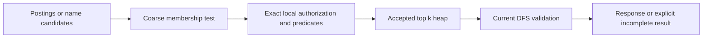

# Memory and recovery design for embedded DFS search

[Current clean benchmark](../../dfs-bench/docs/RESULTS.md). Previous benchmark runs and timing reports were removed at the user’s request.

This is a source-based investigation of the current DFS implementation, with Tantivy 0.26.2 and RocksDB in the same process. It excludes LanceDB. Kubernetes is the deployment target: keep that pairing in one engine process per storage pod hosting multiple shard replicas, introduce explicit memory ownership and admission, and let Kubernetes restart or replace failed pods. PostgreSQL offers valuable mechanisms for resource ownership and recovery, but copying its fork-per-connection architecture would require replacing assumptions inside both embedded engines.

Deployment decision, 2026-10-04: Kubernetes supplies process lifecycle and placement; etcd coordinates ownership and DFS supplies WAL replication, fencing, and verified recovery. Each replica has independent persistent storage. Memory caches disappear on restart, so the proposed search projection must support checkpoint restore plus incremental catch-up. The [restart protocol below](#persistent-search-projections-and-pod-recovery) and [Kubernetes lifecycle design](HA_DESIGN.md#kubernetes-deployment-and-operator-scope) define the target; these mechanisms remain unimplemented.

The companion [server implementation design](SERVER_IMPLEMENTATION_DESIGN.md) now selects concrete mechanisms for these problems, with source edit sites, Rust sketches, crash algorithms, and acceptance gates. It owns the implementation choices where this investigation lists alternatives: a separate RocksDB projection, chunked persistent memberships, on-demand subtree caches, and a redo protocol paired with Tantivy. This document remains the evidence and rationale.

The companion [client kernel-cache design](CLIENT_CACHE_DESIGN.md) applies the same ownership, lifetime, acknowledgment, and recovery rules to FUSE. The expanded analysis incorporates the design consequences of a source-based Flavify review of the prototype. Review findings and the verdict remain in the conversation; this document records the engineering rationale and proposed work.

The HA follow-up selects [one leader with asynchronous sidecar replication](HA_DESIGN.md), independent replica storage, readable followers, and etcd ownership coordination. Follower count remains open. The writer replies after local publication without waiting for replicas; recovered state may lose a suffix. The [fixed-pool discussion](#fixed-pools-and-the-half-ram-proposal) addresses whether reserving half the available memory would contain growth. These remain design proposals, not implemented fixes for the review findings.

The accompanying [uploads workload investigation](UPLOADS_SIZING.md) grounds sizing in read-only GCS metrics and `front` source: 457.18 million live private objects occupy 15.907 TiB, and metadata lookup/listing account for 77.17% of measured bucket requests. The bucket combines multiple representations and non-filesystem blobs, so neither object count nor bytes can be converted directly to DFS node count. The evidence strengthens the need for scoped metadata and bounded residency, and adds the existing `front` metadata/immutable-blob separation to the HA capacity comparison.

The [large-corpus measurement requirements](#large-corpus-memory-findings) and [memory follow-up register](#memory-inefficiencies-to-track) identify the evidence still needed. Previous benchmark artifacts and quantitative baselines were deleted for the clean run.

The most consequential findings are:

- Memory limits currently cover individual operations or components, not the whole service. Metadata generations and many small allocations deserve measurement before lossy permission bitmaps.
- Lossy candidate sets can preserve exact authorization and ranking, provided exact checks happen before pagination and before raising the ranking threshold.
- PostgreSQL's postmaster is valuable as a recovery boundary. Its shared buffer pool is explicit shared memory, not a consequence of copy-on-write.
- Publication, persistence, replication, and search visibility need separate acknowledgments. Current DFS mutation replies promise publication; even the RPC named `Barrier` does not perform persistence.
- Content can have an explicitly recoverable suffix-loss policy. Acknowledged revocations and leadership changes should have stronger persistence and fencing rules.

The investigation follows two diamonds: discover the mechanisms and current behavior; define the problems; explore possible designs; select the priorities. Recommendations below are proposed work, not implemented behavior.

## 1. Discover the current behavior and relevant database mechanisms

### The authorization path already gets several difficult things right

In [LexicalIndex::search](../src/lexical/query.rs), the searcher, metadata, lookup maps, and permission cache belong to one immutable `Published` generation. A permission key includes principal, scope, administrator status, policy generation, namespace generation, and body-versus-metadata access. Index generation is implicit in the containing publication.

Current grants select subtree bitmaps; scope intersects them; namespace exclusions subtract from them; body queries additionally require the indexed-body set. The resulting mask restricts candidates before offset and top-k. [top_docs](../src/lexical/ranking.rs) checks live-document status, permission membership, and exact literal verification before adding a hit to its bounded heap or raising its pruning threshold. Final DFS validation suppresses changed records, and a policy change suppresses the page. These obligations are explicit in [the lexical contracts](../src/lexical/CONTRACTS).

That makes the existing authorization behavior a foundation to preserve. Adding approximate membership without changing the collector interface correctly would break it.

### The memory surface is substantially larger than a permission mask

| Allocation or resource | Current implementation | Consequence |
| --- | --- | --- |
| Permission cache | Up to 128 entries per publication; clears the entire cache at capacity | Entry count does not cap bytes; simultaneous misses can duplicate construction; every publication starts cold |
| Query masks | Clones the cached allowed mask into `candidates`; prefix queries build another union | Cache hits still allocate; selective queries pay for a complete allowed-set clone |
| Subtree index | Inserts every record's slot into its own and every ancestor's bitmap | Work scales with the sum of node depths; even leaf nodes allocate a bitmap and a 64-character label key |
| Other namespace data | Records, slot-to-ID map, names, trigrams, and slot-to-document-address map | Multiple maps, strings, and allocations per node; bitmap payload is only one part |
| Refresh | Clones all metadata, gathers exported nodes, sometimes rebuilds all lookups, serializes all metadata | Ordinary content extraction is incremental, but metadata copying and checkpoint serialization still scale with total node count |
| Published generations | Queries retain `Arc<Published>`; refresh builds beside the old publication | Eviction or publication replacement cannot reclaim memory still held by readers |
| Ingestion | 32 MiB admission for owned body capacity plus document storage; extraction happens before admission | Useful bounded queue, but extraction, tokenization, postings, merges, and allocator retention are outside it |
| Tantivy writer | Two indexing workers share a 64 MiB writer budget | This is not the total number of engine threads or a process-memory bound |
| RocksDB | Three configured column families, each with 32 MiB write-buffer size; four background jobs | Immutable memtables, read caches, table readers, and other allocations remain additional consumers |
| Service admission | Eight lexical searches; RPC admission separately allows 64 globally and eight per tenant | Count limits constrain concurrency, but do not reserve a common byte budget across subsystems |
| Export | At most four leases retaining node vectors; the scale follow-up renews the 60-second deadline every 20 seconds, bounded by session expiry | Renewal permits longer extraction; request pagination still does not make the stored snapshot streaming |
| DFS views and startup validation | `Reader::scan()` collects a complete prefix into a vector; views retain nodes and ancestry; startup scans retained versions and verifies referenced chunks | Memory and restart cost also grow outside lexical search, including when several RPCs overlap |

Evidence: [index and lookup construction](../src/lexical/index.rs), [ingestion admission](../src/lexical/ingest.rs), [HTTP admission](../src/lexical/http.rs), [RPC admission](../src/rpc.rs), [export leases](../src/export.rs), and [RocksDB options](../src/store.rs). The permission cache uses `Arc` when returning a cached value, which avoids one clone; the subsequent candidate clone remains.

### Large-corpus memory findings

The historical memory and visibility measurements were removed. The [current clean comparison](../../dfs-bench/docs/RESULTS.md) uses 10,000 documents and does not establish million-file memory behavior.

Future runs must record total cgroup, anonymous, file-cache and kernel memory at the same sample, while distinguishing live allocations from allocator retention. RSS overlaps file cache and must not be added to it. Vary file count independently of body size to distinguish metadata generation/rebuilding cost from body extraction. A full-service allocation profile is needed before attributing a peak to metadata, bitmaps or RocksDB.

The proposed fix is incremental maintenance of metadata and namespace lookups, backed by a durable search checkpoint so pod replacement does not repeat the full build. A one-file create/delete/rename should update affected names, trigrams, and ancestor memberships while sharing unchanged structures. Directory moves may affect a subtree and need separate measurements. Compact allocations alone cannot remove the full rebuild. Measure visibility latency and recovery separately; neither has a new SLA yet.

### What duplicated metadata actually contains

The search projection stores complete filesystem descriptions. A [Node](../src/model.rs) owns its ID, optional parent ID, filename, content-version ID, and directory-entry token, plus kind, size, mode, modification time, and unlink flag. `Id` is a `String`. A lexical `Record` adds its numeric slot and an owned indexing-status string; `Metadata.records` is a `BTreeMap<Id, Record>`, so its key duplicates the ID inside the node. File contents and chunk manifests are separate objects and are not fields of this record.

The confirmed copying paths in [the indexer](../src/lexical/index.rs) and [export implementation](../src/export.rs) are:

| Owner or operation | Representation and lifetime | Amplification |
| --- | --- | --- |
| Source export lease | `IndexLease.nodes: Vec<Node>`; initial export retains the full node population until lease release | Paged replies clone nodes from an already materialized snapshot; renewal extends its lifetime, not its memory bound |
| Indexer's export staging | `BTreeMap<Id, Node>` collects all pages for the current export | Initial indexing holds another full node population, including separate map-key IDs; an ordinary Tantivy delta contains only changed nodes |
| Next search metadata | Each staged node is cloned into `Record.node`, with another cloned ID as the map key | During initial extraction, lease nodes, staged nodes, and the growing search metadata coexist; the lease is released before lookup construction |
| Refresh of an existing publication | `previous.map(|p| (*p.metadata).clone())` deep-clones the complete record map | Even a one-file body update copies approximately one million records at the million-file tier; unchanged strings are copied too |
| Namespace lookups | Slot-to-ID map, filename keys, node-label keys for subtrees, and name-trigram memberships | IDs and names are represented again in separate maps; allocation and key overhead add to bitmap payload |
| Document addresses | A slot-to-`DocAddress` map is rebuilt when bodies change or relevant segments change | A small body update can still scan all live indexed documents and allocate a replacement address map |
| Metadata checkpoint | Every publication serializes the complete metadata map to a new JSON sidecar through a buffered writer | This is full-population serialization and disk/file-cache traffic; it is not proof of a second full JSON buffer on the heap |

The old `Published` remains available while its replacement is built. Existing queries can retain it through `Arc<Published>` after the new generation is installed. Wrapping `Metadata` in `Arc` does not avoid the explicit deep clone of the value behind it. Multiple pinned generations can outlive cache eviction.

Body-only updates normally share the existing `Arc<Lookups>` when namespace and indexing status stay unchanged. Creating or renaming a file triggers lookup reconstruction beside the previous lookups. These lifetimes overlap differently: do not add every structure's isolated maximum and call it a measured simultaneous peak.

The lookup builder also inserts each file into its own subtree mask and indexes each distinct filename with a bitmap. With one million uniquely named files this creates roughly **one million singleton leaf-subtree masks and one million singleton filename masks**, plus directory masks and trigram postings. The cost includes map nodes, owned keys, bitmap objects, containers, and allocations. This is a source-derived cardinality example, not an allocation measurement. A future probe must attribute actual retained bytes across these representations.

### Memory inefficiencies to track

These are open work items within [implementation steps 3–5](#integrated-implementation-campaign), not completed optimizations or a second delivery plan.

| Work item | Proposed direction | Evidence required to close it |
| --- | --- | --- |
| Whole-map copying on small updates | Compact numeric metadata with shared immutable chunks or bounded overlays; copy changed chunks rather than all records | Allocation profiles at fixed corpus size show lower clone/build bytes; one-file update cost and retained generations are measured across repeated publications and consolidation |
| Whole-namespace lookup rebuilds and cold pod starts | Incrementally update affected lookup entries; checkpoint metadata, slots, and exact lookup chunks with the matching Tantivy commit | One-file create/delete/rename avoids a full namespace pass; same-PVC restart restores a verified projection; missing or invalid checkpoints trigger a bounded rebuild |
| Millions of tiny lookup allocations | Represent leaves and singleton names directly; materialize larger exact sets where useful; evaluate exact Roaring optimization separately | Measure lookup key counts, allocation counts, live bytes, and build time; include duplicate filenames, directory moves, scoped grants, and sparse slots after churn |
| Full export staging | Stream a snapshot-consistent source scan and consume bounded pages, with admission before construction | Peak construction memory remains bounded when consumers stall or cancel; snapshot versions, expiry, cleanup, and failed-publication behavior remain correct |
| Whole-population address and sidecar work | Measure these stages independently; evaluate incremental metadata persistence and reuse of unchanged address structures | Small-update CPU, allocation, and written bytes fall without stale segment addresses; recovery finds the committed artifact and orphan cleanup is crash-safe |
| Unaccounted generation and cache lifetimes | Charge retained objects to their actual owners, bound overlap, coalesce cache misses, and reserve maintenance capacity | Long refresh/query/churn runs settle; cancellation and eviction release unpinned reservations; pinned-reader pressure produces explicit admission behavior |
| Component budgets mistaken for a service bound | Account for DFS, RocksDB, query scratch, extraction, postings/merges, allocator retention, and charged file pages together | Before/after runs use equal cgroup limits and report successful work, rejected work, latency, lag, RSS/PSS, anon/file/kernel, and pressure events |

Profile before export, after export staging, after metadata cloning, after lookup/address construction, after commit/reload, and after the last reader releases a generation. Record both live requested allocation bytes and retained allocator pages. Vary file count independently of body size, namespace depth, unique names/trigrams, grant distribution, and slot churn. Regenerate million-file and large-body fixtures for future comparisons, and add overlapping writes, searches, and slow readers.

Every representation change must preserve publication identity, current grant/scope/exclusion handling, exact checks before offset/top-k, stale-body suppression, and the previous valid publication on failed refresh. Lower memory caused by returning fewer valid results, omitting authority checks, or leaving the index permanently behind does not close a work item. The 64 MiB writer setting and 32 MiB ingestion allowance remain component controls, not a promise that the process fits their sum.

### What PostgreSQL actually does with lossy bitmaps

`TIDBitmap` stores exact tuple offsets per heap page, or a lossy bit saying that a page needs examination. Exact pages and lossy chunks occupy the same hash table. With the usual 8 KiB page size, each chunk covers 256 pages. When the entry limit is exceeded, `tbm_lossify()` aims to reduce entries to half the limit, remembers where it stopped, and can raise the limit when further reduction is impossible. It is an approximate memory budget, not a hard ceiling. Exact sets can also carry a recheck flag, including after intersection with a lossy set. The implementation additionally avoids allocating a hash table for a single exact page. [PostgreSQL tidbitmap.c](https://raw.githubusercontent.com/postgres/postgres/REL_18_STABLE/src/backend/nodes/tidbitmap.c).

`BitmapHeapNext()` performs the original predicate recheck before returning a tuple, counts rejected tuples, and checks interrupts during traversal. Approximation saves candidate-set memory at the cost of extra examination; it need not change the answer. [PostgreSQL nodeBitmapHeapscan.c](https://raw.githubusercontent.com/postgres/postgres/REL_18_STABLE/src/backend/executor/nodeBitmapHeapscan.c).

The transferable ideas are an explicit exact-versus-maybe representation, a cheap empty/singleton case, hysteresis when degrading, and observable recheck costs. DFS should not reproduce PostgreSQL's ability to exceed its bitmap budget if the stated objective is a strict service envelope.

The important distinction is between reducing representation precision and weakening the result. A lossy candidate mask does the former only. Its exact predicate still needs a stable source of namespace and permission facts, enough reserved scratch to run, and a deadline. If that exact path allocates another full allowed mask, the design has merely postponed its original memory problem. DFS should keep exact parent/grant data within the captured publication and use bounded membership checks.

Choose the representation from expected total work, not mask size alone. A rare term with a large allowed population favors checking a small posting set; a common term with a tiny permitted subtree favors a compact permission filter. A widespread coarse mask can be smaller yet much slower because it admits nearly every posting. The planner need not begin as a statistical optimizer: a few measured thresholds based on candidate estimates, grant count, and budget availability are enough for a first experiment. Record the chosen plan so regressions can be attributed.

### What postmaster and fork actually buy

Postmaster accepts connections and launches backends, initializes shared resources, and coordinates startup, shutdown, and crash recovery. It deliberately avoids ordinary shared-memory and lock-manager work so that it can survive damaged backend state. A backend crash that could compromise shared memory triggers termination of other children and a recovery cycle. Consequently, PostgreSQL process separation does not mean every backend crash affects only one query. [PostgreSQL postmaster.c](https://raw.githubusercontent.com/postgres/postgres/REL_18_STABLE/src/backend/postmaster/postmaster.c).

The shared buffer manager allocates one pool of blocks plus descriptors, pins, locks, and I/O coordination. A buffer cannot be recycled while pinned; readers coordinate loading rather than independently installing copies. The pool also reserves checkpoint bookkeeping during initialization. [PostgreSQL buf_init.c](https://raw.githubusercontent.com/postgres/postgres/REL_18_STABLE/src/backend/storage/buffer/buf_init.c).

On the normal Unix path, fork inherits attachment to explicitly shared memory. The alternative exec path reattaches it. That sharing is separate from ordinary private heap pages initially shared through copy-on-write. [PostgreSQL shared-memory setup](https://raw.githubusercontent.com/postgres/postgres/REL_18_STABLE/src/backend/port/sysv_shmem.c), [backend launch](https://raw.githubusercontent.com/postgres/postgres/REL_18_STABLE/src/backend/postmaster/launch_backend.c).

For DFS, distinguish three types of memory:

| Memory | What another process can share | What remains private |
| --- | --- | --- |
| Clean Tantivy files mapped from the same underlying files | Resident file pages through the kernel | Readers, decompression buffers, metadata objects, page tables |
| Explicit shared-memory region | A deliberately designed offset-based representation and synchronization protocol | Anything outside that region |
| Heap inherited by fork | Initially unchanged physical pages | Pages dirtied by allocations, refcounts, locks, or mutations; subsequent updates do not propagate between private heaps |

Fork is not a safe shortcut for duplicating a running Tokio/RocksDB/Tantivy service. In a multithreaded parent, only the calling thread exists in the child, while lock states are inherited; until exec, only async-signal-safe calls are safe. [Linux fork contract](https://man7.org/linux/man-pages/man2/fork.2.html). RocksDB's supported ordinary ownership model is one process opening the database, with its DB object shared by threads inside that process. [RocksDB concurrency](https://github.com/facebook/rocksdb/wiki/Basic-Operations#concurrency).

The practical PostgreSQL lesson maps to Kubernetes supervision outside the engine process, plus explicitly owned resources. Run one engine process per storage pod hosting multiple shard replicas, serving many clients through bounded workers. The kubelet restarts failed containers and workload controllers replace lost pods; no custom parent supervisor is required. Kubernetes replacement does not establish a safe writer: etcd ownership, fencing, and verified WAL promotion control leadership and recoverable history. [Pod lifecycle](https://kubernetes.io/docs/concepts/workloads/pods/pod-lifecycle/).

The sharing boundary also applies to clients. Applications using one FUSE mount can benefit from its kernel cache; independent mounts retain independent identity, authority, and invalidation state. Separate replica PVCs hold separate files, and replicas on different nodes have separate kernels: budget a complete cache and metadata working set per replica. Identical file bytes do not establish shared physical pages. Any same-node sharing requires the same underlying files and must be measured. A replacement client pod starts a new mount unless an explicitly managed external mount survives; see [client lifecycle](CLIENT_CACHE_DESIGN.md#kubernetes-client-lifecycle).

### Other PostgreSQL mechanisms worth borrowing

The buffer replacement implementation uses a clock sweep, honors pins, and supports access-strategy rings for bulk work. These constrain cache pollution from scans without making every read update a global exact LRU. [PostgreSQL freelist.c](https://raw.githubusercontent.com/postgres/postgres/REL_18_STABLE/src/backend/storage/buffer/freelist.c). For DFS, test scan admission and RocksDB cache-fill policy during export/rebuild so maintenance does not evict the foreground working set. A block-cache bypass does not eliminate OS page-cache pressure.

Memory contexts group allocations by lifetime and support bulk cleanup, including cleanup callbacks and a small error reserve. [PostgreSQL memory-context design](https://raw.githubusercontent.com/postgres/postgres/REL_18_STABLE/src/backend/utils/mmgr/README). The Rust analogue is a request/publication-owned resource scope: its byte permits, snapshots, buffers, and cancellation state live and die together. This extends the existing ingestion `Admission` pattern. Rust ownership alone does not ensure immediate return of freed pages to the OS.

`work_mem` applies to individual query operations and can multiply across concurrent sessions and parallel workers. It is not a total server limit. [PostgreSQL resource settings](https://www.postgresql.org/docs/18/runtime-config-resource.html). DFS should use a total admission budget alongside per-operation limits instead of multiplying independent limits and hoping they fit.

PostgreSQL already supports asynchronous commit: a recent transaction suffix may disappear after a crash while recovery still produces a consistent database. Turning off synchronous acknowledgment differs fundamentally from disabling the mechanisms that make recovery correct. [PostgreSQL asynchronous commit](https://www.postgresql.org/docs/18/wal-async-commit.html). For example, PostgreSQL forces WAL through a dirty buffer's LSN before writing that buffer. [PostgreSQL bufmgr.c](https://raw.githubusercontent.com/postgres/postgres/REL_18_STABLE/src/backend/storage/buffer/bufmgr.c). DFS can relax acknowledgment durability while retaining atomic publication and dependency ordering inside RocksDB.

For DFS, the analogous dependency is a manifest's chunks, version, namespace update, and retry result. They must remain recoverable together at the promised prefix. A faster reply can precede persistence; it cannot precede the atomic publication that makes those relationships consistent. On the client, accepting a dirty page adds a still-earlier stage: bytes may exist only in one kernel. That stage needs its own error and crash semantics, as described in [client progress and synchronization](CLIENT_CACHE_DESIGN.md#cache-identities-and-progress).

## 2. Define the problems to solve

The first diamond narrows to six concrete requirements:

1. **A bounded working set under overlap.** Foreground queries, RPC writes, extraction, flushes, merges, refreshes, and old readers must fit together. A count limit or a configured writer budget cannot establish this.
2. **Exact authorization under every execution plan.** Changing representation must preserve grant unions, body READ, scope, exclusions, deletion checks, ranking, and policy-change behavior.
3. **Cheap steady updates and bounded retained generations.** A one-file update should not require unbounded whole-corpus copying; readers need explicit lifetime accounting.
4. **An explicit acknowledgment and loss contract.** A client must know whether success means published, persisted, replicated, or indexed, and how to reconcile an unknown result.
5. **A real ownership and recovery boundary.** Kubernetes must be able to replace a failed replica pod while etcd coordination and fencing prevent stale writers and recovery admission protects healthy shards.
6. **Steady throughput under maintenance and failure.** Admission must leave enough CPU, memory, and I/O for the tasks that release resources and restore progress.

Relaxing full filesystem ACID semantics does not remove these requirements. In particular, accepting lost content does not justify resurrecting a successfully revoked permission, publishing a manifest with missing chunks, or accepting writes from two owners.

## 3. Explore solutions and their tradeoffs

### Use several authorization execution plans before inventing a bitmap format

| Plan | Appropriate case | Tradeoff |
| --- | --- | --- |
| Empty, singleton, or all-within-scope fast path | No grants, one node, unscoped admin | Very small representation; exclusions and body predicates still apply |
| Shared exact Roaring mask | Repeated queries, compact slot domain | Cheap membership; reserve and account for build and retained bytes |
| Predicate-first traversal with exact authorization | Rare terms or selective node/name predicates | Avoids materializing the whole allowed set; needs a local exact permission oracle |
| Exact runs or namespace intervals | Hierarchical grants and clustered identifiers | Compact, but random slot assignment and moves reduce the benefit |
| Lossy blocks plus exact checks | Exact sets exceed budget and blocks retain useful selectivity | Less candidate memory, potentially much more CPU or I/O |
| Exact sequential scan with bounded scratch | No useful compact index/filter fits | Predictable memory, slower; deadline may require an explicit retryable failure |

The current builder creates self-subtree masks for files. Represent a leaf directly by its slot, and materialize subtree masks on demand for grant, scope, and exclusion roots under a byte budget. Keep an exact parent structure available for fallback. That avoids permanently allocating one tiny bitmap per file. It also creates a measurable tradeoff between build cost, hot-root caching, and candidate checks.

A compact slot-indexed metadata layout could replace repeated strings and tree nodes with numeric references. Chunked immutable pages or a bounded delta overlay could share unchanged metadata between publications. A snapshot-specific depth-first ordering can represent subtrees as intervals, but the existing slots are assigned while processing ID-sorted exports, not tree order. Do not assume present subtree memberships form ranges. Renames also make persistent interval maintenance a substantive design choice.

The same bounded-iteration principle applies below search. `Reader::scan()` returns all matching records, and some capacity checks happen only after that allocation. Introduce streaming or byte-bounded scans for views, export, and validation, preserving the required snapshot consistency. Startup currently verifies chunks referenced by every retained manifest, so WAL replay size alone cannot predict restart time. Verified checkpoints and incremental integrity validation could reduce that cost, but need their own recovery proof.

Each lexical publication also creates and syncs a complete JSON metadata sidecar. There is no sidecar reclamation in the inspected lexical code. Beyond write amplification, accumulated sidecars consume disk and file-cache capacity. Reclaim them only with explicit ownership rules covering the current commit, readers, in-progress publication, and retained recovery/checkpoint artifacts; a filename-age rule would not establish safety.

For exact masks, test `optimize()` once before immutable publication; avoid optimizing after every insertion. Replace clear-all eviction with a byte-accounted policy, and coalesce simultaneous builds of the same key. Account for outstanding `Arc` references after cache eviction. Sharing equivalent principals' masks is possible using canonical effective grants, but principal, scope, policy, namespace, and publication identity must not be omitted accidentally.

For selective queries, avoid the unconditional full-mask clone. Membership can be expressed as intersected immutable predicates, or a small candidate set can be checked against the shared permission mask. A local exact oracle could use the publication's numeric parent links plus captured grants, scope, and namespace exclusions. This preserves the existing prohibition on remote calls during ranking. Calling the current RocksDB-backed `validate_search()` for every posting would be a poor substitute: it would move allocation and read amplification into the hot loop.

### Metadata generations and reclamation

Treat every publication as a resource owner with a measurable byte size and oldest-reader age. A query pins the generation it actually uses; cache eviction cannot release that pin. Refresh admission therefore depends on the old live generations plus the next generation's construction peak, not just on current published bytes. Limit admitted overlap and cancel obsolete optional work, while keeping the last valid publication usable when a refresh fails.

A bounded overlay can make one-file changes proportional to changed metadata, but it introduces a consolidation threshold. Consolidation requires a reservation covering old base, overlay, and new base simultaneously. Record maximum overlay size and age, then compact under reserved capacity. Do not turn “incremental” into an indefinitely growing chain of lookups or retained publications.

Sidecar reclamation needs crash-safe ordering: write and sync the new artifact, commit its reference, establish which recovery artifacts remain valid, then delete unreferenced artifacts. Readers and retained checkpoints may impose additional retention. An orphan from a failed commit should eventually be collected, while the artifact named by the surviving commit must remain. Exercise crashes between those steps; a successful steady-state refresh test cannot prove reclamation safety.

The same lifecycle question appears in the mount. Its inode maps can grow with historical lookups, and per-handle directory vectors can duplicate namespace data. Kernel-managed file pages do not reclaim these daemon objects. [Client lifecycle accounting](CLIENT_CACHE_DESIGN.md#ordering-replies-insertion-and-reconciliation) belongs in the same memory campaign as lexical generation accounting.

### A safe lossy fallback needs precise semantics

Let `A` be the exact permitted set and `C` the coarse candidate set. Require `A ⊆ C`. A coarse hit means “possibly permitted,” never “permitted.” A block can be absent, proven entirely allowed, exact mixed, or mixed requiring recheck. Conversion must happen while building under the budget; constructing an oversized exact mask first defeats admission.

The proposed retrieval pipeline is:



For example, suppose an unauthorized result scores 100, an authorized result scores 10, and k is one. If the coarse hit at 100 enters the heap, it raises the pruning threshold and may prevent examination of the authorized result. Dropping the unauthorized result from the final page cannot repair the missing result. Exact authorization must precede heap insertion and threshold advancement, even when the final response validator is retained.

Positive unions and intersections of conservative supersets remain conservative. Subtraction does not: subtracting an approximate excluded set can delete legitimate results. Preserve the exact meaning of scope and namespace exclusions in the recheck; do not reuse positive-filter approximation rules for NOT or exclusion.

A slot-block design also lacks PostgreSQL's natural heap-page locality. With independent permission probability `p` and block size `b`, the chance that a block is retained is `1 - (1-p)^b`. At `p = 0.001` and `b = 4096`, approximately 98.3% of blocks survive despite only 0.1% of documents being authorized. This model is not a workload measurement; it demonstrates why coarse masks can become almost useless without clustering. Test block sizes and segment/slot locality against real grant distributions.

If even the coarse representation exceeds its allowance, stream with a bounded exact oracle or reject the query explicitly. Never silently omit checks or claim a complete top-k after a resource deadline. Track exact/lossy blocks, bytes, recheck count, rejection ratio, visited postings, and fallback reasons.

### Give memory a common owner and leave a reclaim reserve

Budget the service as:

```text
engine heaps + metadata generations + permission caches
  + admitted query scratch + write buffers + ingestion bodies
  + flush/merge/rebuild workspaces + allocator headroom
  + resident file cache + kernel overhead <= deployment envelope
```

Mapped file RSS overlaps the file cache, so do not add it a second time. Use process allocation attribution, RSS/PSS, cgroup anonymous/file/kernel accounting, and pressure/reclaim signals for different questions. An application budget can directly control its own reservations; it cannot perfectly predict all foreign-library or kernel allocations. A cgroup supplies containment, with a lower operating target to avoid relying on OOM kills for admission.

RocksDB documents multiple memory consumers: block caches, index/filter blocks, memtables, and pinned blocks. Cache defaults can be separate per column family, and index/filter memory may be outside the block-cache allowance. [RocksDB memory usage](https://github.com/facebook/rocksdb/wiki/Memory-usage-in-RocksDB). Configure a cache and `WriteBufferManager` shared across the column families within each shard, with separate managers across shards, decide which index/filter allocations to charge to that cache, and observe pinned usage. `WriteBufferManager` supports memtable accounting across families and cache integration; stalling is a soft control, not a process-wide hard limit. [WriteBufferManager](https://github.com/facebook/rocksdb/wiki/Write-Buffer-Manager). The pinned Rust binding already exposes the needed manager and cache APIs.

Tantivy 0.26.2 divides the configured total writer budget among indexing threads; it checks segment memory after processing document groups and separately runs merging. Its input queue is count-bounded. [Tantivy writer implementation](https://raw.githubusercontent.com/quickwit-oss/tantivy/0.26.2/src/indexer/index_writer.rs), [writer budget construction](https://raw.githubusercontent.com/quickwit-oss/tantivy/0.26.2/src/index/index.rs). Keep DFS's byte admission and additionally account for extraction and merge pressure. A single large token-rich document can create allocations beyond the raw body size; body-byte admission cannot prove a tokenization-memory bound.

Use soft pressure to evict rebuildable caches, stop starting optional refresh work, reduce concurrency, and choose bounded query plans. Reserve capacity for WAL synchronization, flushes, compactions, cancellation, and error responses. Blocking all work when memory is full can deadlock progress if the blocked work is what would free that memory. Rebuild throttling must also expose index lag rather than allowing permanently stale search.

The HTTP search permit already stays inside the blocking closure, so a timed-out request does not immediately free a slot while computation continues. Preserve this. Add deadline/cancellation checks to permission construction, namespace-mask work, and refresh loops; a timer around `spawn_blocking` cannot preempt a C++ call or a long unchecked loop. A hard execution-time boundary requires a process boundary and its associated recovery cost.

### Memory reservations and maintenance progress

A useful reservation is owned by the allocation's lifetime. Give query scratch to the query object, immutable lookup storage to its publication, ingestion bytes to the queued body, and snapshot bytes to the active snapshot. A cache entry holds a retained reservation; eviction transfers no bytes back until the last owner releases them. Foreign-library estimates remain estimates, so compare the sum with measured anonymous and file memory and retain explicit headroom.

Admission should happen before a full view or oversized candidate set has been assembled. If the final size is unknown, build in bounded chunks and acquire further capacity before extending. A failed extension can choose a bounded fallback or return a resource error. Do not wait for more capacity while holding the writer gate or another lock needed by a task that releases capacity.

Use separate queues or reserved allowances for foreground reads, writes, snapshots, and maintenance, under a common envelope. Per-tenant count and byte limits prevent one tenant from exhausting global snapshot capacity. The current snapshot path's 256-node messages and channel capacity of two do not bound its construction: it first creates a full view and copies all nodes into message parts. Its global stream pool is also shared with long-lived watches. A bounded transport queue is downstream of those allocations.

Likewise, the client needs demand, speculation, metadata, and dirty-write limits independent of retained body-cache bytes. These are separate machine budgets, connected by backpressure rather than a fictional distributed semaphore. A rejected snapshot or stalled write should produce a bounded retry policy, not unlimited queued work on the other side. [Client memory ownership](CLIENT_CACHE_DESIGN.md#memory-ownership-and-throughput).

Throughput should be measured after all queues reach steady behavior. In a simplified workload with mean retained work size `s`, arrival rate `r`, and time in flight `t`, the associated working set is approximately `r * t * s`. This is a sizing approximation, not a bound: tail latency and oversized operations require their own allowances. Slower sync, compaction, or snapshot consumers increase retained bytes even if input rate stays unchanged.

Protect the operations that drain those bytes. Reserve enough memory and execution capacity for WAL sync, flush, compaction, publication completion, and invalidation. Optional prefetch, refresh, or full exports can be delayed first. Report queue wait separately from execution, and show admission rejections alongside throughput; a lower p99 caused by rejecting half the workload is a different outcome from processing it faster.

Metrics should expose bounded categories such as operation, stage, result, and execution plan. Keep individual request, tenant, inode, and publication identifiers in diagnostic logs or sampled traces rather than creating an unbounded metric series for each. Useful gauges include reserved versus measured bytes, retained generation count/age, dirty bytes, oldest unpersisted age, and snapshot bytes by admission class.

### Fixed pools and the half RAM proposal

A fixed pool can bound the memory allocated through it. PostgreSQL's shared buffers demonstrate the value of fixed capacity, explicit pinning, replacement, and ownership. They do not bound the whole PostgreSQL process population: private query work and other allocations remain outside. PostgreSQL recommends 25% of system memory as a starting point for shared buffers on a dedicated server and notes that allocating over 40% is unlikely to help because the OS cache also matters. Those are PostgreSQL tuning guidelines, not DFS sizing rules. [PostgreSQL resource settings](https://www.postgresql.org/docs/18/runtime-config-resource.html).

For DFS, distinguish three proposals:

| Mechanism | What it controls | What remains outside |
| --- | --- | --- |
| Fixed byte allowance shared by components | Admission and retention for allocations that reserve against it | Unaccounted native allocations, allocator overhead, kernel/file memory |
| Preallocated arena or slab pool | Actual storage for objects designed to allocate from that pool | RocksDB/Tantivy internals unless explicitly adapted; arbitrary heap allocations |
| Interprocess shared memory | Physical duplication for data represented with a shared layout and synchronization | Replica copies on different machines and private engine objects |

The first is the best starting point. A single-process shard already allows threads to share cache objects; it does not need interprocess shared memory for that. Allocate reusable slabs where profiling finds value, such as fixed-size content buffers or compact metadata pages. Do not assume an ordinary Rust `Vec`, a C++ memtable, a Tantivy posting buffer, and a memory-mapped segment will all use a newly allocated byte arena.

Flink supplies a particularly relevant precedent: it configures a shared RocksDB cache and write-buffer manager across instances within a task slot, charging the dominant read/write structures to a managed allowance. It does not replace all RocksDB allocations with a universal arena. [Flink RocksDB memory management](https://nightlies.apache.org/flink/flink-docs-stable/docs/ops/state/state_backends/#memory-management). Its process configuration separately accounts for managed memory, task/framework memory, networking, and runtime overhead. [TaskManager memory](https://nightlies.apache.org/flink/flink-docs-stable/docs/deployment/memory/mem_setup_tm/).

The DFS equivalent should configure one RocksDB cache plus a write-buffer manager across its column families, include index/filter blocks where supported, and give DFS metadata/query work separate reservations within the same process envelope. Charging memtables against cache capacity is accounting: the memtables do not physically become cache blocks, and their allowance must not be added twice. [RocksDB write-buffer manager](https://github.com/facebook/rocksdb/wiki/Write-Buffer-Manager).

Pinned blocks deserve explicit treatment. RocksDB's default non-strict LRU capacity can be exceeded when readers pin blocks; strict capacity rejects further insertions and can fail reads or iterators. That is a pressure behavior to test, not a guarantee that the entire native heap fits. Long iterators and snapshots also prolong storage lifetimes even when their immediate heap footprint is small. [RocksDB block-cache limits](https://github.com/facebook/rocksdb/wiki/Block-Cache).

### A concrete memory experiment

Treat 50% as a configurable aggregate managed allowance to test, not an instruction to touch half the node's RAM at startup. Use the replica container's memory limit, with capacity planned for colocated pods and recovery. If there is no explicit deployment allowance, require configuration rather than assuming the machine's total RAM belongs to one replica.

For an illustrative 8 GiB replica container, the following is a starting experiment, not a validated production configuration:

| Owner | Allowance | Pressure behavior |
| --- | ---: | --- |
| RocksDB read cache plus charged memtables | 2 GiB | Evict clean blocks; flush and throttle writes; account pinned memory |
| DFS metadata generations and permission caches | 1 GiB | Reclaim unpinned entries; admit fewer overlapping generations; reject growth that cannot fit |
| Query, snapshot, replication, and RPC buffers | 0.5 GiB | Bound bytes and concurrency before allocation; reserve replication and lease-renewal capacity |
| Index ingestion and configured writer budget | 0.5 GiB | Throttle ingestion; account native excess outside this allowance |
| Native workspaces, runtime, stacks, and allocator overhead | 1.25 GiB planning allowance | Observe actual use; reduce foreground allowances if the estimate is exceeded |
| Resident file cache and kernel memory | 2 GiB planning allowance | Leave room for mapped search files and storage activity; observe cgroup pressure |
| Emergency and uncertainty headroom | 0.75 GiB | Keep operational target below the container limit |
| Total | 8 GiB | The first four rows form a 4 GiB managed budget |

These are not seven independently enforceable kernel partitions. Some are application admission limits, some engine configurations with soft behavior, and others measured planning allowances. Shared pages must be counted once. If native workspaces grow beyond the estimate, the managed budget must contract or concurrency must fall; the table alone cannot stop an OOM.

Reserve logical capacity at startup, then acquire physical pages as useful work needs them. Pre-touching a large unused arena consumes resident memory and reduces room for the file cache; reserving virtual address space alone does not establish resident capacity. Reuse warmed slabs when doing so reduces allocation overhead, with a way to release unused pages if the implementation supports it. Neither approach removes the need for fallible admission before building a full snapshot or next metadata generation.

Start with explicit byte permits and existing engine controls. A process-wide custom allocator is a much larger undertaking: C++ allocations, memory maps, fragmentation, and allocator failure behavior must all be addressed. Exhaustion of an arena must lead to a defined resource error or throttling, not an unexpected process abort while handling an otherwise valid request.

For the review findings, a managed budget directly helps permission masks, overlapping metadata, snapshot construction, and replication queues. Inode lifetime leaks still need reclamation. Metadata sidecars still need disk garbage collection. Stale replies, async lock discipline, and unknown mutation outcomes still need their specific correctness fixes. A pool changes the consequence of excess allocation from uncontrolled growth to admission pressure; it does not make stale or unreachable objects useful.

Compare 35%, 50%, and 60% managed allowances at equal container limits, including live refresh, snapshot transfer, slow followers, and index rebuild. Record throughput, tail latency, rejects, cache misses, pinned bytes, native excess, file-cache residency, and pressure stalls. A 50% setting is successful only if the complete mixed workload progresses within its envelope. Connect the server experiment to [the client application-plus-daemon envelope](CLIENT_CACHE_DESIGN.md#memory-ownership-and-throughput); the two machines have separate budgets.

The uploads cardinality gives a useful conditional stress case: one resident 1 KiB record per live private object would require 436 GiB per logical copy, or 6.81 GiB per replica with 64 perfectly balanced shards. Neither one-record-per-object nor 1 KiB is a measured DFS mapping or allocation cost. Even so, the example exceeds the proposed 1 GiB metadata allowance and shows why reserving half the RAM cannot fix full-population metadata maps. Establish the selected workload's node count and skew, then test compact, disk-backed metadata with bounded hot views and pinned-generation admission. [Measured workload and explicit assumptions](UPLOADS_SIZING.md#consequences-for-the-half-ram-proposal-and-client-cache).

### Choose the process boundary around a shard

| Design | Memory and throughput | Recovery implications | Assessment |
| --- | --- | --- | --- |
| Multiple shard replicas in one DFS process, plus a replication sidecar | Shares fixed process/worker overhead; per-shard caches and budgets; separate sidecar memory | Process crash affects hosted replicas; copies of each shard stay on distinct nodes | Proposed production topology |
| Fork a warmed DFS for clients | Private heaps diverge; threaded engine state is unsafe to reuse | No supported shared writer or lock protocol | Reject for the current engines |
| Separate immutable search workers | Can share clean file pages; duplicates private query state | Requires snapshot retention, publication distribution, and current-authority protocol | Alternative only if the single-process engine requirement changes |
| Build a PostgreSQL-style shared-memory engine | Potential common cache across backends | Requires new allocators, interprocess synchronization, cleanup, and engine integration | Disproportionate work here |

Kubernetes starts a storage pod containing `dfsd` and a replication sidecar. `dfsd` opens one writable RocksDB per hosted shard; the sidecar opens local secondaries for WAL export. Investigate separate PVCs per replica versus separate directories on a pod PVC. Propose per-shard caches/write-buffer managers under a DFS process governor, plus a separate sidecar budget: secondary state is not shared Rust heap memory. A process-wide cache is an elasticity alternative to measure against noisy-shard isolation. Kubernetes handles lifecycle; DFS handles replay, fencing, promotion, and routing. [Concrete runtime/volume architecture](HA_DESIGN.md#2-multiple-shards-volumes-and-memory).

Sharding should follow tenant or another explicit namespace ownership boundary. The current `Engine::mutate()` holds a global writer mutex through validation and publication, so unrelated tenants can serialize. Retain its correctness while measuring time spent validating, waiting, and publishing. Parallel preparation and batching can help only if mutable preconditions are revalidated at the serialization point. More RocksDB background threads alone cannot remove this bottleneck. Separate shard databases permit independent writer gates; cross-shard atomic rename should be unsupported or a separately specified protocol.

Whole-process recycling also currently has a significant hidden cost. [Engine::open](../src/engine.rs) creates a fresh incarnation every time, and [LexicalIndex::restore](../src/lexical/index.rs) declines an index from a different incarnation. The next refresh performs a rebuild. [The recovery test](../tests/lexical.rs) intentionally covers this. Rebuild cost must be measured before assuming frequent shard recycling is cheap.

A future recovery design should distinguish session/boot epoch, fenced writer term, and durable data lineage. Reusing an index must verify its source prefix and lineage against recovered data, including truncation or divergence; merely ignoring the incarnation mismatch would be unsafe. Retain the current rebuild behavior until those checks exist. Replicas can provide availability while a shard rebuilds, provided their authority and ownership rules are explicit.

Recovery readiness should be staged. A replica can have its database opened but still be validating source dependencies; it can serve authorized filesystem operations once authority and source state are ready, while search remains unavailable. The client selects a peer using source/search readiness; the receiving peer enforces those checks independently. Kubernetes liveness measures local process health, not quorum or search lag; a startup probe allows bounded initialization without repeatedly killing a recovering process. Cap recovery attempts and concurrency at the application/operational layer; container restart backoff alone cannot bound rebuild I/O. [Probe semantics](https://kubernetes.io/docs/concepts/workloads/pods/probes/).

Pod isolation protects healthy shards only when their storage, CPU, and memory allowances also leave room for recovery. A replica restart that launches an unrestricted full scan and index rebuild can harm every neighbor on the same node or storage backend. Cap rebuild concurrency and reserve recovery capacity before relying on replacement as an operational tool.

### Persistent search projections and pod recovery

Shutdown loses every heap bitmap, permission-cache entry, and in-memory delta. A machine shutdown also loses its kernel page cache. The current implementation persists Tantivy and a JSON metadata sidecar, but not `Lookups`: restore reconstructs those maps with `Lookups::build`. Engine restart changes incarnation and rejects the previous projection, causing a broader rebuild. Merely mounting these files on a PVC does not change that code path.

The proposed Kubernetes target persists the expensive derived structures as a reusable search checkpoint. This is additional implementation work, not an existing bitmap serialization feature:

The [selected storage and commit design](SERVER_IMPLEMENTATION_DESIGN.md#7-commit-projection-and-tantivy-together-then-recover) realizes this with projection RocksDB state/WAL for ordinary restart and periodic paired checkpoints for transfer/backup. It does not write a full snapshot each publication. Name/trigram/live/body memberships are persistent; optional subtree masks are rebuilt lazily from persisted parent/child relationships. The manifest discussion below states recovery requirements; that companion specifies the concrete two-engine protocol.

| State | Durable location in the target | Recovery behavior |
| --- | --- | --- |
| Source nodes, policy, versions, retry outcomes, and applied position | Replica PVC, covered by its locally recovered source WAL/checkpoint and atomic replay cursor | Recover local state and replay verified WAL batches; missing storage requires checkpoint installation |
| Tantivy segments and commit | Same replica PVC, in the search directory | Reopen the selected verified commit; rebuild if incompatible or inconsistent |
| Compact metadata, slot mapping, parent links, name/trigram/live/body memberships | Projection RocksDB state/WAL on the PVC; paired checkpoints for transfer | Reopen verified state and read needed chunks, then maintain affected entries incrementally |
| Uncheckpointed metadata/lookup deltas | Volatile, with a replayable committed source suffix retained | Reconstruct from source changes after the checkpoint; never require a lost heap overlay |
| Optional subtree masks, effective permission masks, and query scratch | Bounded process memory | Start cold and construct against exact parent relationships, the captured generation, and current authority |

Use singleton slots directly and compressed exact sets for larger memberships. The persisted format must support bounded reads and updates; persisting one huge blob only relocates the full-copy problem. Immutable chunks plus a bounded delta are the proposed direction. The exact chunk size, serialization format, and whether chunks are mapped or decoded remain measurement decisions. An `Arc` around a whole Roaring bitmap does not provide container-level copy-on-write.

A projection manifest binds format/schema, shard and durable lineage, covered committed source position, metadata and slot generation, checksums, and the exact Tantivy commit/segment set. Document addresses depend on that segment set and must be validated or rebuilt when it changes. Persist new artifacts before atomically committing their references; retain the previous recoverable manifest and all referenced files until the replacement is durable. Coordinate Tantivy segment reclamation with this retention; a manifest referencing deleted segments is not a checkpoint. Metadata, bitmap chunks, and text segments from different generations must never be combined. Garbage collection honors readers, checkpoints, and in-progress publication.

On restart:

1. Open the replica's durable identity and storage, recover source/replay state, and establish the recovered prefix and current ownership before serving. A StatefulSet name alone does not authorize a new member or prove data lineage.
2. Select a complete search checkpoint from the same lineage whose covered position belongs to the recovered committed history. Reject corrupt, incompatible, ahead-of-source, or divergent artifacts. Boot/session epochs remain distinct from durable lineage.
3. Reopen its Tantivy commit and load required metadata/lookup chunks under the replica's memory budget. Permission caches start empty. Serve search only when the complete captured generation and current-authority checks are usable.
4. Catch up from the checkpoint position using retained source changes, maintaining metadata and lookups incrementally. Retention must preserve the content versions needed for replay, or the implementation must reconcile to a later consistent source snapshot. A history gap triggers snapshot reconciliation or full rebuild, never a partial generation advertised as complete.
5. Publish the completed generation atomically and expose its indexed position. A safe older generation may serve only under the existing exact validation and namespace-exclusion rules; otherwise search returns index-not-ready. Source readiness can precede search readiness.

A replacement with an intact PVC takes this restore path. A lost PVC takes source snapshot plus log replay from a healthy peer, then builds a projection or installs a separately verified search checkpoint. A copied search checkpoint includes its own slot map and matching segments, not another replica's ownership or local identity. Recovery remains possible without a search checkpoint because source state is authoritative. See [replacement replicas](HA_DESIGN.md#snapshots-and-replacement-replicas).

For planned termination, stop new admissions and attempt a bounded drain/checkpoint within the pod's grace period. Correctness must survive SIGKILL or power loss before that work completes; periodic durable checkpoints and retained replay history provide recovery. A complete cluster restart needs recovered etcd authority, fencing, and an explicitly selected complete source prefix. The selected asynchronous design does not require a synchronized follower before the leader publishes. Loss beyond that requires the documented backup/disaster-recovery procedure, not bootstrap of a fresh empty cluster under the old identity.

Benchmark same-PVC cold restart, lost-PVC replacement, missing/corrupt projection artifacts, replay gaps, and simultaneous node recovery. Report source recovery, projection load, catch-up, full-rebuild time, bytes read/written, and peak memory separately. The new measurements must distinguish the current implementation from the proposed format.

### Make permitted loss visible in the protocol

Current `Store::publish()` writes an atomic RocksDB batch with WAL enabled and sync disabled. The internal helper currently named `Engine::persistence_barrier()` serializes persistence, captures a publication prefix under the writer gate, releases that gate during `flush_wal(true)`, and advances only the captured prefix on success. Concurrent later writes remain pending. This is a useful group-persistence foundation, with focused tests in [persistence_tests.rs](../src/persistence_tests.rs).

The default 100 ms timer is a scheduling target, not a maximum loss window. Publication rejects a full pending-byte backlog and latches returned storage errors, but persistence age is currently a metric rather than an admission gate. A slow or stuck sync can outlive the interval. The byte check happens before building the next batch, so it can overshoot the threshold by an admitted mutation.

Normal non-sync WAL writes reach the OS before completion when manual WAL buffering is disabled. Process death and host/power failure therefore have different expected outcomes; disabling WAL introduces a different failure mode again. [RocksDB write durability](https://github.com/facebook/rocksdb/wiki/Basic-Operations#synchronous-writes).

There is currently no durable mutation mode in `Outcome`, and the RPC `Barrier` only checks that the session exists. `published` and `persisted` metrics are aggregate engine counters, while mutation `Outcome.head` is per tenant; comparing them directly would be invalid. [RPC dispatch](../src/rpc.rs), [Outcome and Metrics](../src/model.rs), [persistence counters](../src/engine.rs).

Proposed acknowledgment stages should carry a common shard/tenant sequence mapping and an identity that cannot be confused across recovery or leadership changes:

| Stage | Success means | What it does not establish |
| --- | --- | --- |
| Published | Atomic mutation visible on the current owner; retry identity recorded with it | Survival of power failure or owner loss |
| Locally durable | A completed sync covers the mutation and its dependencies | Survival of disk/failure-domain loss |
| Quorum durable | Unsupported in the selected asynchronous replication design | Local sync cannot establish this stage |
| Indexed through | This search generation covers a verified source boundary | Current permission validity without authority checks |

Keep the contract aligned with DESIGN.md: ordinary content and policy changes publish without waiting for replicas. Group opt-in local durability waiters behind one sync. Promotion to a lagging follower can lose a complete suffix, including recent grants/revocations and locally persisted writes absent from that follower. A stronger policy-durability contract would be additional work, not an implicit default.

Receipts should identify the request, data lineage/writer term, tenant/shard, sequence, and acknowledged stage. On retry, return the stored result when present; otherwise distinguish not applied from unknown after loss. An external acknowledgment ledger or retained client receipts is needed to identify vanished acknowledged operations: a lost in-memory high-water mark cannot describe its own disappearance. Existing recovery tests already use an independent list of accepted mutations; bring that principle into the operational contract.

### Operation names and receipts

Retire “barrier” as the name for these different operations. It hides the condition being waited on, and the current wire operation does not wait at all:

| Existing behavior or proposed need | Name | Completion condition |
| --- | --- | --- |
| Existing `Call::Barrier` behavior | `CheckSession` | Session validation succeeded at this call; no publication or persistence promise |
| Internal group sync currently called `persistence_barrier` | `persist_published_prefix` | Captured publication prefix is covered by completed local sync |
| Drain buffered local writes | `WaitForPublication` | Captured per-inode write sequence has resolved successful server outcomes |
| Wait for specified durable receipts | `PersistThrough` | Requested receipts and dependencies reached local persistence; quorum requests remain unsupported |
| Wait for search freshness | `WaitForIndex` | Search source cursor covers the requested receipt in the same lineage |
| Wait for one mount's cache reconciliation | `WaitForReconciliation` | Its view and required invalidations cover the requested source cursor |

These are design names, not implemented calls. A future rename must preserve bincode enum tag ordering; new semantics require explicit protocol additions and compatibility tests. Renaming the existing no-op wait to `PersistThrough` would falsely strengthen its guarantee. The client proposal uses the same [progress vocabulary](CLIENT_CACHE_DESIGN.md#cache-identities-and-progress).

A receipt should identify the request and sequence domain before exposing a numeric position. For example, lineage, shard, tenant, writer term, tenant head, and a server-resolved persistence position establish the mapping; the exact wire representation can be smaller through opaque tokens. Clients should not synthesize that mapping from aggregate metrics. Return which durability level was actually achieved, and reject impossible comparisons across lineage changes.

The current client retries the same serialized mutation during its bounded retry loop, which preserves idempotency within that loop. After retries are exhausted, however, `Client::mutate` returns an error without exposing the request identity it generated. A caller cannot reliably distinguish a lost reply from a lost mutation or resume that identity later. Retain pending mutation identities outside the individual RPC attempt and expose outcome reconciliation before introducing kernel writeback, where subsequent batches depend on the prior result.

Define the lifetime of retry evidence. Pruning outcomes without a published retention contract makes an old unknown request ambiguous again. Within the supported window, distinguish found-and-applied, proven-not-applied, and unknown; absence alone does not prove nonapplication after history pruning or suffix loss. Clients must stop dependent optimistic writes when the outcome remains unknown.

Persistence backpressure should cover both bytes and age. Reserve the next mutation's encoded cost before publication, or document a maximum bounded overshoot. Once the oldest unpersisted publication exceeds a configured age, stop accepting weaker acknowledgments until sync catches up or return an explicit failure. This bounds accepted exposure during a stalled sync; it does not make the storage operation itself complete within that age.

| Failure | Current behavior or risk | Required observable outcome in the proposed design |
| --- | --- | --- |
| Query deadline or canceled client | Blocking work can continue until it exits | Keep admission charged; discard the failed page; record deadline and work duration |
| Process SIGKILL, OS survives | WAL-backed completed publications are expected to survive ordinary process death | New sessions/incarnation; recovered prefix and retry reconciliation |
| Host/power failure | Unsynced suffix may disappear | Report recovered boundary and reconcile receipts; no invented 100 ms guarantee |
| Slow or failed sync | Byte backlog grows; returned errors latch | Bound accepted bytes and persistence age; reject explicitly; keep recovery capacity |
| WAL corruption or missing storage | Point-in-time recovery can stop before damaged data | Separate corruption from permitted suffix loss; compare durable evidence and repair or fail closed |
| Index commit/publication failure | Readers retain prior publication; changed source records are suppressed | Publish index lag/failure and rebuild/retry status; never mix generations |
| Owner partition or stale former leader | Current PoC has no consensus ownership protocol | Fence old owner; minority cannot acknowledge authoritative progress |
| Disk loss or replica failure | Local WAL alone cannot recover the failed storage | Apply the declared replica/backup RPO and RTO, verify data before promotion |
| Lost invalidation notification | A wakeup cannot establish complete history | Reconcile by authoritative cursor; detect gaps and resynchronize |

Point-in-time recovery is a choice about handling damaged WAL, not evidence that acknowledged durable data cannot be lost through media corruption. [RocksDB recovery modes](https://github.com/facebook/rocksdb/wiki/WAL-Recovery-Modes). The current tests combine process kills with offline WAL truncation and consistency checks; they do not simulate storage firmware, kernel crashes, real power loss, or distributed failover. Do not promote their success into those guarantees.

### HA requires choosing one authoritative ordering mechanism

The leader supplies mutation order and publishes locally without waiting for replication. A separate sidecar exports WAL batches to readable followers with independent storage; follower count remains open. etcd supplies ownership/configuration consensus through its built-in Raft. File mutations do not go through etcd or an application Raft log. Multiple shards per pod and tenant partitioning use a [versioned range map](HA_DESIGN.md#routing-algorithm).

[HA_DESIGN.md](HA_DESIGN.md#1-can-the-sidecar-replicate-rocksdb-wal) examines the pinned secondary/WAL APIs, exporter and receiver code boundaries, retention, and RPC fallbacks. Both leader and follower DFS processes open RocksDB as primary; their sidecars open it as secondary. The receiver applies resolved operations and its source cursor atomically. Replaying the public mutation API would regenerate IDs/timestamps; the existing Change journal also lacks enough information to reconstruct state.

Leader reads and indexing follow local publication immediately. Current follower reads obtain a leader barrier and wait for a covering snapshot, including authorization. Replication and index progress remain separate. Lagging-follower promotion may discard an acknowledged suffix; it must preserve a complete prefix and fence the former writer. [Failure model and tests](HA_DESIGN.md#4-failure-model-and-jepsen-campaign).

### What to take from Cassandra, NATS, and etcd

| System | Useful lesson | Proposed role or boundary for DFS |
| --- | --- | --- |
| Cassandra | Periodic acknowledgment versus group/batch persistence; lag-aware backpressure | Borrow configurable acknowledgment stages and batching, while retaining a single namespace order |
| Core NATS | Fast, transient publish/subscribe with at-most-once delivery | Optional invalidation/wakeup transport; authoritative cursor polling remains necessary |
| JetStream | Replay, retention limits, acknowledged delivery, replicated streams | Optional external event distribution; only use as the authoritative mutation log after specifying conditional writes, replay, durability, and apply semantics |
| etcd | Durable ordered control state, leases, revisions | Ownership/control plane, with real storage fencing; keep content and search traffic out of it |

Cassandra's configuration distinguishes periodic writes that can acknowledge before sync from group/batch writes that wait for commit-log persistence. [Cassandra 5.0 configuration](https://raw.githubusercontent.com/apache/cassandra/cassandra-5.0/conf/cassandra.yaml). Its general replica model resolves conflicts through timestamp-based last-write-wins and repairs divergent replicas. [Cassandra architecture](https://cassandra.apache.org/doc/latest/cassandra/architecture/dynamo.html). My inference is that importing that conflict model for rename, version preconditions, and revocation would create harder product semantics than the current single-owner namespace. Quorum counts alone do not turn it into a serial namespace transaction protocol.

Core NATS does not retain missed messages; JetStream supplies replay and at-least-once delivery. [NATS delivery model](https://docs.nats.io/concepts/jetstream). DFS therefore does not need a bus between its colocated engine and indexer: the current notification channel plus source-head polling is sufficient in principle. Add a bus for independently deployed consumers when needed. An outbox written with the source mutation and idempotent consumers handles the gap between a RocksDB write and an external publish. JetStream delivery/deduplication is not atomic with a separate RocksDB application transaction.

NATS explicitly documents that file-stream acknowledgment can precede fsync, including after replication to a quorum. Its documented failure sequences include an OS-failed replica losing unsynced data and later joining a majority that lacks formerly acknowledged messages. The documentation offers `sync_interval: always` for stronger disk acknowledgment and discusses controlled replica rejoining. [JetStream durability](https://raw.githubusercontent.com/nats-io/nats.docs/master/nats-concepts/jetstream/README.md). This is exactly the sort of named failure mode DFS should expose if selecting faster acknowledgments; “three replicas” is not a sufficient durability specification.

etcd's KV contract provides durable ordered operations, but watches can be arbitrarily delayed. [etcd API guarantees](https://etcd.io/docs/v3.6/learning/api_guarantees/). An expired owner lease alone cannot stop a paused former owner from resuming and writing; the resource must enforce a fencing token, or infrastructure must isolate the former owner before storage reuse. [etcd fencing example](https://github.com/etcd-io/etcd/blob/main/contrib/lock/README.md). An etcd check followed by an unguarded local write still has a gap. Stale replicas also cannot safely serve current authorization based only on delayed watches: require a current leader barrier and a covering local snapshot under the fencing protocol.

### Ownership and failover sequence

Asynchronous replication permits a lost suffix. It still requires one authoritative leader and a complete recovered prefix. StatefulSet replacement, endpoint changes, and lease expiry cannot by themselves fence a paused former writer.

1. Reserve a promotion attempt with an etcd transaction against the current configuration.
2. Fence the old writer; confirm its termination or infrastructure isolation before activating another owner.
3. Freeze candidate replay and verify recovered prefixes in the same history. Rank by complete position, then configured priority and replica ID; persist the selected prefix locally, then record its parent boundary and candidate conditionally in etcd.
4. Activate a new epoch/history anchored to that prefix. Rebuild replicas with divergent suffixes; never merge abandoned writes.
5. Recreate sessions and reconcile receipts. Missing recovered retry records remain unknown; clients must not silently replay them under new identities.
6. Validate search artifacts against the recovered history; rebuild incompatible projections and report readiness separately.

A planned transfer drains writes, waits for destination persistence through the final source batch, and durably demotes the healthy old writer before switching etcd ownership. Its acknowledged demotion supplies planned-path fencing; the failure procedure above requires termination or infrastructure isolation when that acknowledgment cannot be established. A [rolling deployment](HA_DESIGN.md#rolling-a-new-deployment-all-pods-must-eventually-restart) does this for every leader on the next pod, then restarts it and waits for recovery before advancing. Ordinary writes remain independent of replication. [Unexpected pod/node failure](HA_DESIGN.md#a-pod-or-node-goes-down-unexpectedly) may instead lose a suffix.

Recent policy changes can roll back during failure recovery under DESIGN.md's relaxed contract; subsequent authoritative operations must all use the recovered policy. Disconnected mounts retaining already delivered pages remain a separate [client-cache boundary](CLIENT_CACHE_DESIGN.md#synchronization-and-failure-semantics).

The implementation and fault cases belong in [HA_DESIGN.md](HA_DESIGN.md#deterministic-election-and-fencing), including stale candidate reports, returning leaders, and failed fencing. DFS uses a separate etcd deployment for coordination rather than Kubernetes' internal etcd. No additional message bus is required for the selected WAL transport.

## 4. Select the priorities and decisive experiments

| Priority | Work to pursue | Evidence needed before claiming success |
| --- | --- | --- |
| 1 | Define publication/local-durability receipts and explicit suffix-loss recovery | Accepted and durable ledgers survive their declared failure models; unknown results are reported distinctly |
| 1 | Instrument and enforce a common memory envelope with maintenance reserve | Allocator attribution and cgroup accounting under overlapping search, write, refresh, and merge workloads; admission occurs before uncontrolled growth |
| 2 | Reduce metadata duplication and bitmap allocation count | Memory profiles before/after at fixed corpus, grants, churn, and query concurrency; current authorization semantics preserved |
| 2 | Establish Kubernetes replica lifecycle and verified checkpoint recovery | Same-PVC restore, lost-PVC replacement, no duplicate writer, separate source/search readiness, healthy-shard isolation |
| 3 | Add adaptive exact plans; then evaluate lossy fallback | Exact-reference results, native ranking/offsets, bounded scratch, and useful CPU/memory tradeoffs across grant distributions |
| 3 | Implement and validate the WAL/etcd design with the eventual replica configuration on Kubernetes | Partition, leader pause, replica restart, promotion, and content-dependency tests; documented RPO/RTO |

These experiments should distinguish causes rather than bundle unrelated changes:

1. **Allocation attribution:** take snapshots before/after export, metadata clone, lookup build, commit, reader reload, query completion, and cache eviction. Vary node count, depth, unique names/trigrams, permission-set shape, slot churn, and refresh frequency. Separate active allocations from retained allocator pages. Track bytes and age of every retained publication.
2. **Exact representations:** compare current masks, optimized Roaring, singleton leaves, numeric metadata, and predicate-first traversal separately. Include dense grants, many independent users, scoped administrators, and small authorized subsets of common terms. Record cache build bytes/time, hit rate, and duplicate builds.
3. **Lossy correctness and cost:** compare against the exact implementation with unauthorized high-score documents, nonzero offsets, ties, deletions, scope intersections, excluded moved subtrees, revoked grants, and policy changes during retrieval. Sweep block sizes and permit locality. Measure rechecks and false positives as well as latency. Exceed both exact and coarse budgets deliberately.
4. **Memory pressure:** run foreground writes and eight searches while building/rebuilding and merging under several deployment limits, such as 1/2/4 GiB where the resident baseline permits. Exercise full-body responses, timed-out clients, stalled storage, and overlapping old generations. Require explicit rejection and recovery progress, not an OOM-free short idle run.
5. **Durability and recovery:** keep an external receipt ledger; test process death separately from a VM/storage fault model that discards unsynced writes. Inject partial writes, sync errors, full disks, and checkpoint failure. Confirm that any recovered prefix includes every acknowledgment protected by that mode, and identify weaker acknowledged writes that disappeared.
6. **HA and fencing:** partition the owner, pause it past lease expiry, promote another replica, then resume it. Test replica loss of volatile data before rejoining, dropped notifications, replay duplicates, lag beyond retention, and an index ahead of the chosen recovered source. A permitted suffix rollback may include revocation; after promotion, every authoritative operation must consistently use the selected recovered policy.

The benchmark outputs should include throughput and p50/p95/p99, queue/admission wait, writer-gate time, sync duration and age, pending/replicated/applied/indexed prefixes, allocation categories, cgroup pressure, compaction backlog, generation retention, and rebuild time. Run long enough to reach flush/merge steady state. The saved four/eight-client search rates are useful baselines, not proof of sustained mixed read/write capacity.

The first implementation tranche should contain memory attribution/admission and acknowledgment semantics. Exact metadata and mask improvements follow from the measured attribution. The Kubernetes replica boundary and verified checkpoint recovery should be established before depending on pod replacement; automatic promotion depends on fencing and the etcd ownership and complete-prefix promotion protocol. Lossy bitmaps are a targeted fallback after those foundations, not a prerequisite for scaling this PoC.

### Integrated implementation campaign

The prototype review and client proposal change the order of work: existing cache-reply ordering must be made reliable before adding kernel insertion, and synchronization semantics must precede buffered writes. Keep the changes independently reviewable:

| Step | Concrete scope | Exit evidence |
| --- | --- | --- |
| 1 | Serialize all cache-populating replies with view replacement; move blocking reconciliation gates off async workers | Deterministic delayed-reply and slow-RPC/reconnect tests, followed by Linux FUSE integration |
| 2 | Introduce honest operation names, receipts, unknown-outcome resolution, and a real persistence wait | Lost-reply retries retain identity; local durability waits cover the captured prefix; wire tags remain compatible |
| 3 | Attribute memory and admit snapshots/queries/refreshes by bytes and tenant; reserve maintenance capacity | One tenant's snapshot flood cannot exhaust all stream or construction capacity; mixed workloads show bounded queues |
| 4 | Bound metadata/artifact lifetimes and persist recoverable search generations | Long churn runs settle; crashes preserve a matching manifest, lookup checkpoint, and Tantivy commit |
| 5 | Apply exact metadata/mask improvements and incremental namespace lookup maintenance | Equal authorized top-k; one-file namespace changes avoid whole-population rebuilds; bounded consolidation |
| 6 | Add clean kernel prefetch insertion and independently tune daemon residency | No stale refill across revoke/truncate/restart; equal-envelope application benchmarks |
| 7 | Establish Kubernetes lifecycle, etcd ownership, WAL replication, and bounded replica recovery | Protected-pair maintenance, old-owner fencing, same-PVC restore, lost-PVC replacement, separate source/search readiness |
| 8 | Experiment with buffered writes and, separately, lossy query plans | Defined dirty-state conflict recovery for writes; exact answers and bounded recheck cost for search |

Steps 6 and 8 are separate experiments: kernel read residency need not wait for distributed writer leases, and lossy search need not wait for kernel writeback. Both depend on earlier accounting and correctness work. Revisit the plan after measured results rather than treating every proposed subsystem as a commitment.

The review did not establish a current authorization leak in the search collector, nor a requirement to remove the documented disconnected-cache behavior. It did identify concrete scheduling, admission, naming, and lifecycle concerns. Keep those findings separate from speculative improvements: current contract violations deserve fixes; new HA and writeback semantics require implementation evidence before they become promises.

**Verification limits.** This document records source investigation and proposed work. Old benchmark and allocation artifacts were deleted. The [current clean report](../../dfs-bench/docs/RESULTS.md) states its own validation scope. Kubernetes lifecycle, persistent lookup checkpoints, incremental namespace maintenance, lossy execution, a service-wide memory governor and compact metadata representation remain separate implementation and validation work.
